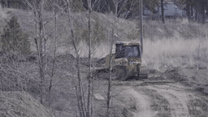
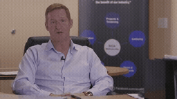
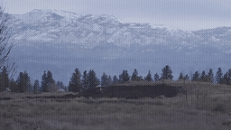
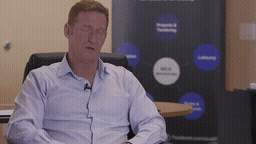
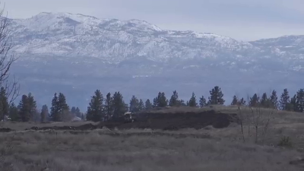
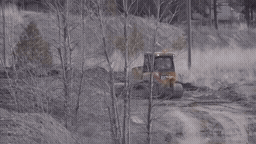
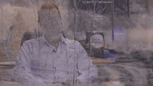
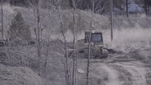
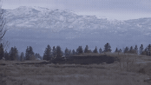
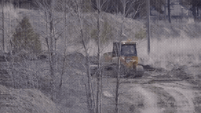

# 초기 Local / Random / Oracle · pilot_001_interview_return

[이 실험의 사례 목록](README.md) · [전체 실험](../README.md) · [입력 방식](../../docs/METHODS.md)

Video-Past와 Image-Target-guide의 초기 비교입니다. 형식과 시간 위치가 함께 달라지는 비교를 구분합니다.

관찰·해석은 [실험별 결과](../../docs/EXPERIMENTS.md)를 함께 확인하세요.

**GIF는 축소 미리보기(8 FPS)입니다.** 모든 생성 Target은 원본 3초입니다. 미리보기 또는 MP4 링크를 클릭하면 저장소 파일을 열 수 있습니다. 재사용 표시는 같은 원실행을 다시 비교했다는 뜻입니다.

## 실제 입력과 평가용 후속

Local은 생성 조건입니다. 원본 후속은 입력에 넣지 않았습니다.

### Local · 고정 생성 조건

[](../../media/videos/3db1881b88303a781de6cca2866a483e43a47ff03c15c8949213479afa61c124.mp4)

RGB 표시 · 48 frames / 24 FPS · [MP4 파일](../../media/videos/3db1881b88303a781de6cca2866a483e43a47ff03c15c8949213479afa61c124.mp4) · [원본 열기/다운로드](../../media/videos/3db1881b88303a781de6cca2866a483e43a47ff03c15c8949213479afa61c124.mp4?raw=true)

### Oracle · 과거 증거

[](../../media/videos/192a580090a50e362862988c4c70da14e3180da3bc76c6dc9e6b605d741eae91.mp4)

RGB 표시 · 72 frames / 24 FPS · [MP4 파일](../../media/videos/192a580090a50e362862988c4c70da14e3180da3bc76c6dc9e6b605d741eae91.mp4) · [원본 열기/다운로드](../../media/videos/192a580090a50e362862988c4c70da14e3180da3bc76c6dc9e6b605d741eae91.mp4?raw=true)

### Random · 무관한 과거 구간

[](../../media/videos/ac32828b0e52b07bec603a18ea746f0c51dd1c271a7e2860beb7d8e55295172b.mp4)

RGB 표시 · 72 frames / 24 FPS · [MP4 파일](../../media/videos/ac32828b0e52b07bec603a18ea746f0c51dd1c271a7e2860beb7d8e55295172b.mp4) · [원본 열기/다운로드](../../media/videos/ac32828b0e52b07bec603a18ea746f0c51dd1c271a7e2860beb7d8e55295172b.mp4?raw=true)

### 원본 후속 · 생성 입력 제외

[](../../media/videos/d0b9718cbc1e5226057b1e80960aab6d92efe2b9fe77d2860ac1630308343125.mp4)

원본 후속 · 생성 입력 제외 · [MP4 파일](../../media/videos/d0b9718cbc1e5226057b1e80960aab6d92efe2b9fe77d2860ac1630308343125.mp4) · [원본 열기/다운로드](../../media/videos/d0b9718cbc1e5226057b1e80960aab6d92efe2b9fe77d2860ac1630308343125.mp4?raw=true)

### Oracle 이미지 · 실제 frame 36


이미지 조건은 이 한 장을 인코딩했습니다. 영상 조건과 구분합니다.

### Random 이미지 · 실제 frame 36



이미지 조건은 이 한 장을 인코딩했습니다. 영상 조건과 구분합니다.

원본: Training Heavy Equipment Operators · [구간·출처 metadata](../../records/data/pilot_001_interview_return/metadata.json)

## 생성 결과

###  Local-only · seed 42

**신규 실행 · run_100**

[](../../media/videos/7f0b380e4b84131e77665af5590d20c12f9bc53b8b78be8d5964549fa01e6505.mp4)

[Target MP4](../../media/videos/7f0b380e4b84131e77665af5590d20c12f9bc53b8b78be8d5964549fa01e6505.mp4) · [원본 열기/다운로드](../../media/videos/7f0b380e4b84131e77665af5590d20c12f9bc53b8b78be8d5964549fa01e6505.mp4?raw=true) · [Local + Target 5초](../../media/videos/1c197381b49f71849e0cbbddf6f95c352d60556857cb3d85a3fcf1505013f373.mp4) · [원실행 config](../../records/outputs/pilot_001_interview_return/reference_past_seed42/local/config.json)

참조: 추가 참조 없음. Local clean prefix + Target noise

<details>
<summary>Prompt · 시간 좌표 · 원실행</summary>

```text
The video cuts back to a previously shown indoor interview. The interviewee continues speaking in a seated medium shot.
```

- 참조 모델 좌표: `[0.0000, 3.0417) s`
- Target 모델 좌표: `[6.0833, 9.0833) s`
- 원본 참조 구간: `원본 config 참조`
- 추가 참조 token: 0
- 원실행: `outputs/pilot_001_interview_return/reference_past_seed42/local/config.json`

</details>

###  Local-only · seed 42

**신규 실행 · run_105**

[](../../media/videos/7f0b380e4b84131e77665af5590d20c12f9bc53b8b78be8d5964549fa01e6505.mp4)

[Target MP4](../../media/videos/7f0b380e4b84131e77665af5590d20c12f9bc53b8b78be8d5964549fa01e6505.mp4) · [원본 열기/다운로드](../../media/videos/7f0b380e4b84131e77665af5590d20c12f9bc53b8b78be8d5964549fa01e6505.mp4?raw=true) · [Local + Target 5초](../../media/videos/1c197381b49f71849e0cbbddf6f95c352d60556857cb3d85a3fcf1505013f373.mp4) · [원실행 config](../../records/outputs/pilot_001_interview_return/reference_target_guide_seed42/local/config.json)

참조: 추가 참조 없음. Local clean prefix + Target noise

<details>
<summary>Prompt · 시간 좌표 · 원실행</summary>

```text
The video cuts back to a previously shown indoor interview. The interviewee continues speaking in a seated medium shot.
```

- 참조 모델 좌표: `[6.0833, 6.1250) s`
- Target 모델 좌표: `[6.0833, 9.0833) s`
- 원본 참조 구간: `원본 config 참조`
- 추가 참조 token: 0
- 원실행: `outputs/pilot_001_interview_return/reference_target_guide_seed42/local/config.json`

</details>

###  Oracle · Image-Target · seed 42

**신규 실행 · run_106**

[](../../media/videos/ec364bce82901bf19f164d14c8fe0d01de50f4c914ee68336da899b91fd3ea2d.mp4)

[Target MP4](../../media/videos/ec364bce82901bf19f164d14c8fe0d01de50f4c914ee68336da899b91fd3ea2d.mp4) · [원본 열기/다운로드](../../media/videos/ec364bce82901bf19f164d14c8fe0d01de50f4c914ee68336da899b91fd3ea2d.mp4?raw=true) · [Local + Target 5초](../../media/videos/959f9c9a584b35c0ddb9f649eb2afa739cd3d665f958c3941f7a713ad0024423.mp4) · [원실행 config](../../records/outputs/pilot_001_interview_return/reference_target_guide_seed42/oracle/config.json)

참조: Oracle 이미지 · frame 36. Local clean prefix + 별도 clean 참조 token + Target noise

[이 조건의 참조 파일](../../media/stills/pilot_001_interview_return_oracle_frame36.png)

<details>
<summary>Prompt · 시간 좌표 · 원실행</summary>

```text
The video cuts back to a previously shown indoor interview. The interviewee continues speaking in a seated medium shot.
```

- 참조 모델 좌표: `[6.0833, 6.1250) s`
- Target 모델 좌표: `[6.0833, 9.0833) s`
- 원본 참조 구간: `[90.0000, 93.0000) s`
- 추가 참조 token: 144
- 원실행: `outputs/pilot_001_interview_return/reference_target_guide_seed42/oracle/config.json`

</details>

###  Oracle · Video-Past · seed 42

**신규 실행 · run_101**

[](../../media/videos/3774a92f6f2bc3a14a2eb0685c0f90ad97a775a303e73b61f8e830204960130c.mp4)

[Target MP4](../../media/videos/3774a92f6f2bc3a14a2eb0685c0f90ad97a775a303e73b61f8e830204960130c.mp4) · [원본 열기/다운로드](../../media/videos/3774a92f6f2bc3a14a2eb0685c0f90ad97a775a303e73b61f8e830204960130c.mp4?raw=true) · [Local + Target 5초](../../media/videos/0b565ba03735f16e565e2a0ff47b31941fbeaf375bc427271710610bbdc9c6d3.mp4) · [원실행 config](../../records/outputs/pilot_001_interview_return/reference_past_seed42/oracle/config.json)

참조: Oracle 영상 · 전체 프레임. Local clean prefix + 별도 clean 참조 token + Target noise

[이 조건의 참조 파일](../../media/videos/192a580090a50e362862988c4c70da14e3180da3bc76c6dc9e6b605d741eae91.mp4)

<details>
<summary>Prompt · 시간 좌표 · 원실행</summary>

```text
The video cuts back to a previously shown indoor interview. The interviewee continues speaking in a seated medium shot.
```

- 참조 모델 좌표: `[0.0000, 3.0417) s`
- Target 모델 좌표: `[6.0833, 9.0833) s`
- 원본 참조 구간: `[90.0000, 93.0000) s`
- 추가 참조 token: 1440
- 원실행: `outputs/pilot_001_interview_return/reference_past_seed42/oracle/config.json`

</details>

###  Random · Image-Target · seed 42

**신규 실행 · run_107**

[](../../media/videos/82b4a38a8b219ac4450d6954d659140d1d7f52bb9a3005cd98e90b14f1e663cc.mp4)

[Target MP4](../../media/videos/82b4a38a8b219ac4450d6954d659140d1d7f52bb9a3005cd98e90b14f1e663cc.mp4) · [원본 열기/다운로드](../../media/videos/82b4a38a8b219ac4450d6954d659140d1d7f52bb9a3005cd98e90b14f1e663cc.mp4?raw=true) · [Local + Target 5초](../../media/videos/054805d783d3b826f507e150116ae773d3fd24be0ae8a6f878a73a809dc8627e.mp4) · [원실행 config](../../records/outputs/pilot_001_interview_return/reference_target_guide_seed42/random/config.json)

참조: Random 이미지 · frame 36. Local clean prefix + 별도 clean 참조 token + Target noise

[이 조건의 참조 파일](../../media/stills/pilot_001_interview_return_random_frame36.png)

<details>
<summary>Prompt · 시간 좌표 · 원실행</summary>

```text
The video cuts back to a previously shown indoor interview. The interviewee continues speaking in a seated medium shot.
```

- 참조 모델 좌표: `[6.0833, 6.1250) s`
- Target 모델 좌표: `[6.0833, 9.0833) s`
- 원본 참조 구간: `[44.0000, 47.0000) s`
- 추가 참조 token: 144
- 원실행: `outputs/pilot_001_interview_return/reference_target_guide_seed42/random/config.json`

</details>

###  Random · Video-Past · seed 42

**신규 실행 · run_102**

[](../../media/videos/f0900be127f64e223bc30ace1a8f31b0bb136f70faadac3791b77d1fc6a1cd35.mp4)

[Target MP4](../../media/videos/f0900be127f64e223bc30ace1a8f31b0bb136f70faadac3791b77d1fc6a1cd35.mp4) · [원본 열기/다운로드](../../media/videos/f0900be127f64e223bc30ace1a8f31b0bb136f70faadac3791b77d1fc6a1cd35.mp4?raw=true) · [Local + Target 5초](../../media/videos/df1bca748e1111c7c966ba612cd4bae698ba640644e58be892d7cd7d67468d46.mp4) · [원실행 config](../../records/outputs/pilot_001_interview_return/reference_past_seed42/random/config.json)

참조: Random 영상 · 전체 프레임. Local clean prefix + 별도 clean 참조 token + Target noise

[이 조건의 참조 파일](../../media/videos/ac32828b0e52b07bec603a18ea746f0c51dd1c271a7e2860beb7d8e55295172b.mp4)

<details>
<summary>Prompt · 시간 좌표 · 원실행</summary>

```text
The video cuts back to a previously shown indoor interview. The interviewee continues speaking in a seated medium shot.
```

- 참조 모델 좌표: `[0.0000, 3.0417) s`
- Target 모델 좌표: `[6.0833, 9.0833) s`
- 원본 참조 구간: `[44.0000, 47.0000) s`
- 추가 참조 token: 1440
- 원실행: `outputs/pilot_001_interview_return/reference_past_seed42/random/config.json`

</details>
