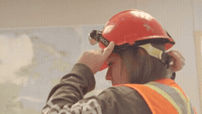
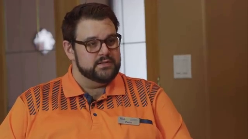
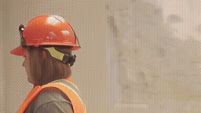

# 초기 Local / Random / Oracle · pilot_002_interview_return

[이 실험의 사례 목록](README.md) · [전체 실험](../README.md) · [입력 방식](../../docs/METHODS.md)

Video-Past와 Image-Target-guide의 초기 비교입니다. 형식과 시간 위치가 함께 달라지는 비교를 구분합니다.

관찰·해석은 [실험별 결과](../../docs/EXPERIMENTS.md)를 함께 확인하세요.

**GIF는 축소 미리보기(8 FPS)입니다.** 모든 생성 Target은 원본 3초입니다. 미리보기 또는 MP4 링크를 클릭하면 저장소 파일을 열 수 있습니다. 재사용 표시는 같은 원실행을 다시 비교했다는 뜻입니다.

## 실제 입력과 평가용 후속

Local은 생성 조건입니다. 원본 후속은 입력에 넣지 않았습니다.

### Local · 고정 생성 조건

[](../../media/videos/6939f5167a376b797e135559627e8070a6397b50c4967c99ff149943779e9537.mp4)

RGB 표시 · 48 frames / 24 FPS · [MP4 파일](../../media/videos/6939f5167a376b797e135559627e8070a6397b50c4967c99ff149943779e9537.mp4) · [원본 열기/다운로드](../../media/videos/6939f5167a376b797e135559627e8070a6397b50c4967c99ff149943779e9537.mp4?raw=true)

### Oracle · 과거 증거

[](../../media/videos/6cfffd6467739a10bd61d601e3239d13d44751e67766f0a43de5a32d154af1a9.mp4)

RGB 표시 · 72 frames / 24 FPS · [MP4 파일](../../media/videos/6cfffd6467739a10bd61d601e3239d13d44751e67766f0a43de5a32d154af1a9.mp4) · [원본 열기/다운로드](../../media/videos/6cfffd6467739a10bd61d601e3239d13d44751e67766f0a43de5a32d154af1a9.mp4?raw=true)

### Random · 무관한 과거 구간

[](../../media/videos/ac32828b0e52b07bec603a18ea746f0c51dd1c271a7e2860beb7d8e55295172b.mp4)

RGB 표시 · 72 frames / 24 FPS · [MP4 파일](../../media/videos/ac32828b0e52b07bec603a18ea746f0c51dd1c271a7e2860beb7d8e55295172b.mp4) · [원본 열기/다운로드](../../media/videos/ac32828b0e52b07bec603a18ea746f0c51dd1c271a7e2860beb7d8e55295172b.mp4?raw=true)

### 원본 후속 · 생성 입력 제외

[](../../media/videos/bf7dfea607086ca50c7e148d5966630fb3116091ee47318113a74536436e85d3.mp4)

원본 후속 · 생성 입력 제외 · [MP4 파일](../../media/videos/bf7dfea607086ca50c7e148d5966630fb3116091ee47318113a74536436e85d3.mp4) · [원본 열기/다운로드](../../media/videos/bf7dfea607086ca50c7e148d5966630fb3116091ee47318113a74536436e85d3.mp4?raw=true)

### Oracle 이미지 · 실제 frame 36



이미지 조건은 이 한 장을 인코딩했습니다. 영상 조건과 구분합니다.

### Random 이미지 · 실제 frame 36


이미지 조건은 이 한 장을 인코딩했습니다. 영상 조건과 구분합니다.

원본: Training Heavy Equipment Operators · [구간·출처 metadata](../../records/data/pilot_002_interview_return/metadata.json)

## 생성 결과

###  Local-only · seed 42

**신규 실행 · run_118**

[](../../media/videos/1124f1fda3fb8716812c0f89c9690b72e618508dd4dccc4b940132656c935129.mp4)

[Target MP4](../../media/videos/1124f1fda3fb8716812c0f89c9690b72e618508dd4dccc4b940132656c935129.mp4) · [원본 열기/다운로드](../../media/videos/1124f1fda3fb8716812c0f89c9690b72e618508dd4dccc4b940132656c935129.mp4?raw=true) · [Local + Target 5초](../../media/videos/dfe6fa4f2a99b0e5fb320eda06dc0ecf9ac5ae0685213065c2a6dec0d3db1cca.mp4) · [원실행 config](../../records/outputs/pilot_002_interview_return/reference_past_seed42/local/config.json)

참조: 추가 참조 없음. Local clean prefix + Target noise

<details>
<summary>Prompt · 시간 좌표 · 원실행</summary>

```text
The video cuts back to a previously shown indoor interview. The interviewee continues speaking in a seated medium shot.
```

- 참조 모델 좌표: `[0.0000, 3.0417) s`
- Target 모델 좌표: `[6.0833, 9.0833) s`
- 원본 참조 구간: `원본 config 참조`
- 추가 참조 token: 0
- 원실행: `outputs/pilot_002_interview_return/reference_past_seed42/local/config.json`

</details>

###  Oracle · Video-Past · seed 42

**신규 실행 · run_119**

[](../../media/videos/03930bc441084100af27765467f00bb6ab1767e0649d5feaa77ee3295fbf107b.mp4)

[Target MP4](../../media/videos/03930bc441084100af27765467f00bb6ab1767e0649d5feaa77ee3295fbf107b.mp4) · [원본 열기/다운로드](../../media/videos/03930bc441084100af27765467f00bb6ab1767e0649d5feaa77ee3295fbf107b.mp4?raw=true) · [Local + Target 5초](../../media/videos/df5e7bfa315d1b9ae6ee491afe6e79c78a44e619a550186ef116c1a0b74e98cd.mp4) · [원실행 config](../../records/outputs/pilot_002_interview_return/reference_past_seed42/oracle/config.json)

참조: Oracle 영상 · 전체 프레임. Local clean prefix + 별도 clean 참조 token + Target noise

[이 조건의 참조 파일](../../media/videos/6cfffd6467739a10bd61d601e3239d13d44751e67766f0a43de5a32d154af1a9.mp4)

<details>
<summary>Prompt · 시간 좌표 · 원실행</summary>

```text
The video cuts back to a previously shown indoor interview. The interviewee continues speaking in a seated medium shot.
```

- 참조 모델 좌표: `[0.0000, 3.0417) s`
- Target 모델 좌표: `[6.0833, 9.0833) s`
- 원본 참조 구간: `[60.0000, 63.0000) s`
- 추가 참조 token: 1440
- 원실행: `outputs/pilot_002_interview_return/reference_past_seed42/oracle/config.json`

</details>

###  Random · Video-Past · seed 42

**신규 실행 · run_120**

[](../../media/videos/1130b6c99284b049dd135634f72d4f508e0c49c58b622b423b14db9cef363fd2.mp4)

[Target MP4](../../media/videos/1130b6c99284b049dd135634f72d4f508e0c49c58b622b423b14db9cef363fd2.mp4) · [원본 열기/다운로드](../../media/videos/1130b6c99284b049dd135634f72d4f508e0c49c58b622b423b14db9cef363fd2.mp4?raw=true) · [Local + Target 5초](../../media/videos/1d92f13e6c32a58527aa18c14ea640bf61df8028ddea1e5abbb22d00a00bff8f.mp4) · [원실행 config](../../records/outputs/pilot_002_interview_return/reference_past_seed42/random/config.json)

참조: Random 영상 · 전체 프레임. Local clean prefix + 별도 clean 참조 token + Target noise

[이 조건의 참조 파일](../../media/videos/ac32828b0e52b07bec603a18ea746f0c51dd1c271a7e2860beb7d8e55295172b.mp4)

<details>
<summary>Prompt · 시간 좌표 · 원실행</summary>

```text
The video cuts back to a previously shown indoor interview. The interviewee continues speaking in a seated medium shot.
```

- 참조 모델 좌표: `[0.0000, 3.0417) s`
- Target 모델 좌표: `[6.0833, 9.0833) s`
- 원본 참조 구간: `[44.0000, 47.0000) s`
- 추가 참조 token: 1440
- 원실행: `outputs/pilot_002_interview_return/reference_past_seed42/random/config.json`

</details>
