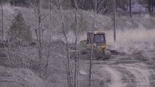
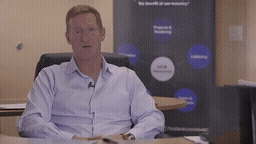
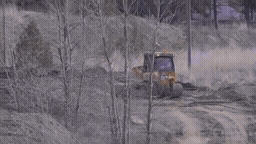
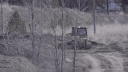
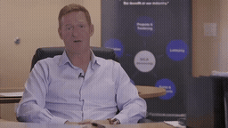
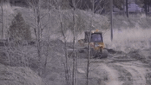
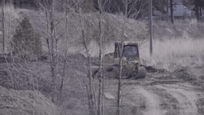
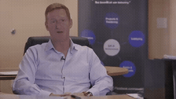

# 형식 × 시간 위치 · 3 seeds · pilot_001_interview_return

[이 실험의 사례 목록](README.md) · [전체 실험](../README.md) · [입력 방식](../../docs/METHODS.md)

이미지/영상 × Past/Target, seed 42/43/44. 기존 seed 42 두 결과를 재사용했습니다.

관찰·해석은 [실험별 결과](../../docs/EXPERIMENTS.md)를 함께 확인하세요.

**GIF는 축소 미리보기(8 FPS)입니다.** 모든 생성 Target은 원본 3초입니다. 미리보기 또는 MP4 링크를 클릭하면 저장소 파일을 열 수 있습니다. 재사용 표시는 같은 원실행을 다시 비교했다는 뜻입니다.

## 실제 입력과 평가용 후속

Local은 생성 조건입니다. 원본 후속은 입력에 넣지 않았습니다.

### Local · 고정 생성 조건

[](../../media/videos/3db1881b88303a781de6cca2866a483e43a47ff03c15c8949213479afa61c124.mp4)

RGB 표시 · 48 frames / 24 FPS · [MP4 파일](../../media/videos/3db1881b88303a781de6cca2866a483e43a47ff03c15c8949213479afa61c124.mp4) · [원본 열기/다운로드](../../media/videos/3db1881b88303a781de6cca2866a483e43a47ff03c15c8949213479afa61c124.mp4?raw=true)

### Oracle · 과거 증거

[](../../media/videos/192a580090a50e362862988c4c70da14e3180da3bc76c6dc9e6b605d741eae91.mp4)

RGB 표시 · 72 frames / 24 FPS · [MP4 파일](../../media/videos/192a580090a50e362862988c4c70da14e3180da3bc76c6dc9e6b605d741eae91.mp4) · [원본 열기/다운로드](../../media/videos/192a580090a50e362862988c4c70da14e3180da3bc76c6dc9e6b605d741eae91.mp4?raw=true)

### Random · 무관한 과거 구간

[](../../media/videos/ac32828b0e52b07bec603a18ea746f0c51dd1c271a7e2860beb7d8e55295172b.mp4)

RGB 표시 · 72 frames / 24 FPS · [MP4 파일](../../media/videos/ac32828b0e52b07bec603a18ea746f0c51dd1c271a7e2860beb7d8e55295172b.mp4) · [원본 열기/다운로드](../../media/videos/ac32828b0e52b07bec603a18ea746f0c51dd1c271a7e2860beb7d8e55295172b.mp4?raw=true)

### 원본 후속 · 생성 입력 제외

[](../../media/videos/d0b9718cbc1e5226057b1e80960aab6d92efe2b9fe77d2860ac1630308343125.mp4)

원본 후속 · 생성 입력 제외 · [MP4 파일](../../media/videos/d0b9718cbc1e5226057b1e80960aab6d92efe2b9fe77d2860ac1630308343125.mp4) · [원본 열기/다운로드](../../media/videos/d0b9718cbc1e5226057b1e80960aab6d92efe2b9fe77d2860ac1630308343125.mp4?raw=true)

### Oracle 이미지 · 실제 frame 36


이미지 조건은 이 한 장을 인코딩했습니다. 영상 조건과 구분합니다.

### Random 이미지 · 실제 frame 36


이미지 조건은 이 한 장을 인코딩했습니다. 영상 조건과 구분합니다.

원본: Training Heavy Equipment Operators · [구간·출처 metadata](../../records/data/pilot_001_interview_return/metadata.json)

## 생성 결과

###  Oracle · Image-Past · seed 42

**신규 실행 · run_108**

[](../../media/videos/f0b98754bd57eb4e87c1bcac513f3b3a6316cdfd74217c30f70ddf521d8ed4cb.mp4)

[Target MP4](../../media/videos/f0b98754bd57eb4e87c1bcac513f3b3a6316cdfd74217c30f70ddf521d8ed4cb.mp4) · [원본 열기/다운로드](../../media/videos/f0b98754bd57eb4e87c1bcac513f3b3a6316cdfd74217c30f70ddf521d8ed4cb.mp4?raw=true) · [Local + Target 5초](../../media/videos/8ae56e41d7d914801c41e1e751c8a7a14593f17b9370792a67b48e36c54578a9.mp4) · [원실행 config](../../records/outputs/pilot_001_interview_return/temporal_position_seed42/image_past/config.json)

참조: Oracle 이미지 · frame 36. Local clean prefix + 별도 clean 참조 token + Target noise

[이 조건의 참조 파일](../../media/stills/pilot_001_interview_return_oracle_frame36.png)

<details>
<summary>Prompt · 시간 좌표 · 원실행</summary>

```text
The video cuts back to a previously shown indoor interview. The interviewee continues speaking in a seated medium shot.
```

- 참조 모델 좌표: `[0.0000, 0.0417) s`
- Target 모델 좌표: `[6.0833, 9.0833) s`
- 원본 참조 구간: `[90.0000, 93.0000) s`
- 추가 참조 token: 144
- 원실행: `outputs/pilot_001_interview_return/temporal_position_seed42/image_past/config.json`

</details>

###  Oracle · Image-Target · seed 42

**재사용 · run_106**

[](../../media/videos/ec364bce82901bf19f164d14c8fe0d01de50f4c914ee68336da899b91fd3ea2d.mp4)

[Target MP4](../../media/videos/ec364bce82901bf19f164d14c8fe0d01de50f4c914ee68336da899b91fd3ea2d.mp4) · [원본 열기/다운로드](../../media/videos/ec364bce82901bf19f164d14c8fe0d01de50f4c914ee68336da899b91fd3ea2d.mp4?raw=true) · [Local + Target 5초](../../media/videos/959f9c9a584b35c0ddb9f649eb2afa739cd3d665f958c3941f7a713ad0024423.mp4) · [원실행 config](../../records/outputs/pilot_001_interview_return/reference_target_guide_seed42/oracle/config.json)

참조: Oracle 이미지 · frame 36. Local clean prefix + 별도 clean 참조 token + Target noise

[이 조건의 참조 파일](../../media/stills/pilot_001_interview_return_oracle_frame36.png)

<details>
<summary>Prompt · 시간 좌표 · 원실행</summary>

```text
The video cuts back to a previously shown indoor interview. The interviewee continues speaking in a seated medium shot.
```

- 참조 모델 좌표: `[6.0833, 6.1250) s`
- Target 모델 좌표: `[6.0833, 9.0833) s`
- 원본 참조 구간: `[90.0000, 93.0000) s`
- 추가 참조 token: 144
- 원실행: `outputs/pilot_001_interview_return/reference_target_guide_seed42/oracle/config.json`

</details>

###  Oracle · Video-Past · seed 42

**재사용 · run_101**

[](../../media/videos/3774a92f6f2bc3a14a2eb0685c0f90ad97a775a303e73b61f8e830204960130c.mp4)

[Target MP4](../../media/videos/3774a92f6f2bc3a14a2eb0685c0f90ad97a775a303e73b61f8e830204960130c.mp4) · [원본 열기/다운로드](../../media/videos/3774a92f6f2bc3a14a2eb0685c0f90ad97a775a303e73b61f8e830204960130c.mp4?raw=true) · [Local + Target 5초](../../media/videos/0b565ba03735f16e565e2a0ff47b31941fbeaf375bc427271710610bbdc9c6d3.mp4) · [원실행 config](../../records/outputs/pilot_001_interview_return/reference_past_seed42/oracle/config.json)

참조: Oracle 영상 · 전체 프레임. Local clean prefix + 별도 clean 참조 token + Target noise

[이 조건의 참조 파일](../../media/videos/192a580090a50e362862988c4c70da14e3180da3bc76c6dc9e6b605d741eae91.mp4)

<details>
<summary>Prompt · 시간 좌표 · 원실행</summary>

```text
The video cuts back to a previously shown indoor interview. The interviewee continues speaking in a seated medium shot.
```

- 참조 모델 좌표: `[0.0000, 3.0417) s`
- Target 모델 좌표: `[6.0833, 9.0833) s`
- 원본 참조 구간: `[90.0000, 93.0000) s`
- 추가 참조 token: 1440
- 원실행: `outputs/pilot_001_interview_return/reference_past_seed42/oracle/config.json`

</details>

###  Oracle · Video-Target · seed 42

**신규 실행 · run_109**

[](../../media/videos/a72b426bda76fc1f2e382d15eb7162cb3e8e0913f848b2b8e587b7c8bf952d3b.mp4)

[Target MP4](../../media/videos/a72b426bda76fc1f2e382d15eb7162cb3e8e0913f848b2b8e587b7c8bf952d3b.mp4) · [원본 열기/다운로드](../../media/videos/a72b426bda76fc1f2e382d15eb7162cb3e8e0913f848b2b8e587b7c8bf952d3b.mp4?raw=true) · [Local + Target 5초](../../media/videos/833478109679e2a5ad8bd897b2e18cc101a4025362f0028e85080965cfe13b8f.mp4) · [원실행 config](../../records/outputs/pilot_001_interview_return/temporal_position_seed42/video_target/config.json)

참조: Oracle 영상 · 전체 프레임. Local clean prefix + 별도 clean 참조 token + Target noise

[이 조건의 참조 파일](../../media/videos/192a580090a50e362862988c4c70da14e3180da3bc76c6dc9e6b605d741eae91.mp4)

<details>
<summary>Prompt · 시간 좌표 · 원실행</summary>

```text
The video cuts back to a previously shown indoor interview. The interviewee continues speaking in a seated medium shot.
```

- 참조 모델 좌표: `[6.0833, 9.1250) s`
- Target 모델 좌표: `[6.0833, 9.0833) s`
- 원본 참조 구간: `[90.0000, 93.0000) s`
- 추가 참조 token: 1440
- 원실행: `outputs/pilot_001_interview_return/temporal_position_seed42/video_target/config.json`

</details>

###  Oracle · Image-Past · seed 43

**신규 실행 · run_110**

[](../../media/videos/7c6ce02dbdd7c3b57b9415f5bd37a76365a0cfe21874d4d110f1bb78dda9bacd.mp4)

[Target MP4](../../media/videos/7c6ce02dbdd7c3b57b9415f5bd37a76365a0cfe21874d4d110f1bb78dda9bacd.mp4) · [원본 열기/다운로드](../../media/videos/7c6ce02dbdd7c3b57b9415f5bd37a76365a0cfe21874d4d110f1bb78dda9bacd.mp4?raw=true) · [Local + Target 5초](../../media/videos/2266882efd21b4ef7f5ba8ee8be0923e4451b764592702c9cde518e7594ac07d.mp4) · [원실행 config](../../records/outputs/pilot_001_interview_return/temporal_position_seed43/image_past/config.json)

참조: Oracle 이미지 · frame 36. Local clean prefix + 별도 clean 참조 token + Target noise

[이 조건의 참조 파일](../../media/stills/pilot_001_interview_return_oracle_frame36.png)

<details>
<summary>Prompt · 시간 좌표 · 원실행</summary>

```text
The video cuts back to a previously shown indoor interview. The interviewee continues speaking in a seated medium shot.
```

- 참조 모델 좌표: `[0.0000, 0.0417) s`
- Target 모델 좌표: `[6.0833, 9.0833) s`
- 원본 참조 구간: `[90.0000, 93.0000) s`
- 추가 참조 token: 144
- 원실행: `outputs/pilot_001_interview_return/temporal_position_seed43/image_past/config.json`

</details>

###  Oracle · Image-Target · seed 43

**신규 실행 · run_111**

[](../../media/videos/68c0b8b35183f8318d4f2aa987db9916eab6e5bcf11b3a9a679020adb04be355.mp4)

[Target MP4](../../media/videos/68c0b8b35183f8318d4f2aa987db9916eab6e5bcf11b3a9a679020adb04be355.mp4) · [원본 열기/다운로드](../../media/videos/68c0b8b35183f8318d4f2aa987db9916eab6e5bcf11b3a9a679020adb04be355.mp4?raw=true) · [Local + Target 5초](../../media/videos/da5e030393476cf2c878893dca35e6e9a268aa86aa0514ff33e905baf9c13204.mp4) · [원실행 config](../../records/outputs/pilot_001_interview_return/temporal_position_seed43/image_target/config.json)

참조: Oracle 이미지 · frame 36. Local clean prefix + 별도 clean 참조 token + Target noise

[이 조건의 참조 파일](../../media/stills/pilot_001_interview_return_oracle_frame36.png)

<details>
<summary>Prompt · 시간 좌표 · 원실행</summary>

```text
The video cuts back to a previously shown indoor interview. The interviewee continues speaking in a seated medium shot.
```

- 참조 모델 좌표: `[6.0833, 6.1250) s`
- Target 모델 좌표: `[6.0833, 9.0833) s`
- 원본 참조 구간: `[90.0000, 93.0000) s`
- 추가 참조 token: 144
- 원실행: `outputs/pilot_001_interview_return/temporal_position_seed43/image_target/config.json`

</details>

###  Oracle · Video-Past · seed 43

**신규 실행 · run_112**

[](../../media/videos/3e6e03478f0ec4a8db09d2c235d907ed95972b0e32b0186fb04b27558d01ba58.mp4)

[Target MP4](../../media/videos/3e6e03478f0ec4a8db09d2c235d907ed95972b0e32b0186fb04b27558d01ba58.mp4) · [원본 열기/다운로드](../../media/videos/3e6e03478f0ec4a8db09d2c235d907ed95972b0e32b0186fb04b27558d01ba58.mp4?raw=true) · [Local + Target 5초](../../media/videos/4a263e16cefbad69577c01d1f470b7cc9d3fa1d277e131d3bef8ffe477b3ee1b.mp4) · [원실행 config](../../records/outputs/pilot_001_interview_return/temporal_position_seed43/video_past/config.json)

참조: Oracle 영상 · 전체 프레임. Local clean prefix + 별도 clean 참조 token + Target noise

[이 조건의 참조 파일](../../media/videos/192a580090a50e362862988c4c70da14e3180da3bc76c6dc9e6b605d741eae91.mp4)

<details>
<summary>Prompt · 시간 좌표 · 원실행</summary>

```text
The video cuts back to a previously shown indoor interview. The interviewee continues speaking in a seated medium shot.
```

- 참조 모델 좌표: `[0.0000, 3.0417) s`
- Target 모델 좌표: `[6.0833, 9.0833) s`
- 원본 참조 구간: `[90.0000, 93.0000) s`
- 추가 참조 token: 1440
- 원실행: `outputs/pilot_001_interview_return/temporal_position_seed43/video_past/config.json`

</details>

###  Oracle · Video-Target · seed 43

**신규 실행 · run_113**

[](../../media/videos/4bf2aee62bb74f616dbd3a9ee43b61c369a455245ca232d6e4036e500993400a.mp4)

[Target MP4](../../media/videos/4bf2aee62bb74f616dbd3a9ee43b61c369a455245ca232d6e4036e500993400a.mp4) · [원본 열기/다운로드](../../media/videos/4bf2aee62bb74f616dbd3a9ee43b61c369a455245ca232d6e4036e500993400a.mp4?raw=true) · [Local + Target 5초](../../media/videos/fdf262804bd87fe5251a67a1fdee4ea198e1763a5b741bc0beded588947995f4.mp4) · [원실행 config](../../records/outputs/pilot_001_interview_return/temporal_position_seed43/video_target/config.json)

참조: Oracle 영상 · 전체 프레임. Local clean prefix + 별도 clean 참조 token + Target noise

[이 조건의 참조 파일](../../media/videos/192a580090a50e362862988c4c70da14e3180da3bc76c6dc9e6b605d741eae91.mp4)

<details>
<summary>Prompt · 시간 좌표 · 원실행</summary>

```text
The video cuts back to a previously shown indoor interview. The interviewee continues speaking in a seated medium shot.
```

- 참조 모델 좌표: `[6.0833, 9.1250) s`
- Target 모델 좌표: `[6.0833, 9.0833) s`
- 원본 참조 구간: `[90.0000, 93.0000) s`
- 추가 참조 token: 1440
- 원실행: `outputs/pilot_001_interview_return/temporal_position_seed43/video_target/config.json`

</details>

###  Oracle · Image-Past · seed 44

**신규 실행 · run_114**

[](../../media/videos/8c9d1bbf7543fc56df9345ec187982361798a7cf0475a5826cf79fb4d64fe640.mp4)

[Target MP4](../../media/videos/8c9d1bbf7543fc56df9345ec187982361798a7cf0475a5826cf79fb4d64fe640.mp4) · [원본 열기/다운로드](../../media/videos/8c9d1bbf7543fc56df9345ec187982361798a7cf0475a5826cf79fb4d64fe640.mp4?raw=true) · [Local + Target 5초](../../media/videos/db8c331f6f4fa761c5f2bbe25a4950328c401b0f3ae2cc93efa152b21385d648.mp4) · [원실행 config](../../records/outputs/pilot_001_interview_return/temporal_position_seed44/image_past/config.json)

참조: Oracle 이미지 · frame 36. Local clean prefix + 별도 clean 참조 token + Target noise

[이 조건의 참조 파일](../../media/stills/pilot_001_interview_return_oracle_frame36.png)

<details>
<summary>Prompt · 시간 좌표 · 원실행</summary>

```text
The video cuts back to a previously shown indoor interview. The interviewee continues speaking in a seated medium shot.
```

- 참조 모델 좌표: `[0.0000, 0.0417) s`
- Target 모델 좌표: `[6.0833, 9.0833) s`
- 원본 참조 구간: `[90.0000, 93.0000) s`
- 추가 참조 token: 144
- 원실행: `outputs/pilot_001_interview_return/temporal_position_seed44/image_past/config.json`

</details>

###  Oracle · Image-Target · seed 44

**신규 실행 · run_115**

[](../../media/videos/d97069c34d42435143ccab5790a3f8d2b44a6689be9c0da0c5250464f1d946b2.mp4)

[Target MP4](../../media/videos/d97069c34d42435143ccab5790a3f8d2b44a6689be9c0da0c5250464f1d946b2.mp4) · [원본 열기/다운로드](../../media/videos/d97069c34d42435143ccab5790a3f8d2b44a6689be9c0da0c5250464f1d946b2.mp4?raw=true) · [Local + Target 5초](../../media/videos/b32acde5ce686f71966781043db0c4b3b2efe47ba5be1102927900e0ca0f1c19.mp4) · [원실행 config](../../records/outputs/pilot_001_interview_return/temporal_position_seed44/image_target/config.json)

참조: Oracle 이미지 · frame 36. Local clean prefix + 별도 clean 참조 token + Target noise

[이 조건의 참조 파일](../../media/stills/pilot_001_interview_return_oracle_frame36.png)

<details>
<summary>Prompt · 시간 좌표 · 원실행</summary>

```text
The video cuts back to a previously shown indoor interview. The interviewee continues speaking in a seated medium shot.
```

- 참조 모델 좌표: `[6.0833, 6.1250) s`
- Target 모델 좌표: `[6.0833, 9.0833) s`
- 원본 참조 구간: `[90.0000, 93.0000) s`
- 추가 참조 token: 144
- 원실행: `outputs/pilot_001_interview_return/temporal_position_seed44/image_target/config.json`

</details>

###  Oracle · Video-Past · seed 44

**신규 실행 · run_116**

[](../../media/videos/fc064360c6e0fab63449bdf8d540f920b2246ca18226c01be1c019bbb6110a5e.mp4)

[Target MP4](../../media/videos/fc064360c6e0fab63449bdf8d540f920b2246ca18226c01be1c019bbb6110a5e.mp4) · [원본 열기/다운로드](../../media/videos/fc064360c6e0fab63449bdf8d540f920b2246ca18226c01be1c019bbb6110a5e.mp4?raw=true) · [Local + Target 5초](../../media/videos/86f7b154df525dd6b95977ea859d233575aef6978af487dd803384c871262469.mp4) · [원실행 config](../../records/outputs/pilot_001_interview_return/temporal_position_seed44/video_past/config.json)

참조: Oracle 영상 · 전체 프레임. Local clean prefix + 별도 clean 참조 token + Target noise

[이 조건의 참조 파일](../../media/videos/192a580090a50e362862988c4c70da14e3180da3bc76c6dc9e6b605d741eae91.mp4)

<details>
<summary>Prompt · 시간 좌표 · 원실행</summary>

```text
The video cuts back to a previously shown indoor interview. The interviewee continues speaking in a seated medium shot.
```

- 참조 모델 좌표: `[0.0000, 3.0417) s`
- Target 모델 좌표: `[6.0833, 9.0833) s`
- 원본 참조 구간: `[90.0000, 93.0000) s`
- 추가 참조 token: 1440
- 원실행: `outputs/pilot_001_interview_return/temporal_position_seed44/video_past/config.json`

</details>

###  Oracle · Video-Target · seed 44

**신규 실행 · run_117**

[](../../media/videos/bbf0815cbaae0461cc1beb5a6051528852c8be304c4e867b162124f380b92bf6.mp4)

[Target MP4](../../media/videos/bbf0815cbaae0461cc1beb5a6051528852c8be304c4e867b162124f380b92bf6.mp4) · [원본 열기/다운로드](../../media/videos/bbf0815cbaae0461cc1beb5a6051528852c8be304c4e867b162124f380b92bf6.mp4?raw=true) · [Local + Target 5초](../../media/videos/8513879a371d723620f97550bcac4d0cd2795ea7a00c79fc89400bd72fbc5254.mp4) · [원실행 config](../../records/outputs/pilot_001_interview_return/temporal_position_seed44/video_target/config.json)

참조: Oracle 영상 · 전체 프레임. Local clean prefix + 별도 clean 참조 token + Target noise

[이 조건의 참조 파일](../../media/videos/192a580090a50e362862988c4c70da14e3180da3bc76c6dc9e6b605d741eae91.mp4)

<details>
<summary>Prompt · 시간 좌표 · 원실행</summary>

```text
The video cuts back to a previously shown indoor interview. The interviewee continues speaking in a seated medium shot.
```

- 참조 모델 좌표: `[6.0833, 9.1250) s`
- Target 모델 좌표: `[6.0833, 9.0833) s`
- 원본 참조 구간: `[90.0000, 93.0000) s`
- 추가 참조 token: 1440
- 원실행: `outputs/pilot_001_interview_return/temporal_position_seed44/video_target/config.json`

</details>
