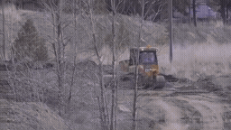
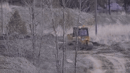
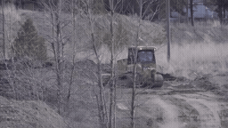

# 동일 이미지 반복수 · pilot_001_interview_return

[이 실험의 사례 목록](README.md) · [전체 실험](../README.md) · [입력 방식](../../docs/METHODS.md)

같은 이미지와 같은 시간 위치에서 1·2·4·10회를 비교합니다. 1·10회 재사용. 5–9회는 미실행입니다.

관찰·해석은 [실험별 결과](../../docs/EXPERIMENTS.md)를 함께 확인하세요.

**GIF는 축소 미리보기(8 FPS)입니다.** 모든 생성 Target은 원본 3초입니다. 미리보기 또는 MP4 링크를 클릭하면 저장소 파일을 열 수 있습니다. 재사용 표시는 같은 원실행을 다시 비교했다는 뜻입니다.

## 실제 입력과 평가용 후속

Local은 생성 조건입니다. 원본 후속은 입력에 넣지 않았습니다.

### Local · 고정 생성 조건

[](../../media/videos/3db1881b88303a781de6cca2866a483e43a47ff03c15c8949213479afa61c124.mp4)

RGB 표시 · 48 frames / 24 FPS · [MP4 파일](../../media/videos/3db1881b88303a781de6cca2866a483e43a47ff03c15c8949213479afa61c124.mp4) · [원본 열기/다운로드](../../media/videos/3db1881b88303a781de6cca2866a483e43a47ff03c15c8949213479afa61c124.mp4?raw=true)

### Oracle · 과거 증거

[](../../media/videos/192a580090a50e362862988c4c70da14e3180da3bc76c6dc9e6b605d741eae91.mp4)

RGB 표시 · 72 frames / 24 FPS · [MP4 파일](../../media/videos/192a580090a50e362862988c4c70da14e3180da3bc76c6dc9e6b605d741eae91.mp4) · [원본 열기/다운로드](../../media/videos/192a580090a50e362862988c4c70da14e3180da3bc76c6dc9e6b605d741eae91.mp4?raw=true)

### Random · 무관한 과거 구간

[](../../media/videos/ac32828b0e52b07bec603a18ea746f0c51dd1c271a7e2860beb7d8e55295172b.mp4)

RGB 표시 · 72 frames / 24 FPS · [MP4 파일](../../media/videos/ac32828b0e52b07bec603a18ea746f0c51dd1c271a7e2860beb7d8e55295172b.mp4) · [원본 열기/다운로드](../../media/videos/ac32828b0e52b07bec603a18ea746f0c51dd1c271a7e2860beb7d8e55295172b.mp4?raw=true)

### 원본 후속 · 생성 입력 제외

[](../../media/videos/d0b9718cbc1e5226057b1e80960aab6d92efe2b9fe77d2860ac1630308343125.mp4)

원본 후속 · 생성 입력 제외 · [MP4 파일](../../media/videos/d0b9718cbc1e5226057b1e80960aab6d92efe2b9fe77d2860ac1630308343125.mp4) · [원본 열기/다운로드](../../media/videos/d0b9718cbc1e5226057b1e80960aab6d92efe2b9fe77d2860ac1630308343125.mp4?raw=true)

### Oracle 이미지 · 실제 frame 36


이미지 조건은 이 한 장을 인코딩했습니다. 영상 조건과 구분합니다.

### Random 이미지 · 실제 frame 36


이미지 조건은 이 한 장을 인코딩했습니다. 영상 조건과 구분합니다.

원본: Training Heavy Equipment Operators · [구간·출처 metadata](../../records/data/pilot_001_interview_return/metadata.json)

## 생성 결과

###  N2 · 이미지 · repeat_2 · seed 42

**신규 실행 · run_103**

[](../../media/videos/c56ae6dab40044c40ae0958a8b390b69f359b8b7691417ea98bce005b5663530.mp4)

[Target MP4](../../media/videos/c56ae6dab40044c40ae0958a8b390b69f359b8b7691417ea98bce005b5663530.mp4) · [원본 열기/다운로드](../../media/videos/c56ae6dab40044c40ae0958a8b390b69f359b8b7691417ea98bce005b5663530.mp4?raw=true) · [Local + Target 5초](../../media/videos/7de3807a5114037387418225387614c9dbfec9ae2cd5b1fcf1407e595321b813.mp4) · [원실행 config](../../records/outputs/pilot_001_interview_return/reference_repetition_seed42/repeat_2/config.json)

참조: Oracle 이미지 · frame 36. Local clean prefix + 별도 clean 참조 token + Target noise · reference layout=same, repeats=2

[이 조건의 참조 파일](../../media/stills/pilot_001_interview_return_oracle_frame36.png)

<details>
<summary>Prompt · 시간 좌표 · 원실행</summary>

```text
The video cuts back to a previously shown indoor interview. The interviewee continues speaking in a seated medium shot.
```

- 참조 모델 좌표: `[0.0000, 0.0417) s`
- Target 모델 좌표: `[6.0833, 9.0833) s`
- 원본 참조 구간: `[90.0000, 93.0000) s`
- 추가 참조 token: 288
- 원실행: `outputs/pilot_001_interview_return/reference_repetition_seed42/repeat_2/config.json`

</details>

###  N4 · 이미지 · repeat_4 · seed 42

**신규 실행 · run_104**

[](../../media/videos/31f33ad1cc29ce24b3a5c6eb892e047e16eec651565897679673aeff948c9584.mp4)

[Target MP4](../../media/videos/31f33ad1cc29ce24b3a5c6eb892e047e16eec651565897679673aeff948c9584.mp4) · [원본 열기/다운로드](../../media/videos/31f33ad1cc29ce24b3a5c6eb892e047e16eec651565897679673aeff948c9584.mp4?raw=true) · [Local + Target 5초](../../media/videos/7daf8f1e29874871e3ef9fbf603baf5903ac1ed756575258629236ef1c601d2f.mp4) · [원실행 config](../../records/outputs/pilot_001_interview_return/reference_repetition_seed42/repeat_4/config.json)

참조: Oracle 이미지 · frame 36. Local clean prefix + 별도 clean 참조 token + Target noise · reference layout=same, repeats=4

[이 조건의 참조 파일](../../media/stills/pilot_001_interview_return_oracle_frame36.png)

<details>
<summary>Prompt · 시간 좌표 · 원실행</summary>

```text
The video cuts back to a previously shown indoor interview. The interviewee continues speaking in a seated medium shot.
```

- 참조 모델 좌표: `[0.0000, 0.0417) s`
- Target 모델 좌표: `[6.0833, 9.0833) s`
- 원본 참조 구간: `[90.0000, 93.0000) s`
- 추가 참조 token: 576
- 원실행: `outputs/pilot_001_interview_return/reference_repetition_seed42/repeat_4/config.json`

</details>

###  이미지 10회 · 같은 Past 좌표 · seed 42

**재사용 · run_097**

[](../../media/videos/0250aa4ebc35217b0d31aafa17d6972c388e1e2fed7d4282cc3b309851153e11.mp4)

[Target MP4](../../media/videos/0250aa4ebc35217b0d31aafa17d6972c388e1e2fed7d4282cc3b309851153e11.mp4) · [원본 열기/다운로드](../../media/videos/0250aa4ebc35217b0d31aafa17d6972c388e1e2fed7d4282cc3b309851153e11.mp4?raw=true) · [Local + Target 5초](../../media/videos/ab3b677097c4bb0450491ed4cc75a155325e662abe45c61f8b6bfa853e031a85.mp4) · [원실행 config](../../records/outputs/pilot_001_interview_return/reference_format_seed42/B_repeat_same/config.json)

참조: Oracle 이미지 · frame 36. Local clean prefix + 별도 clean 참조 token + Target noise · reference layout=same, repeats=10

[이 조건의 참조 파일](../../media/stills/pilot_001_interview_return_oracle_frame36.png)

<details>
<summary>Prompt · 시간 좌표 · 원실행</summary>

```text
The video cuts back to a previously shown indoor interview. The interviewee continues speaking in a seated medium shot.
```

- 참조 모델 좌표: `[0.0000, 0.0417) s`
- Target 모델 좌표: `[6.0833, 9.0833) s`
- 원본 참조 구간: `[90.0000, 93.0000) s`
- 추가 참조 token: 1440
- 원실행: `outputs/pilot_001_interview_return/reference_format_seed42/B_repeat_same/config.json`

</details>

###  이미지 1회 · 같은 Past 좌표 · seed 42

**재사용 · run_108**

[](../../media/videos/f0b98754bd57eb4e87c1bcac513f3b3a6316cdfd74217c30f70ddf521d8ed4cb.mp4)

[Target MP4](../../media/videos/f0b98754bd57eb4e87c1bcac513f3b3a6316cdfd74217c30f70ddf521d8ed4cb.mp4) · [원본 열기/다운로드](../../media/videos/f0b98754bd57eb4e87c1bcac513f3b3a6316cdfd74217c30f70ddf521d8ed4cb.mp4?raw=true) · [Local + Target 5초](../../media/videos/8ae56e41d7d914801c41e1e751c8a7a14593f17b9370792a67b48e36c54578a9.mp4) · [원실행 config](../../records/outputs/pilot_001_interview_return/temporal_position_seed42/image_past/config.json)

참조: Oracle 이미지 · frame 36. Local clean prefix + 별도 clean 참조 token + Target noise

[이 조건의 참조 파일](../../media/stills/pilot_001_interview_return_oracle_frame36.png)

<details>
<summary>Prompt · 시간 좌표 · 원실행</summary>

```text
The video cuts back to a previously shown indoor interview. The interviewee continues speaking in a seated medium shot.
```

- 참조 모델 좌표: `[0.0000, 0.0417) s`
- Target 모델 좌표: `[6.0833, 9.0833) s`
- 원본 참조 구간: `[90.0000, 93.0000) s`
- 추가 참조 token: 144
- 원실행: `outputs/pilot_001_interview_return/temporal_position_seed42/image_past/config.json`

</details>
