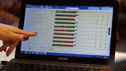
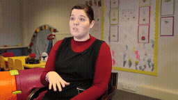
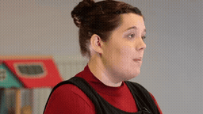
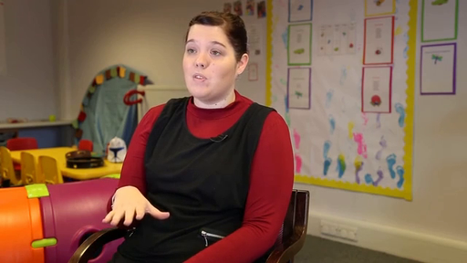
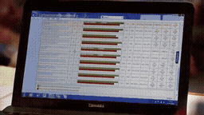
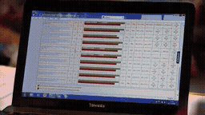

# 5개 원본 Local / Image-Past · 보육원 관리자 재등장

[이 실험의 사례 목록](README.md) · [전체 실험](../README.md) · [입력 방식](../../docs/METHODS.md)

서로 다른 5개 FineVideo 원본에서 Local-only와 Local+Oracle Image-Past를 비교합니다.

관찰·해석은 [실험별 결과](../../docs/EXPERIMENTS.md)를 함께 확인하세요.

**GIF는 축소 미리보기(8 FPS)입니다.** 모든 생성 Target은 원본 3초입니다. 미리보기 또는 MP4 링크를 클릭하면 저장소 파일을 열 수 있습니다. 재사용 표시는 같은 원실행을 다시 비교했다는 뜻입니다.

## 실제 입력과 평가용 후속

Local은 생성 조건입니다. 원본 후속은 입력에 넣지 않았습니다.

### Local · 고정 생성 조건

[](../../media/videos/c03b74ab2791cbc6d09852a39462369de59e0f5abc57800fba9ebf623a1fd7de.mp4)

RGB 표시 · 48 frames / 24 FPS · [MP4 파일](../../media/videos/c03b74ab2791cbc6d09852a39462369de59e0f5abc57800fba9ebf623a1fd7de.mp4) · [원본 열기/다운로드](../../media/videos/c03b74ab2791cbc6d09852a39462369de59e0f5abc57800fba9ebf623a1fd7de.mp4?raw=true)

### Oracle · 과거 증거

[](../../media/videos/d8b685f18afe2d3f64783c998d8ca32a5850a57bc1b6ab8bcf3d8debb550cd69.mp4)

RGB 표시 · 72 frames / 24 FPS · [MP4 파일](../../media/videos/d8b685f18afe2d3f64783c998d8ca32a5850a57bc1b6ab8bcf3d8debb550cd69.mp4) · [원본 열기/다운로드](../../media/videos/d8b685f18afe2d3f64783c998d8ca32a5850a57bc1b6ab8bcf3d8debb550cd69.mp4?raw=true)

### 원본 후속 · 생성 입력 제외

[](../../media/videos/721b20f581ff1ade267af5c1679d79c2542763c58b33249926948d13a8dd9c60.mp4)

원본 후속 · 생성 입력 제외 · [MP4 파일](../../media/videos/721b20f581ff1ade267af5c1679d79c2542763c58b33249926948d13a8dd9c60.mp4) · [원본 열기/다운로드](../../media/videos/721b20f581ff1ade267af5c1679d79c2542763c58b33249926948d13a8dd9c60.mp4?raw=true)

### Oracle 이미지 · 실제 frame 36



이미지 조건은 이 한 장을 인코딩했습니다. 영상 조건과 구분합니다.

원본: Kerry Mills | Trainer Assessor · [구간·출처 metadata](../../records/data/five_001_nursery_manager/metadata.json)

## 생성 결과

###  Local-only · seed 42

**신규 실행 · run_001**

[](../../media/videos/4355ba851305f767e18fdab78920feebc207c673744939b9a927ab038cbd11cb.mp4)

[Target MP4](../../media/videos/4355ba851305f767e18fdab78920feebc207c673744939b9a927ab038cbd11cb.mp4) · [원본 열기/다운로드](../../media/videos/4355ba851305f767e18fdab78920feebc207c673744939b9a927ab038cbd11cb.mp4?raw=true) · [Local + Target 5초](../../media/videos/2b0d62e5ea9af1cc627989626aba153af3126a79e19b4006b4171b563b7f7711.mp4) · [원실행 config](../../records/outputs/five_001_nursery_manager/image_past_seed42/local/config.json)

참조: 추가 참조 없음. Local clean prefix + Target noise

<details>
<summary>Prompt · 시간 좌표 · 원실행</summary>

```text
The video returns to the nursery manager's seated interview as she continues speaking.
```

- 참조 모델 좌표: `[0.0000, 0.0417) s`
- Target 모델 좌표: `[6.0833, 9.0833) s`
- 원본 참조 구간: `원본 config 참조`
- 추가 참조 token: 0
- 원실행: `outputs/five_001_nursery_manager/image_past_seed42/local/config.json`

</details>

###  Oracle · Video-Past · seed 42

**신규 실행 · run_002**

[](../../media/videos/925a2cf99fad45b782daff79de99f724aaed6e2e162c972d762a1cb6b09cfbf8.mp4)

[Target MP4](../../media/videos/925a2cf99fad45b782daff79de99f724aaed6e2e162c972d762a1cb6b09cfbf8.mp4) · [원본 열기/다운로드](../../media/videos/925a2cf99fad45b782daff79de99f724aaed6e2e162c972d762a1cb6b09cfbf8.mp4?raw=true) · [Local + Target 5초](../../media/videos/71d5ab3efa626846f5c85357484099dc6ec9cce9503162746d2d4861929d3e3c.mp4) · [원실행 config](../../records/outputs/five_001_nursery_manager/image_past_seed42/oracle/config.json)

참조: Oracle 영상 · 전체 프레임. Local clean prefix + 별도 clean 참조 token + Target noise

[이 조건의 참조 파일](../../media/videos/d8b685f18afe2d3f64783c998d8ca32a5850a57bc1b6ab8bcf3d8debb550cd69.mp4)

<details>
<summary>Prompt · 시간 좌표 · 원실행</summary>

```text
The video returns to the nursery manager's seated interview as she continues speaking.
```

- 참조 모델 좌표: `[0.0000, 0.0417) s`
- Target 모델 좌표: `[6.0833, 9.0833) s`
- 원본 참조 구간: `[48.0000, 51.0000) s`
- 추가 참조 token: 144
- 원실행: `outputs/five_001_nursery_manager/image_past_seed42/oracle/config.json`

</details>
