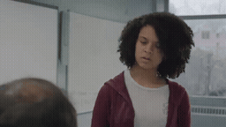
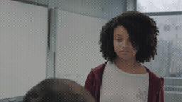
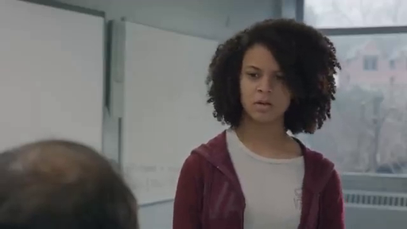
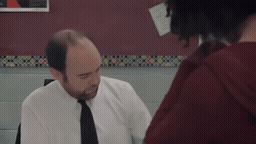
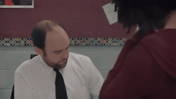

# 5개 원본 Local / Image-Past · 교실 학생의 얼굴 재등장

[이 실험의 사례 목록](README.md) · [전체 실험](../README.md) · [입력 방식](../../docs/METHODS.md)

서로 다른 5개 FineVideo 원본에서 Local-only와 Local+Oracle Image-Past를 비교합니다.

관찰·해석은 [실험별 결과](../../docs/EXPERIMENTS.md)를 함께 확인하세요.

**GIF는 축소 미리보기(8 FPS)입니다.** 모든 생성 Target은 원본 3초입니다. 미리보기 또는 MP4 링크를 클릭하면 저장소 파일을 열 수 있습니다. 재사용 표시는 같은 원실행을 다시 비교했다는 뜻입니다.

## 실제 입력과 평가용 후속

Local은 생성 조건입니다. 원본 후속은 입력에 넣지 않았습니다.

### Local · 고정 생성 조건

[](../../media/videos/af973ca0dc5e47730f88f1317c74db9649fe80347a5f015d94771fb0ab6bbc9f.mp4)

RGB 표시 · 48 frames / 24 FPS · [MP4 파일](../../media/videos/af973ca0dc5e47730f88f1317c74db9649fe80347a5f015d94771fb0ab6bbc9f.mp4) · [원본 열기/다운로드](../../media/videos/af973ca0dc5e47730f88f1317c74db9649fe80347a5f015d94771fb0ab6bbc9f.mp4?raw=true)

### Oracle · 과거 증거

[](../../media/videos/2cdbf4abd1c8ca13bb745e11ed76ac8d646c940fcb30567e3889af52c38652ad.mp4)

RGB 표시 · 72 frames / 24 FPS · [MP4 파일](../../media/videos/2cdbf4abd1c8ca13bb745e11ed76ac8d646c940fcb30567e3889af52c38652ad.mp4) · [원본 열기/다운로드](../../media/videos/2cdbf4abd1c8ca13bb745e11ed76ac8d646c940fcb30567e3889af52c38652ad.mp4?raw=true)

### 원본 후속 · 생성 입력 제외

[](../../media/videos/a5c8f3acf6682d799ba0652dc157059d48b8dd1a8d2000e32c505ac7a2d20a19.mp4)

원본 후속 · 생성 입력 제외 · [MP4 파일](../../media/videos/a5c8f3acf6682d799ba0652dc157059d48b8dd1a8d2000e32c505ac7a2d20a19.mp4) · [원본 열기/다운로드](../../media/videos/a5c8f3acf6682d799ba0652dc157059d48b8dd1a8d2000e32c505ac7a2d20a19.mp4?raw=true)

### Oracle 이미지 · 실제 frame 36



이미지 조건은 이 한 장을 인코딩했습니다. 영상 조건과 구분합니다.

원본: Short Film: Third Period · [구간·출처 metadata](../../records/data/five_003_student_return/metadata.json)

## 생성 결과

###  Local-only · seed 42

**신규 실행 · run_029**

[](../../media/videos/e059247af6cb72c7a374965e5616394854a3e3f45b1d071cae59fef62e754f9c.mp4)

[Target MP4](../../media/videos/e059247af6cb72c7a374965e5616394854a3e3f45b1d071cae59fef62e754f9c.mp4) · [원본 열기/다운로드](../../media/videos/e059247af6cb72c7a374965e5616394854a3e3f45b1d071cae59fef62e754f9c.mp4?raw=true) · [Local + Target 5초](../../media/videos/902a597d3c5ffff0b9146c56ded7575a78c31a73a08797e6b0eecfa5fffcdd0e.mp4) · [원실행 config](../../records/outputs/five_003_student_return/image_past_seed42/local/config.json)

참조: 추가 참조 없음. Local clean prefix + Target noise

<details>
<summary>Prompt · 시간 좌표 · 원실행</summary>

```text
The view returns to the student standing at the teacher's desk as she listens and responds.
```

- 참조 모델 좌표: `[0.0000, 0.0417) s`
- Target 모델 좌표: `[6.0833, 9.0833) s`
- 원본 참조 구간: `원본 config 참조`
- 추가 참조 token: 0
- 원실행: `outputs/five_003_student_return/image_past_seed42/local/config.json`

</details>

###  Oracle · Video-Past · seed 42

**신규 실행 · run_030**

[](../../media/videos/fd0d5f3324907e9e0bc14ccab462165a06833c78e05a9a49f79897a6018ad280.mp4)

[Target MP4](../../media/videos/fd0d5f3324907e9e0bc14ccab462165a06833c78e05a9a49f79897a6018ad280.mp4) · [원본 열기/다운로드](../../media/videos/fd0d5f3324907e9e0bc14ccab462165a06833c78e05a9a49f79897a6018ad280.mp4?raw=true) · [Local + Target 5초](../../media/videos/fdc028bea34bffecea66c58f5874fa28d6272953d0178b3aa59fa346d6351ce0.mp4) · [원실행 config](../../records/outputs/five_003_student_return/image_past_seed42/oracle/config.json)

참조: Oracle 영상 · 전체 프레임. Local clean prefix + 별도 clean 참조 token + Target noise

[이 조건의 참조 파일](../../media/videos/2cdbf4abd1c8ca13bb745e11ed76ac8d646c940fcb30567e3889af52c38652ad.mp4)

<details>
<summary>Prompt · 시간 좌표 · 원실행</summary>

```text
The view returns to the student standing at the teacher's desk as she listens and responds.
```

- 참조 모델 좌표: `[0.0000, 0.0417) s`
- Target 모델 좌표: `[6.0833, 9.0833) s`
- 원본 참조 구간: `[107.0000, 110.0000) s`
- 추가 참조 token: 144
- 원실행: `outputs/five_003_student_return/image_past_seed42/oracle/config.json`

</details>
