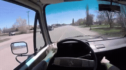
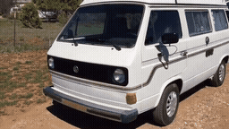
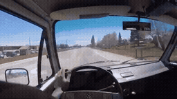
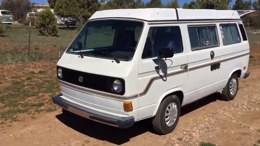
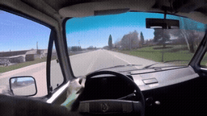
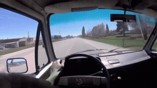

# 5개 원본 Local / Image-Past · 캠퍼 밴 외관으로 시점 전환

[이 실험의 사례 목록](README.md) · [전체 실험](../README.md) · [입력 방식](../../docs/METHODS.md)

서로 다른 5개 FineVideo 원본에서 Local-only와 Local+Oracle Image-Past를 비교합니다.

관찰·해석은 [실험별 결과](../../docs/EXPERIMENTS.md)를 함께 확인하세요.

**GIF는 축소 미리보기(8 FPS)입니다.** 모든 생성 Target은 원본 3초입니다. 미리보기 또는 MP4 링크를 클릭하면 저장소 파일을 열 수 있습니다. 재사용 표시는 같은 원실행을 다시 비교했다는 뜻입니다.

## 실제 입력과 평가용 후속

Local은 생성 조건입니다. 원본 후속은 입력에 넣지 않았습니다.

### Local · 고정 생성 조건

[](../../media/videos/03b21a0e48d639865fddad345ed89a316b202dd6e88187af24b98b7471bde7e7.mp4)

RGB 표시 · 48 frames / 24 FPS · [MP4 파일](../../media/videos/03b21a0e48d639865fddad345ed89a316b202dd6e88187af24b98b7471bde7e7.mp4) · [원본 열기/다운로드](../../media/videos/03b21a0e48d639865fddad345ed89a316b202dd6e88187af24b98b7471bde7e7.mp4?raw=true)

### Oracle · 과거 증거

[](../../media/videos/e33850631fcd7e747aaf2538e358829bedc976dfecc83af5ff5b2748314a5338.mp4)

RGB 표시 · 72 frames / 24 FPS · [MP4 파일](../../media/videos/e33850631fcd7e747aaf2538e358829bedc976dfecc83af5ff5b2748314a5338.mp4) · [원본 열기/다운로드](../../media/videos/e33850631fcd7e747aaf2538e358829bedc976dfecc83af5ff5b2748314a5338.mp4?raw=true)

### 원본 후속 · 생성 입력 제외

[](../../media/videos/b44c687f4f87587bace865f6293b91f8b43a1e48ea904ffca70e1f2e30d5643a.mp4)

원본 후속 · 생성 입력 제외 · [MP4 파일](../../media/videos/b44c687f4f87587bace865f6293b91f8b43a1e48ea904ffca70e1f2e30d5643a.mp4) · [원본 열기/다운로드](../../media/videos/b44c687f4f87587bace865f6293b91f8b43a1e48ea904ffca70e1f2e30d5643a.mp4?raw=true)

### Oracle 이미지 · 실제 frame 36



이미지 조건은 이 한 장을 인코딩했습니다. 영상 조건과 구분합니다.

원본: 1983 Aircooled Vanagon Subaru JDM 2.5 Conversion Tour · [구간·출처 metadata](../../records/data/five_004_van_exterior/metadata.json)

## 생성 결과

###  Local-only · seed 42

**신규 실행 · run_043**

[](../../media/videos/19b428a4d2ccce5d75bcf07bcb960848c4a164f477aba0ca1074f00b25d6d6ac.mp4)

[Target MP4](../../media/videos/19b428a4d2ccce5d75bcf07bcb960848c4a164f477aba0ca1074f00b25d6d6ac.mp4) · [원본 열기/다운로드](../../media/videos/19b428a4d2ccce5d75bcf07bcb960848c4a164f477aba0ca1074f00b25d6d6ac.mp4?raw=true) · [Local + Target 5초](../../media/videos/d649c384ed1838007fd91f370a46fda4284556c71718ce5c8f7941ccd656bd0d.mp4) · [원실행 config](../../records/outputs/five_004_van_exterior/image_past_seed42/local/config.json)

참조: 추가 참조 없음. Local clean prefix + Target noise

<details>
<summary>Prompt · 시간 좌표 · 원실행</summary>

```text
The camera transitions outside to the camper van from the tour as it slowly drives across the driveway.
```

- 참조 모델 좌표: `[0.0000, 0.0417) s`
- Target 모델 좌표: `[6.0833, 9.0833) s`
- 원본 참조 구간: `원본 config 참조`
- 추가 참조 token: 0
- 원실행: `outputs/five_004_van_exterior/image_past_seed42/local/config.json`

</details>

###  Oracle · Video-Past · seed 42

**신규 실행 · run_044**

[](../../media/videos/db8048153744ff0655b43d50af02cdb2eac672c257c8facab712a4677b595cc9.mp4)

[Target MP4](../../media/videos/db8048153744ff0655b43d50af02cdb2eac672c257c8facab712a4677b595cc9.mp4) · [원본 열기/다운로드](../../media/videos/db8048153744ff0655b43d50af02cdb2eac672c257c8facab712a4677b595cc9.mp4?raw=true) · [Local + Target 5초](../../media/videos/6535911ac31f5aca75de0910d61a989e21a02aaa9fd19565d46c5188a9a5dfca.mp4) · [원실행 config](../../records/outputs/five_004_van_exterior/image_past_seed42/oracle/config.json)

참조: Oracle 영상 · 전체 프레임. Local clean prefix + 별도 clean 참조 token + Target noise

[이 조건의 참조 파일](../../media/videos/e33850631fcd7e747aaf2538e358829bedc976dfecc83af5ff5b2748314a5338.mp4)

<details>
<summary>Prompt · 시간 좌표 · 원실행</summary>

```text
The camera transitions outside to the camper van from the tour as it slowly drives across the driveway.
```

- 참조 모델 좌표: `[0.0000, 0.0417) s`
- Target 모델 좌표: `[6.0833, 9.0833) s`
- 원본 참조 구간: `[138.0000, 141.0000) s`
- 추가 참조 token: 144
- 원실행: `outputs/five_004_van_exterior/image_past_seed42/oracle/config.json`

</details>
