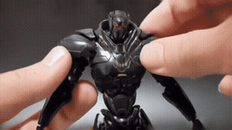
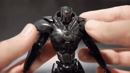

# 5개 사례 전체 2×2 · 로봇 모형의 가려졌던 머리

[이 실험의 사례 목록](README.md) · [전체 실험](../README.md) · [입력 방식](../../docs/METHODS.md)

Local과 Image-Past는 재사용하고 Image-Target / Video-Past / Video-Target을 추가했습니다.

관찰·해석은 [실험별 결과](../../docs/EXPERIMENTS.md)를 함께 확인하세요.

**GIF는 축소 미리보기(8 FPS)입니다.** 모든 생성 Target은 원본 3초입니다. 미리보기 또는 MP4 링크를 클릭하면 저장소 파일을 열 수 있습니다. 재사용 표시는 같은 원실행을 다시 비교했다는 뜻입니다.

## 실제 입력과 평가용 후속

Local은 생성 조건입니다. 원본 후속은 입력에 넣지 않았습니다.

### Local · 고정 생성 조건

[](../../media/videos/d5f6a81366e9ce8d9cca51f3c6a6d2e4984ec9fc2f7145b9d7f144a85bd5e0db.mp4)

RGB 표시 · 48 frames / 24 FPS · [MP4 파일](../../media/videos/d5f6a81366e9ce8d9cca51f3c6a6d2e4984ec9fc2f7145b9d7f144a85bd5e0db.mp4) · [원본 열기/다운로드](../../media/videos/d5f6a81366e9ce8d9cca51f3c6a6d2e4984ec9fc2f7145b9d7f144a85bd5e0db.mp4?raw=true)

### Oracle · 과거 증거

[](../../media/videos/e15ae741c1e79a9d6f8026dbc0ec88969b744c7d050c4e98aa836f211d4aa5fe.mp4)

RGB 표시 · 72 frames / 24 FPS · [MP4 파일](../../media/videos/e15ae741c1e79a9d6f8026dbc0ec88969b744c7d050c4e98aa836f211d4aa5fe.mp4) · [원본 열기/다운로드](../../media/videos/e15ae741c1e79a9d6f8026dbc0ec88969b744c7d050c4e98aa836f211d4aa5fe.mp4?raw=true)

### 원본 후속 · 생성 입력 제외

[](../../media/videos/7fd86bac820db09bbed5316b7ffdbc82c7efae238d4d2638a6792064458d0e82.mp4)

원본 후속 · 생성 입력 제외 · [MP4 파일](../../media/videos/7fd86bac820db09bbed5316b7ffdbc82c7efae238d4d2638a6792064458d0e82.mp4) · [원본 열기/다운로드](../../media/videos/7fd86bac820db09bbed5316b7ffdbc82c7efae238d4d2638a6792064458d0e82.mp4?raw=true)

### Oracle 이미지 · 실제 frame 36


이미지 조건은 이 한 장을 인코딩했습니다. 영상 조건과 구분합니다.

원본: HG Obsidian Fury Review (Pacific Rim Uprising) · [구간·출처 metadata](../../records/data/five_002_robot_head/metadata.json)

## 생성 결과

###  Local-only · seed 42

**재사용 · run_015**

[](../../media/videos/4a0c89a0f12fcea5df162189cc7442cef5e954fdf595e51a1c39d17480e31ae1.mp4)

[Target MP4](../../media/videos/4a0c89a0f12fcea5df162189cc7442cef5e954fdf595e51a1c39d17480e31ae1.mp4) · [원본 열기/다운로드](../../media/videos/4a0c89a0f12fcea5df162189cc7442cef5e954fdf595e51a1c39d17480e31ae1.mp4?raw=true) · [Local + Target 5초](../../media/videos/2a7803c4fbea9868dffa3fc4a4c040f252f219fc0d7ca4bc7e44c5cafa165d22.mp4) · [원실행 config](../../records/outputs/five_002_robot_head/image_past_seed42/local/config.json)

참조: 추가 참조 없음. Local clean prefix + Target noise

<details>
<summary>Prompt · 시간 좌표 · 원실행</summary>

```text
The view switches to the same robot model posed on its display turntable, showing its head and upper body.
```

- 참조 모델 좌표: `[0.0000, 0.0417) s`
- Target 모델 좌표: `[6.0833, 9.0833) s`
- 원본 참조 구간: `원본 config 참조`
- 추가 참조 token: 0
- 원실행: `outputs/five_002_robot_head/image_past_seed42/local/config.json`

</details>

###  Oracle · Image-Target · seed 42

**신규 실행 · run_026**

[](../../media/videos/344a9ff92b353c872f2b9771591755b0f04a2875e63ca42aa211003dc21f95f1.mp4)

[Target MP4](../../media/videos/344a9ff92b353c872f2b9771591755b0f04a2875e63ca42aa211003dc21f95f1.mp4) · [원본 열기/다운로드](../../media/videos/344a9ff92b353c872f2b9771591755b0f04a2875e63ca42aa211003dc21f95f1.mp4?raw=true) · [Local + Target 5초](../../media/videos/376c0c1cfbb2a4211658a23cb51440f4036666985f2b56b32f5413ba4356c76f.mp4) · [원실행 config](../../records/outputs/five_002_robot_head/reference_grid_seed42/image_target/config.json)

참조: Oracle 이미지 · frame 36. Local clean prefix + 별도 clean 참조 token + Target noise

[이 조건의 참조 파일](../../media/stills/five_002_robot_head_oracle_frame36.png)

<details>
<summary>Prompt · 시간 좌표 · 원실행</summary>

```text
The view switches to the same robot model posed on its display turntable, showing its head and upper body.
```

- 참조 모델 좌표: `[6.0833, 6.1250) s`
- Target 모델 좌표: `[6.0833, 9.0833) s`
- 원본 참조 구간: `[147.0000, 150.0000) s`
- 추가 참조 token: 144
- 원실행: `outputs/five_002_robot_head/reference_grid_seed42/image_target/config.json`

</details>

###  Oracle · Video-Past · seed 42

**신규 실행 · run_027**

[](../../media/videos/c48aa7d4f054f19541a9ade2e22f3cc4ebe90ccc35aaf1efa96200cb89f620b8.mp4)

[Target MP4](../../media/videos/c48aa7d4f054f19541a9ade2e22f3cc4ebe90ccc35aaf1efa96200cb89f620b8.mp4) · [원본 열기/다운로드](../../media/videos/c48aa7d4f054f19541a9ade2e22f3cc4ebe90ccc35aaf1efa96200cb89f620b8.mp4?raw=true) · [Local + Target 5초](../../media/videos/6cca90e58a1da2887bb6ccb7fea1d68c01b497dc22a984f9732771c6fc880862.mp4) · [원실행 config](../../records/outputs/five_002_robot_head/reference_grid_seed42/video_past/config.json)

참조: Oracle 영상 · 전체 프레임. Local clean prefix + 별도 clean 참조 token + Target noise

[이 조건의 참조 파일](../../media/videos/e15ae741c1e79a9d6f8026dbc0ec88969b744c7d050c4e98aa836f211d4aa5fe.mp4)

<details>
<summary>Prompt · 시간 좌표 · 원실행</summary>

```text
The view switches to the same robot model posed on its display turntable, showing its head and upper body.
```

- 참조 모델 좌표: `[0.0000, 3.0417) s`
- Target 모델 좌표: `[6.0833, 9.0833) s`
- 원본 참조 구간: `[147.0000, 150.0000) s`
- 추가 참조 token: 1440
- 원실행: `outputs/five_002_robot_head/reference_grid_seed42/video_past/config.json`

</details>

###  Oracle · Video-Past · seed 42

**재사용 · run_016**

[](../../media/videos/2dd4d40f74bf9c0403fcec03711e3d394dfd3325b7359cb6be3174d52e2b2368.mp4)

[Target MP4](../../media/videos/2dd4d40f74bf9c0403fcec03711e3d394dfd3325b7359cb6be3174d52e2b2368.mp4) · [원본 열기/다운로드](../../media/videos/2dd4d40f74bf9c0403fcec03711e3d394dfd3325b7359cb6be3174d52e2b2368.mp4?raw=true) · [Local + Target 5초](../../media/videos/e8e96399bf10563ed1b72a4b14be2442da558e2f2046be6bb5fd7ed5db60a4e0.mp4) · [원실행 config](../../records/outputs/five_002_robot_head/image_past_seed42/oracle/config.json)

참조: Oracle 영상 · 전체 프레임. Local clean prefix + 별도 clean 참조 token + Target noise

[이 조건의 참조 파일](../../media/videos/e15ae741c1e79a9d6f8026dbc0ec88969b744c7d050c4e98aa836f211d4aa5fe.mp4)

<details>
<summary>Prompt · 시간 좌표 · 원실행</summary>

```text
The view switches to the same robot model posed on its display turntable, showing its head and upper body.
```

- 참조 모델 좌표: `[0.0000, 0.0417) s`
- Target 모델 좌표: `[6.0833, 9.0833) s`
- 원본 참조 구간: `[147.0000, 150.0000) s`
- 추가 참조 token: 144
- 원실행: `outputs/five_002_robot_head/image_past_seed42/oracle/config.json`

</details>

###  Oracle · Video-Target · seed 42

**신규 실행 · run_028**

[](../../media/videos/e2b115a02d0047c4ff057c2ae18af52c82669b2ab189c5b49c0d5dbcd1a94ee8.mp4)

[Target MP4](../../media/videos/e2b115a02d0047c4ff057c2ae18af52c82669b2ab189c5b49c0d5dbcd1a94ee8.mp4) · [원본 열기/다운로드](../../media/videos/e2b115a02d0047c4ff057c2ae18af52c82669b2ab189c5b49c0d5dbcd1a94ee8.mp4?raw=true) · [Local + Target 5초](../../media/videos/4f9b448385f1dad6fcbc7d925ac17d8c84c254899c17580161d84987d30a9e3c.mp4) · [원실행 config](../../records/outputs/five_002_robot_head/reference_grid_seed42/video_target/config.json)

참조: Oracle 영상 · 전체 프레임. Local clean prefix + 별도 clean 참조 token + Target noise

[이 조건의 참조 파일](../../media/videos/e15ae741c1e79a9d6f8026dbc0ec88969b744c7d050c4e98aa836f211d4aa5fe.mp4)

<details>
<summary>Prompt · 시간 좌표 · 원실행</summary>

```text
The view switches to the same robot model posed on its display turntable, showing its head and upper body.
```

- 참조 모델 좌표: `[6.0833, 9.1250) s`
- Target 모델 좌표: `[6.0833, 9.0833) s`
- 원본 참조 구간: `[147.0000, 150.0000) s`
- 추가 참조 token: 1440
- 원실행: `outputs/five_002_robot_head/reference_grid_seed42/video_target/config.json`

</details>
