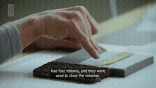
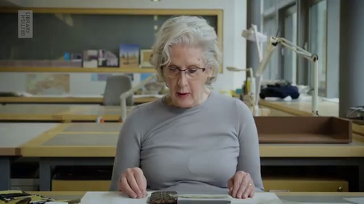
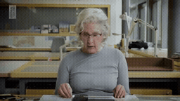
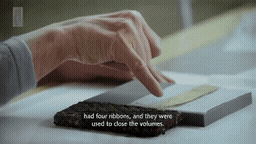

# 5개 사례 전체 2×2 · 보존 작업자의 얼굴 재등장

[이 실험의 사례 목록](README.md) · [전체 실험](../README.md) · [입력 방식](../../docs/METHODS.md)

Local과 Image-Past는 재사용하고 Image-Target / Video-Past / Video-Target을 추가했습니다.

관찰·해석은 [실험별 결과](../../docs/EXPERIMENTS.md)를 함께 확인하세요.

**GIF는 축소 미리보기(8 FPS)입니다.** 모든 생성 Target은 원본 3초입니다. 미리보기 또는 MP4 링크를 클릭하면 저장소 파일을 열 수 있습니다. 재사용 표시는 같은 원실행을 다시 비교했다는 뜻입니다.

## 실제 입력과 평가용 후속

Local은 생성 조건입니다. 원본 후속은 입력에 넣지 않았습니다.

### Local · 고정 생성 조건

[](../../media/videos/16c72b537953bab48122204bddffdbf880fbc1c8a55c3d74073ec4b2bf5bc8e8.mp4)

RGB 표시 · 48 frames / 24 FPS · [MP4 파일](../../media/videos/16c72b537953bab48122204bddffdbf880fbc1c8a55c3d74073ec4b2bf5bc8e8.mp4) · [원본 열기/다운로드](../../media/videos/16c72b537953bab48122204bddffdbf880fbc1c8a55c3d74073ec4b2bf5bc8e8.mp4?raw=true)

### Oracle · 과거 증거

[](../../media/videos/043b280c2f5d90c63b8c4df759e5accad5931d9c1abeff3c3d1ccf33ce09edbb.mp4)

RGB 표시 · 72 frames / 24 FPS · [MP4 파일](../../media/videos/043b280c2f5d90c63b8c4df759e5accad5931d9c1abeff3c3d1ccf33ce09edbb.mp4) · [원본 열기/다운로드](../../media/videos/043b280c2f5d90c63b8c4df759e5accad5931d9c1abeff3c3d1ccf33ce09edbb.mp4?raw=true)

### 원본 후속 · 생성 입력 제외

[](../../media/videos/9e8d86af098e2df1ce18e10fe7c47eabfcc5ed15dcc009cb2dcad403d90daa2f.mp4)

원본 후속 · 생성 입력 제외 · [MP4 파일](../../media/videos/9e8d86af098e2df1ce18e10fe7c47eabfcc5ed15dcc009cb2dcad403d90daa2f.mp4) · [원본 열기/다운로드](../../media/videos/9e8d86af098e2df1ce18e10fe7c47eabfcc5ed15dcc009cb2dcad403d90daa2f.mp4?raw=true)

### Oracle 이미지 · 실제 frame 36



이미지 조건은 이 한 장을 인코딩했습니다. 영상 조건과 구분합니다.

원본: Cleaning a tiny 500-year-old embroidered book | In the Conservation Studio | British Library · [구간·출처 metadata](../../records/data/five_005_conservator/metadata.json)

## 생성 결과

###  Local-only · seed 42

**재사용 · run_057**

[](../../media/videos/005b3bfdcb07fe347b149c349026cb1ed3da658e6a61301bff8b365760d550a8.mp4)

[Target MP4](../../media/videos/005b3bfdcb07fe347b149c349026cb1ed3da658e6a61301bff8b365760d550a8.mp4) · [원본 열기/다운로드](../../media/videos/005b3bfdcb07fe347b149c349026cb1ed3da658e6a61301bff8b365760d550a8.mp4?raw=true) · [Local + Target 5초](../../media/videos/26bfc5f6b951f591a7492bb58c1ea5fa206ea75d116f7f4d5b7a3c7ac68a3e7d.mp4) · [원실행 config](../../records/outputs/five_005_conservator/image_past_seed42/local/config.json)

참조: 추가 참조 없음. Local clean prefix + Target noise

<details>
<summary>Prompt · 시간 좌표 · 원실행</summary>

```text
The camera returns to the textile conservator at the workbench, showing her face as she looks down and resumes working.
```

- 참조 모델 좌표: `[0.0000, 0.0417) s`
- Target 모델 좌표: `[6.0833, 9.0833) s`
- 원본 참조 구간: `원본 config 참조`
- 추가 참조 token: 0
- 원실행: `outputs/five_005_conservator/image_past_seed42/local/config.json`

</details>

###  Oracle · Image-Target · seed 42

**신규 실행 · run_068**

[](../../media/videos/7d2d6115a8edc55f0869f84b809b9d9dc2962846280e800f7fa1da843b223e4d.mp4)

[Target MP4](../../media/videos/7d2d6115a8edc55f0869f84b809b9d9dc2962846280e800f7fa1da843b223e4d.mp4) · [원본 열기/다운로드](../../media/videos/7d2d6115a8edc55f0869f84b809b9d9dc2962846280e800f7fa1da843b223e4d.mp4?raw=true) · [Local + Target 5초](../../media/videos/a3b689b42d1b25bc88cd79614200a7a20e4bc4f74de6011dfbdcdd02cdecd978.mp4) · [원실행 config](../../records/outputs/five_005_conservator/reference_grid_seed42/image_target/config.json)

참조: Oracle 이미지 · frame 36. Local clean prefix + 별도 clean 참조 token + Target noise

[이 조건의 참조 파일](../../media/stills/five_005_conservator_oracle_frame36.png)

<details>
<summary>Prompt · 시간 좌표 · 원실행</summary>

```text
The camera returns to the textile conservator at the workbench, showing her face as she looks down and resumes working.
```

- 참조 모델 좌표: `[6.0833, 6.1250) s`
- Target 모델 좌표: `[6.0833, 9.0833) s`
- 원본 참조 구간: `[45.5000, 48.5000) s`
- 추가 참조 token: 144
- 원실행: `outputs/five_005_conservator/reference_grid_seed42/image_target/config.json`

</details>

###  Oracle · Video-Past · seed 42

**신규 실행 · run_069**

[](../../media/videos/635ce4475e920af26526fc5c349d7de5c18443a3adfcb909c5df6b68d95f7f06.mp4)

[Target MP4](../../media/videos/635ce4475e920af26526fc5c349d7de5c18443a3adfcb909c5df6b68d95f7f06.mp4) · [원본 열기/다운로드](../../media/videos/635ce4475e920af26526fc5c349d7de5c18443a3adfcb909c5df6b68d95f7f06.mp4?raw=true) · [Local + Target 5초](../../media/videos/db9bf3a04b8a6632f524c519f1086316869935d7447df8d345840b8179895ef1.mp4) · [원실행 config](../../records/outputs/five_005_conservator/reference_grid_seed42/video_past/config.json)

참조: Oracle 영상 · 전체 프레임. Local clean prefix + 별도 clean 참조 token + Target noise

[이 조건의 참조 파일](../../media/videos/043b280c2f5d90c63b8c4df759e5accad5931d9c1abeff3c3d1ccf33ce09edbb.mp4)

<details>
<summary>Prompt · 시간 좌표 · 원실행</summary>

```text
The camera returns to the textile conservator at the workbench, showing her face as she looks down and resumes working.
```

- 참조 모델 좌표: `[0.0000, 3.0417) s`
- Target 모델 좌표: `[6.0833, 9.0833) s`
- 원본 참조 구간: `[45.5000, 48.5000) s`
- 추가 참조 token: 1440
- 원실행: `outputs/five_005_conservator/reference_grid_seed42/video_past/config.json`

</details>

###  Oracle · Video-Past · seed 42

**재사용 · run_058**

[](../../media/videos/49514a10a20a205616e9881ebc65efcb22e910ac7fe9488509cc486034b08842.mp4)

[Target MP4](../../media/videos/49514a10a20a205616e9881ebc65efcb22e910ac7fe9488509cc486034b08842.mp4) · [원본 열기/다운로드](../../media/videos/49514a10a20a205616e9881ebc65efcb22e910ac7fe9488509cc486034b08842.mp4?raw=true) · [Local + Target 5초](../../media/videos/785b1d602705b182d4ad285f1a8a89e93eacca77dc90d40c26c1201051ebddad.mp4) · [원실행 config](../../records/outputs/five_005_conservator/image_past_seed42/oracle/config.json)

참조: Oracle 영상 · 전체 프레임. Local clean prefix + 별도 clean 참조 token + Target noise

[이 조건의 참조 파일](../../media/videos/043b280c2f5d90c63b8c4df759e5accad5931d9c1abeff3c3d1ccf33ce09edbb.mp4)

<details>
<summary>Prompt · 시간 좌표 · 원실행</summary>

```text
The camera returns to the textile conservator at the workbench, showing her face as she looks down and resumes working.
```

- 참조 모델 좌표: `[0.0000, 0.0417) s`
- Target 모델 좌표: `[6.0833, 9.0833) s`
- 원본 참조 구간: `[45.5000, 48.5000) s`
- 추가 참조 token: 144
- 원실행: `outputs/five_005_conservator/image_past_seed42/oracle/config.json`

</details>

###  Oracle · Video-Target · seed 42

**신규 실행 · run_070**

[](../../media/videos/7f1da43082db4ea7268d18855b15545eb159405c8bfffddd0f33919bfa7f5960.mp4)

[Target MP4](../../media/videos/7f1da43082db4ea7268d18855b15545eb159405c8bfffddd0f33919bfa7f5960.mp4) · [원본 열기/다운로드](../../media/videos/7f1da43082db4ea7268d18855b15545eb159405c8bfffddd0f33919bfa7f5960.mp4?raw=true) · [Local + Target 5초](../../media/videos/16b8e2df75b2ebdd5035ef2e86883a6d462292fc8e917982be9ddc869e68c4c1.mp4) · [원실행 config](../../records/outputs/five_005_conservator/reference_grid_seed42/video_target/config.json)

참조: Oracle 영상 · 전체 프레임. Local clean prefix + 별도 clean 참조 token + Target noise

[이 조건의 참조 파일](../../media/videos/043b280c2f5d90c63b8c4df759e5accad5931d9c1abeff3c3d1ccf33ce09edbb.mp4)

<details>
<summary>Prompt · 시간 좌표 · 원실행</summary>

```text
The camera returns to the textile conservator at the workbench, showing her face as she looks down and resumes working.
```

- 참조 모델 좌표: `[6.0833, 9.1250) s`
- Target 모델 좌표: `[6.0833, 9.0833) s`
- 원본 참조 구간: `[45.5000, 48.5000) s`
- 추가 참조 token: 1440
- 원실행: `outputs/five_005_conservator/reference_grid_seed42/video_target/config.json`

</details>
