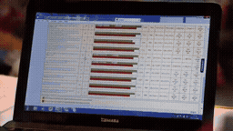
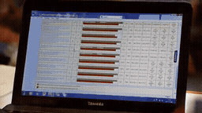
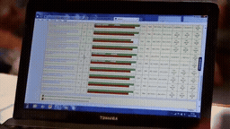
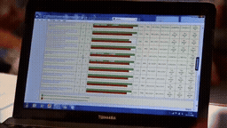
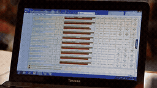
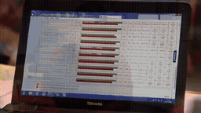
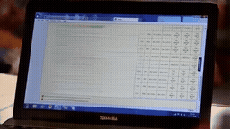
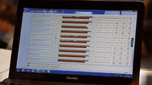
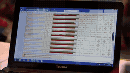
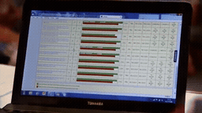

# Prompt P0 / P1 / P2 / P3 · 보육원 관리자 재등장

[이 실험의 사례 목록](README.md) · [전체 실험](../README.md) · [입력 방식](../../docs/METHODS.md)

P1 출력 구도·행동, P2 +연속성, P3 +참조 역할. 같은 prompt의 Local/Image-Past/Video-Past를 비교합니다. P0는 재사용입니다.

관찰·해석은 [실험별 결과](../../docs/EXPERIMENTS.md)를 함께 확인하세요.

**GIF는 축소 미리보기(8 FPS)입니다.** 모든 생성 Target은 원본 3초입니다. 미리보기 또는 MP4 링크를 클릭하면 저장소 파일을 열 수 있습니다. 재사용 표시는 같은 원실행을 다시 비교했다는 뜻입니다.

## 실제 입력과 평가용 후속

Local은 생성 조건입니다. 원본 후속은 입력에 넣지 않았습니다.

### Local · 고정 생성 조건

[](../../media/videos/c03b74ab2791cbc6d09852a39462369de59e0f5abc57800fba9ebf623a1fd7de.mp4)

RGB 표시 · 48 frames / 24 FPS · [MP4 파일](../../media/videos/c03b74ab2791cbc6d09852a39462369de59e0f5abc57800fba9ebf623a1fd7de.mp4) · [원본 열기/다운로드](../../media/videos/c03b74ab2791cbc6d09852a39462369de59e0f5abc57800fba9ebf623a1fd7de.mp4?raw=true)

### Oracle · 과거 증거

[](../../media/videos/d8b685f18afe2d3f64783c998d8ca32a5850a57bc1b6ab8bcf3d8debb550cd69.mp4)

RGB 표시 · 72 frames / 24 FPS · [MP4 파일](../../media/videos/d8b685f18afe2d3f64783c998d8ca32a5850a57bc1b6ab8bcf3d8debb550cd69.mp4) · [원본 열기/다운로드](../../media/videos/d8b685f18afe2d3f64783c998d8ca32a5850a57bc1b6ab8bcf3d8debb550cd69.mp4?raw=true)

### 원본 후속 · 생성 입력 제외

[](../../media/videos/721b20f581ff1ade267af5c1679d79c2542763c58b33249926948d13a8dd9c60.mp4)

원본 후속 · 생성 입력 제외 · [MP4 파일](../../media/videos/721b20f581ff1ade267af5c1679d79c2542763c58b33249926948d13a8dd9c60.mp4) · [원본 열기/다운로드](../../media/videos/721b20f581ff1ade267af5c1679d79c2542763c58b33249926948d13a8dd9c60.mp4?raw=true)

### Oracle 이미지 · 실제 frame 36


이미지 조건은 이 한 장을 인코딩했습니다. 영상 조건과 구분합니다.

원본: Kerry Mills | Trainer Assessor · [구간·출처 metadata](../../records/data/five_001_nursery_manager/metadata.json)

## 생성 결과

### P0 Local-only · seed 42

**재사용 · run_001**

[](../../media/videos/4355ba851305f767e18fdab78920feebc207c673744939b9a927ab038cbd11cb.mp4)

[Target MP4](../../media/videos/4355ba851305f767e18fdab78920feebc207c673744939b9a927ab038cbd11cb.mp4) · [원본 열기/다운로드](../../media/videos/4355ba851305f767e18fdab78920feebc207c673744939b9a927ab038cbd11cb.mp4?raw=true) · [Local + Target 5초](../../media/videos/2b0d62e5ea9af1cc627989626aba153af3126a79e19b4006b4171b563b7f7711.mp4) · [원실행 config](../../records/outputs/five_001_nursery_manager/image_past_seed42/local/config.json)

참조: 추가 참조 없음. Local clean prefix + Target noise

<details>
<summary>Prompt · 시간 좌표 · 원실행</summary>

```text
The video returns to the nursery manager's seated interview as she continues speaking.
```

- 참조 모델 좌표: `[0.0000, 0.0417) s`
- Target 모델 좌표: `[6.0833, 9.0833) s`
- 원본 참조 구간: `원본 config 참조`
- 추가 참조 token: 0
- 원실행: `outputs/five_001_nursery_manager/image_past_seed42/local/config.json`

</details>

### P0 Oracle · Video-Past · seed 42

**재사용 · run_002**

[](../../media/videos/925a2cf99fad45b782daff79de99f724aaed6e2e162c972d762a1cb6b09cfbf8.mp4)

[Target MP4](../../media/videos/925a2cf99fad45b782daff79de99f724aaed6e2e162c972d762a1cb6b09cfbf8.mp4) · [원본 열기/다운로드](../../media/videos/925a2cf99fad45b782daff79de99f724aaed6e2e162c972d762a1cb6b09cfbf8.mp4?raw=true) · [Local + Target 5초](../../media/videos/71d5ab3efa626846f5c85357484099dc6ec9cce9503162746d2d4861929d3e3c.mp4) · [원실행 config](../../records/outputs/five_001_nursery_manager/image_past_seed42/oracle/config.json)

참조: Oracle 영상 · 전체 프레임. Local clean prefix + 별도 clean 참조 token + Target noise

[이 조건의 참조 파일](../../media/videos/d8b685f18afe2d3f64783c998d8ca32a5850a57bc1b6ab8bcf3d8debb550cd69.mp4)

<details>
<summary>Prompt · 시간 좌표 · 원실행</summary>

```text
The video returns to the nursery manager's seated interview as she continues speaking.
```

- 참조 모델 좌표: `[0.0000, 0.0417) s`
- Target 모델 좌표: `[6.0833, 9.0833) s`
- 원본 참조 구간: `[48.0000, 51.0000) s`
- 추가 참조 token: 144
- 원실행: `outputs/five_001_nursery_manager/image_past_seed42/oracle/config.json`

</details>

### P0 Oracle · Video-Past · seed 42

**재사용 · run_013**

[](../../media/videos/2394e7ea41575d24a91f2831c1c4bb81660f7de5d3ed34e972d13f58c3ed6d14.mp4)

[Target MP4](../../media/videos/2394e7ea41575d24a91f2831c1c4bb81660f7de5d3ed34e972d13f58c3ed6d14.mp4) · [원본 열기/다운로드](../../media/videos/2394e7ea41575d24a91f2831c1c4bb81660f7de5d3ed34e972d13f58c3ed6d14.mp4?raw=true) · [Local + Target 5초](../../media/videos/108a214fa44bc16a9d1140ac9a6b25e0b857fafe93e84330765a8dd84be4a3c4.mp4) · [원실행 config](../../records/outputs/five_001_nursery_manager/reference_grid_seed42/video_past/config.json)

참조: Oracle 영상 · 전체 프레임. Local clean prefix + 별도 clean 참조 token + Target noise

[이 조건의 참조 파일](../../media/videos/d8b685f18afe2d3f64783c998d8ca32a5850a57bc1b6ab8bcf3d8debb550cd69.mp4)

<details>
<summary>Prompt · 시간 좌표 · 원실행</summary>

```text
The video returns to the nursery manager's seated interview as she continues speaking.
```

- 참조 모델 좌표: `[0.0000, 3.0417) s`
- Target 모델 좌표: `[6.0833, 9.0833) s`
- 원본 참조 구간: `[48.0000, 51.0000) s`
- 추가 참조 token: 1440
- 원실행: `outputs/five_001_nursery_manager/reference_grid_seed42/video_past/config.json`

</details>

### P1 Local-only · seed 42

**신규 실행 · run_004**

[](../../media/videos/acb6cdc3c9615d14b54af013cc16877b7c672d9ffa9ac49fd5007916cc1adda4.mp4)

[Target MP4](../../media/videos/acb6cdc3c9615d14b54af013cc16877b7c672d9ffa9ac49fd5007916cc1adda4.mp4) · [원본 열기/다운로드](../../media/videos/acb6cdc3c9615d14b54af013cc16877b7c672d9ffa9ac49fd5007916cc1adda4.mp4?raw=true) · [Local + Target 5초](../../media/videos/1ba288474084161f33a6529432f577319249a64c8a82f229a790ba2b311204e6.mp4) · [원실행 config](../../records/outputs/five_001_nursery_manager/prompt_control_seed42/P1/local/config.json)

참조: 추가 참조 없음. Local clean prefix + Target noise

<details>
<summary>Prompt · 시간 좌표 · 원실행</summary>

```text
The close-up of the laptop ends with a hard cut to an eye-level medium close-up of the same childcare manager seated in the childcare room. The camera views her from a three-quarter side angle and keeps her face and shoulders in frame. She continues speaking and makes a small hand gesture. The camera stays steady throughout the interview shot.
```

- 참조 모델 좌표: `[0.0000, 0.0000) s`
- Target 모델 좌표: `[6.0833, 9.0833) s`
- 원본 참조 구간: `원본 config 참조`
- 추가 참조 token: 0
- 원실행: `outputs/five_001_nursery_manager/prompt_control_seed42/P1/local/config.json`

</details>

### P1 Oracle · Image-Past · seed 42

**신규 실행 · run_003**

[](../../media/videos/35b7c5e6c891f484daac90ae63c18adf74ec1d3b41fadae4c5944b0bb5d3f7dc.mp4)

[Target MP4](../../media/videos/35b7c5e6c891f484daac90ae63c18adf74ec1d3b41fadae4c5944b0bb5d3f7dc.mp4) · [원본 열기/다운로드](../../media/videos/35b7c5e6c891f484daac90ae63c18adf74ec1d3b41fadae4c5944b0bb5d3f7dc.mp4?raw=true) · [Local + Target 5초](../../media/videos/1ee71e3cab6b797167b27b98f4c3bcb7a34311a1943071c9b43df1b8262fdbe9.mp4) · [원실행 config](../../records/outputs/five_001_nursery_manager/prompt_control_seed42/P1/image_past/config.json)

참조: Oracle 이미지 · frame 36. Local clean prefix + 별도 clean 참조 token + Target noise

[이 조건의 참조 파일](../../media/stills/five_001_nursery_manager_oracle_frame36.png)

<details>
<summary>Prompt · 시간 좌표 · 원실행</summary>

```text
The close-up of the laptop ends with a hard cut to an eye-level medium close-up of the same childcare manager seated in the childcare room. The camera views her from a three-quarter side angle and keeps her face and shoulders in frame. She continues speaking and makes a small hand gesture. The camera stays steady throughout the interview shot.
```

- 참조 모델 좌표: `[0.0000, 0.0417) s`
- Target 모델 좌표: `[6.0833, 9.0833) s`
- 원본 참조 구간: `[48.0000, 51.0000) s`
- 추가 참조 token: 144
- 원실행: `outputs/five_001_nursery_manager/prompt_control_seed42/P1/image_past/config.json`

</details>

### P1 Oracle · Video-Past · seed 42

**신규 실행 · run_005**

[](../../media/videos/1bc15211f7b3de59ccd919b1a8ce7325e9bcb91320ddb51a0bda6f9a8fcedf37.mp4)

[Target MP4](../../media/videos/1bc15211f7b3de59ccd919b1a8ce7325e9bcb91320ddb51a0bda6f9a8fcedf37.mp4) · [원본 열기/다운로드](../../media/videos/1bc15211f7b3de59ccd919b1a8ce7325e9bcb91320ddb51a0bda6f9a8fcedf37.mp4?raw=true) · [Local + Target 5초](../../media/videos/a309b2fa144f2b857403c644bf45c7278efe1110193147d77ab0d09739b8f049.mp4) · [원실행 config](../../records/outputs/five_001_nursery_manager/prompt_control_seed42/P1/video_past/config.json)

참조: Oracle 영상 · 전체 프레임. Local clean prefix + 별도 clean 참조 token + Target noise

[이 조건의 참조 파일](../../media/videos/d8b685f18afe2d3f64783c998d8ca32a5850a57bc1b6ab8bcf3d8debb550cd69.mp4)

<details>
<summary>Prompt · 시간 좌표 · 원실행</summary>

```text
The close-up of the laptop ends with a hard cut to an eye-level medium close-up of the same childcare manager seated in the childcare room. The camera views her from a three-quarter side angle and keeps her face and shoulders in frame. She continues speaking and makes a small hand gesture. The camera stays steady throughout the interview shot.
```

- 참조 모델 좌표: `[0.0000, 3.0417) s`
- Target 모델 좌표: `[6.0833, 9.0833) s`
- 원본 참조 구간: `[48.0000, 51.0000) s`
- 추가 참조 token: 1440
- 원실행: `outputs/five_001_nursery_manager/prompt_control_seed42/P1/video_past/config.json`

</details>

### P2 Local-only · seed 42

**신규 실행 · run_007**

[](../../media/videos/eb10b21f92159e20fe9e85ec0a8902315759a25f9d0c586975151f03508f7b71.mp4)

[Target MP4](../../media/videos/eb10b21f92159e20fe9e85ec0a8902315759a25f9d0c586975151f03508f7b71.mp4) · [원본 열기/다운로드](../../media/videos/eb10b21f92159e20fe9e85ec0a8902315759a25f9d0c586975151f03508f7b71.mp4?raw=true) · [Local + Target 5초](../../media/videos/a5ba6bda62ec86175198348a81e8128545960e6cc624cf0e310f9d75096006ce.mp4) · [원실행 config](../../records/outputs/five_001_nursery_manager/prompt_control_seed42/P2/local/config.json)

참조: 추가 참조 없음. Local clean prefix + Target noise

<details>
<summary>Prompt · 시간 좌표 · 원실행</summary>

```text
The close-up of the laptop ends with a hard cut to an eye-level medium close-up of the same childcare manager seated in the childcare room. The camera views her from a three-quarter side angle and keeps her face and shoulders in frame. She continues speaking and makes a small hand gesture. The camera stays steady throughout the interview shot. The manager's appearance and the recognizable childcare-room setting stay consistent with the earlier interview.
```

- 참조 모델 좌표: `[0.0000, 0.0000) s`
- Target 모델 좌표: `[6.0833, 9.0833) s`
- 원본 참조 구간: `원본 config 참조`
- 추가 참조 token: 0
- 원실행: `outputs/five_001_nursery_manager/prompt_control_seed42/P2/local/config.json`

</details>

### P2 Oracle · Image-Past · seed 42

**신규 실행 · run_006**

[](../../media/videos/87f5afd6adeeda5478615817cd3798a75c2cacf549a096a0e68f8bb37917ef06.mp4)

[Target MP4](../../media/videos/87f5afd6adeeda5478615817cd3798a75c2cacf549a096a0e68f8bb37917ef06.mp4) · [원본 열기/다운로드](../../media/videos/87f5afd6adeeda5478615817cd3798a75c2cacf549a096a0e68f8bb37917ef06.mp4?raw=true) · [Local + Target 5초](../../media/videos/1878545869f6ce030240cf4a6c10114313d918d83e578be6f692c22eabfe87ca.mp4) · [원실행 config](../../records/outputs/five_001_nursery_manager/prompt_control_seed42/P2/image_past/config.json)

참조: Oracle 이미지 · frame 36. Local clean prefix + 별도 clean 참조 token + Target noise

[이 조건의 참조 파일](../../media/stills/five_001_nursery_manager_oracle_frame36.png)

<details>
<summary>Prompt · 시간 좌표 · 원실행</summary>

```text
The close-up of the laptop ends with a hard cut to an eye-level medium close-up of the same childcare manager seated in the childcare room. The camera views her from a three-quarter side angle and keeps her face and shoulders in frame. She continues speaking and makes a small hand gesture. The camera stays steady throughout the interview shot. The manager's appearance and the recognizable childcare-room setting stay consistent with the earlier interview.
```

- 참조 모델 좌표: `[0.0000, 0.0417) s`
- Target 모델 좌표: `[6.0833, 9.0833) s`
- 원본 참조 구간: `[48.0000, 51.0000) s`
- 추가 참조 token: 144
- 원실행: `outputs/five_001_nursery_manager/prompt_control_seed42/P2/image_past/config.json`

</details>

### P2 Oracle · Video-Past · seed 42

**신규 실행 · run_008**

[](../../media/videos/16bcd1d09f3852480be18ca0a04df10e9c30bfc5df06f4359eb8ddd128a71ba9.mp4)

[Target MP4](../../media/videos/16bcd1d09f3852480be18ca0a04df10e9c30bfc5df06f4359eb8ddd128a71ba9.mp4) · [원본 열기/다운로드](../../media/videos/16bcd1d09f3852480be18ca0a04df10e9c30bfc5df06f4359eb8ddd128a71ba9.mp4?raw=true) · [Local + Target 5초](../../media/videos/e0f669982f91f8fc6cb9d03fb1b30a7f5f6e165a5588b73cecea7a6a2184f8fe.mp4) · [원실행 config](../../records/outputs/five_001_nursery_manager/prompt_control_seed42/P2/video_past/config.json)

참조: Oracle 영상 · 전체 프레임. Local clean prefix + 별도 clean 참조 token + Target noise

[이 조건의 참조 파일](../../media/videos/d8b685f18afe2d3f64783c998d8ca32a5850a57bc1b6ab8bcf3d8debb550cd69.mp4)

<details>
<summary>Prompt · 시간 좌표 · 원실행</summary>

```text
The close-up of the laptop ends with a hard cut to an eye-level medium close-up of the same childcare manager seated in the childcare room. The camera views her from a three-quarter side angle and keeps her face and shoulders in frame. She continues speaking and makes a small hand gesture. The camera stays steady throughout the interview shot. The manager's appearance and the recognizable childcare-room setting stay consistent with the earlier interview.
```

- 참조 모델 좌표: `[0.0000, 3.0417) s`
- Target 모델 좌표: `[6.0833, 9.0833) s`
- 원본 참조 구간: `[48.0000, 51.0000) s`
- 추가 참조 token: 1440
- 원실행: `outputs/five_001_nursery_manager/prompt_control_seed42/P2/video_past/config.json`

</details>

### P3 Local-only · seed 42

**신규 실행 · run_010**

[](../../media/videos/2879bc6af39418e2a0bb6a5658d47cd844e2ebbff8cc83e387777f88a528f095.mp4)

[Target MP4](../../media/videos/2879bc6af39418e2a0bb6a5658d47cd844e2ebbff8cc83e387777f88a528f095.mp4) · [원본 열기/다운로드](../../media/videos/2879bc6af39418e2a0bb6a5658d47cd844e2ebbff8cc83e387777f88a528f095.mp4?raw=true) · [Local + Target 5초](../../media/videos/fbd73192810004487c24ab5ed46397b41a7398e989fa9b358883999ff0b25152.mp4) · [원실행 config](../../records/outputs/five_001_nursery_manager/prompt_control_seed42/P3/local/config.json)

참조: 추가 참조 없음. Local clean prefix + Target noise

<details>
<summary>Prompt · 시간 좌표 · 원실행</summary>

```text
The close-up of the laptop ends with a hard cut to an eye-level medium close-up of the same childcare manager seated in the childcare room. The camera views her from a three-quarter side angle and keeps her face and shoulders in frame. She continues speaking and makes a small hand gesture. The camera stays steady throughout the interview shot. The manager's appearance and the recognizable childcare-room setting stay consistent with the earlier interview. The earlier interview provides visual details of the manager and the room. The framing, camera position and ongoing speech follow the new side-angle interview shot described here.
```

- 참조 모델 좌표: `[0.0000, 0.0000) s`
- Target 모델 좌표: `[6.0833, 9.0833) s`
- 원본 참조 구간: `원본 config 참조`
- 추가 참조 token: 0
- 원실행: `outputs/five_001_nursery_manager/prompt_control_seed42/P3/local/config.json`

</details>

### P3 Oracle · Image-Past · seed 42

**신규 실행 · run_009**

[](../../media/videos/5240ff0ed412fbf2b3cd459557a70cdc18b2c5c82bd4f98041f8d2e56fb8f7e6.mp4)

[Target MP4](../../media/videos/5240ff0ed412fbf2b3cd459557a70cdc18b2c5c82bd4f98041f8d2e56fb8f7e6.mp4) · [원본 열기/다운로드](../../media/videos/5240ff0ed412fbf2b3cd459557a70cdc18b2c5c82bd4f98041f8d2e56fb8f7e6.mp4?raw=true) · [Local + Target 5초](../../media/videos/dc62133fd24f173ed5fd583a8d9f9ce6f62423a3e08ef3f3db1c04ff0a9c0d92.mp4) · [원실행 config](../../records/outputs/five_001_nursery_manager/prompt_control_seed42/P3/image_past/config.json)

참조: Oracle 이미지 · frame 36. Local clean prefix + 별도 clean 참조 token + Target noise

[이 조건의 참조 파일](../../media/stills/five_001_nursery_manager_oracle_frame36.png)

<details>
<summary>Prompt · 시간 좌표 · 원실행</summary>

```text
The close-up of the laptop ends with a hard cut to an eye-level medium close-up of the same childcare manager seated in the childcare room. The camera views her from a three-quarter side angle and keeps her face and shoulders in frame. She continues speaking and makes a small hand gesture. The camera stays steady throughout the interview shot. The manager's appearance and the recognizable childcare-room setting stay consistent with the earlier interview. The earlier interview provides visual details of the manager and the room. The framing, camera position and ongoing speech follow the new side-angle interview shot described here.
```

- 참조 모델 좌표: `[0.0000, 0.0417) s`
- Target 모델 좌표: `[6.0833, 9.0833) s`
- 원본 참조 구간: `[48.0000, 51.0000) s`
- 추가 참조 token: 144
- 원실행: `outputs/five_001_nursery_manager/prompt_control_seed42/P3/image_past/config.json`

</details>

### P3 Oracle · Video-Past · seed 42

**신규 실행 · run_011**

[](../../media/videos/a091904c3f308dae877a760a286051488d943a0429c501df6b7472a2deb1bece.mp4)

[Target MP4](../../media/videos/a091904c3f308dae877a760a286051488d943a0429c501df6b7472a2deb1bece.mp4) · [원본 열기/다운로드](../../media/videos/a091904c3f308dae877a760a286051488d943a0429c501df6b7472a2deb1bece.mp4?raw=true) · [Local + Target 5초](../../media/videos/a148e449b4b79bf4308c0df902922fce455e6a18749b53b0ef30e01b7575eb3e.mp4) · [원실행 config](../../records/outputs/five_001_nursery_manager/prompt_control_seed42/P3/video_past/config.json)

참조: Oracle 영상 · 전체 프레임. Local clean prefix + 별도 clean 참조 token + Target noise

[이 조건의 참조 파일](../../media/videos/d8b685f18afe2d3f64783c998d8ca32a5850a57bc1b6ab8bcf3d8debb550cd69.mp4)

<details>
<summary>Prompt · 시간 좌표 · 원실행</summary>

```text
The close-up of the laptop ends with a hard cut to an eye-level medium close-up of the same childcare manager seated in the childcare room. The camera views her from a three-quarter side angle and keeps her face and shoulders in frame. She continues speaking and makes a small hand gesture. The camera stays steady throughout the interview shot. The manager's appearance and the recognizable childcare-room setting stay consistent with the earlier interview. The earlier interview provides visual details of the manager and the room. The framing, camera position and ongoing speech follow the new side-angle interview shot described here.
```

- 참조 모델 좌표: `[0.0000, 3.0417) s`
- Target 모델 좌표: `[6.0833, 9.0833) s`
- 원본 참조 구간: `[48.0000, 51.0000) s`
- 추가 참조 token: 1440
- 원실행: `outputs/five_001_nursery_manager/prompt_control_seed42/P3/video_past/config.json`

</details>
