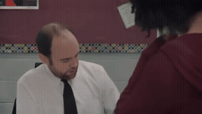
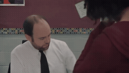
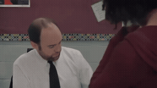
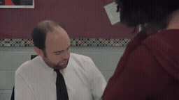

# Prompt P0 / P1 / P2 / P3 · 교실 학생의 얼굴 재등장

[이 실험의 사례 목록](README.md) · [전체 실험](../README.md) · [입력 방식](../../docs/METHODS.md)

P1 출력 구도·행동, P2 +연속성, P3 +참조 역할. 같은 prompt의 Local/Image-Past/Video-Past를 비교합니다. P0는 재사용입니다.

관찰·해석은 [실험별 결과](../../docs/EXPERIMENTS.md)를 함께 확인하세요.

**GIF는 축소 미리보기(8 FPS)입니다.** 모든 생성 Target은 원본 3초입니다. 미리보기 또는 MP4 링크를 클릭하면 저장소 파일을 열 수 있습니다. 재사용 표시는 같은 원실행을 다시 비교했다는 뜻입니다.

## 실제 입력과 평가용 후속

Local은 생성 조건입니다. 원본 후속은 입력에 넣지 않았습니다.

### Local · 고정 생성 조건

[](../../media/videos/af973ca0dc5e47730f88f1317c74db9649fe80347a5f015d94771fb0ab6bbc9f.mp4)

RGB 표시 · 48 frames / 24 FPS · [MP4 파일](../../media/videos/af973ca0dc5e47730f88f1317c74db9649fe80347a5f015d94771fb0ab6bbc9f.mp4) · [원본 열기/다운로드](../../media/videos/af973ca0dc5e47730f88f1317c74db9649fe80347a5f015d94771fb0ab6bbc9f.mp4?raw=true)

### Oracle · 과거 증거

[](../../media/videos/2cdbf4abd1c8ca13bb745e11ed76ac8d646c940fcb30567e3889af52c38652ad.mp4)

RGB 표시 · 72 frames / 24 FPS · [MP4 파일](../../media/videos/2cdbf4abd1c8ca13bb745e11ed76ac8d646c940fcb30567e3889af52c38652ad.mp4) · [원본 열기/다운로드](../../media/videos/2cdbf4abd1c8ca13bb745e11ed76ac8d646c940fcb30567e3889af52c38652ad.mp4?raw=true)

### 원본 후속 · 생성 입력 제외

[](../../media/videos/a5c8f3acf6682d799ba0652dc157059d48b8dd1a8d2000e32c505ac7a2d20a19.mp4)

원본 후속 · 생성 입력 제외 · [MP4 파일](../../media/videos/a5c8f3acf6682d799ba0652dc157059d48b8dd1a8d2000e32c505ac7a2d20a19.mp4) · [원본 열기/다운로드](../../media/videos/a5c8f3acf6682d799ba0652dc157059d48b8dd1a8d2000e32c505ac7a2d20a19.mp4?raw=true)

### Oracle 이미지 · 실제 frame 36


이미지 조건은 이 한 장을 인코딩했습니다. 영상 조건과 구분합니다.

원본: Short Film: Third Period · [구간·출처 metadata](../../records/data/five_003_student_return/metadata.json)

## 생성 결과

### P0 Local-only · seed 42

**재사용 · run_029**

[](../../media/videos/e059247af6cb72c7a374965e5616394854a3e3f45b1d071cae59fef62e754f9c.mp4)

[Target MP4](../../media/videos/e059247af6cb72c7a374965e5616394854a3e3f45b1d071cae59fef62e754f9c.mp4) · [원본 열기/다운로드](../../media/videos/e059247af6cb72c7a374965e5616394854a3e3f45b1d071cae59fef62e754f9c.mp4?raw=true) · [Local + Target 5초](../../media/videos/902a597d3c5ffff0b9146c56ded7575a78c31a73a08797e6b0eecfa5fffcdd0e.mp4) · [원실행 config](../../records/outputs/five_003_student_return/image_past_seed42/local/config.json)

참조: 추가 참조 없음. Local clean prefix + Target noise

<details>
<summary>Prompt · 시간 좌표 · 원실행</summary>

```text
The view returns to the student standing at the teacher's desk as she listens and responds.
```

- 참조 모델 좌표: `[0.0000, 0.0417) s`
- Target 모델 좌표: `[6.0833, 9.0833) s`
- 원본 참조 구간: `원본 config 참조`
- 추가 참조 token: 0
- 원실행: `outputs/five_003_student_return/image_past_seed42/local/config.json`

</details>

### P0 Oracle · Video-Past · seed 42

**재사용 · run_030**

[](../../media/videos/fd0d5f3324907e9e0bc14ccab462165a06833c78e05a9a49f79897a6018ad280.mp4)

[Target MP4](../../media/videos/fd0d5f3324907e9e0bc14ccab462165a06833c78e05a9a49f79897a6018ad280.mp4) · [원본 열기/다운로드](../../media/videos/fd0d5f3324907e9e0bc14ccab462165a06833c78e05a9a49f79897a6018ad280.mp4?raw=true) · [Local + Target 5초](../../media/videos/fdc028bea34bffecea66c58f5874fa28d6272953d0178b3aa59fa346d6351ce0.mp4) · [원실행 config](../../records/outputs/five_003_student_return/image_past_seed42/oracle/config.json)

참조: Oracle 영상 · 전체 프레임. Local clean prefix + 별도 clean 참조 token + Target noise

[이 조건의 참조 파일](../../media/videos/2cdbf4abd1c8ca13bb745e11ed76ac8d646c940fcb30567e3889af52c38652ad.mp4)

<details>
<summary>Prompt · 시간 좌표 · 원실행</summary>

```text
The view returns to the student standing at the teacher's desk as she listens and responds.
```

- 참조 모델 좌표: `[0.0000, 0.0417) s`
- Target 모델 좌표: `[6.0833, 9.0833) s`
- 원본 참조 구간: `[107.0000, 110.0000) s`
- 추가 참조 token: 144
- 원실행: `outputs/five_003_student_return/image_past_seed42/oracle/config.json`

</details>

### P0 Oracle · Video-Past · seed 42

**재사용 · run_041**

[](../../media/videos/f0fc35209ffce27aaae40e176bb6f64b1848be97c31ec57ce834e2efb25ccdeb.mp4)

[Target MP4](../../media/videos/f0fc35209ffce27aaae40e176bb6f64b1848be97c31ec57ce834e2efb25ccdeb.mp4) · [원본 열기/다운로드](../../media/videos/f0fc35209ffce27aaae40e176bb6f64b1848be97c31ec57ce834e2efb25ccdeb.mp4?raw=true) · [Local + Target 5초](../../media/videos/0c08e8381316c6491b23e893874dd212af88efa9f4339d1504e6df3404798d72.mp4) · [원실행 config](../../records/outputs/five_003_student_return/reference_grid_seed42/video_past/config.json)

참조: Oracle 영상 · 전체 프레임. Local clean prefix + 별도 clean 참조 token + Target noise

[이 조건의 참조 파일](../../media/videos/2cdbf4abd1c8ca13bb745e11ed76ac8d646c940fcb30567e3889af52c38652ad.mp4)

<details>
<summary>Prompt · 시간 좌표 · 원실행</summary>

```text
The view returns to the student standing at the teacher's desk as she listens and responds.
```

- 참조 모델 좌표: `[0.0000, 3.0417) s`
- Target 모델 좌표: `[6.0833, 9.0833) s`
- 원본 참조 구간: `[107.0000, 110.0000) s`
- 추가 참조 token: 1440
- 원실행: `outputs/five_003_student_return/reference_grid_seed42/video_past/config.json`

</details>

### P1 Local-only · seed 42

**신규 실행 · run_032**

[](../../media/videos/5ebf5c7abfb8b6f2b442aa915e2bf1d8e6dad1ff3d82efcbe4c510b8970bb96f.mp4)

[Target MP4](../../media/videos/5ebf5c7abfb8b6f2b442aa915e2bf1d8e6dad1ff3d82efcbe4c510b8970bb96f.mp4) · [원본 열기/다운로드](../../media/videos/5ebf5c7abfb8b6f2b442aa915e2bf1d8e6dad1ff3d82efcbe4c510b8970bb96f.mp4?raw=true) · [Local + Target 5초](../../media/videos/952eaaf21c964dac6d57b938c9577000ed51eff4d8d6a193e31917476c3bb5b4.mp4) · [원실행 config](../../records/outputs/five_003_student_return/prompt_control_seed42/P1/local/config.json)

참조: 추가 참조 없음. Local clean prefix + Target noise

<details>
<summary>Prompt · 시간 좌표 · 원실행</summary>

```text
A hard cut switches from the teacher-facing view to a reverse-angle medium close-up of the same student at the teacher's desk. Her face is fully visible as she looks toward the teacher just beside the camera. She listens and gives a brief response with a small nod. The camera stays fixed on the student throughout the shot.
```

- 참조 모델 좌표: `[0.0000, 0.0000) s`
- Target 모델 좌표: `[6.0833, 9.0833) s`
- 원본 참조 구간: `원본 config 참조`
- 추가 참조 token: 0
- 원실행: `outputs/five_003_student_return/prompt_control_seed42/P1/local/config.json`

</details>

### P1 Oracle · Image-Past · seed 42

**신규 실행 · run_031**

[](../../media/videos/2263bf971ad444416ce6e336aa2150b2a69be092047d37b58fe9373b38d486b9.mp4)

[Target MP4](../../media/videos/2263bf971ad444416ce6e336aa2150b2a69be092047d37b58fe9373b38d486b9.mp4) · [원본 열기/다운로드](../../media/videos/2263bf971ad444416ce6e336aa2150b2a69be092047d37b58fe9373b38d486b9.mp4?raw=true) · [Local + Target 5초](../../media/videos/0db0bd7da64fa15e1aadae2baa16356dfdac0ab9b9ba9da4d650233d325f4f17.mp4) · [원실행 config](../../records/outputs/five_003_student_return/prompt_control_seed42/P1/image_past/config.json)

참조: Oracle 이미지 · frame 36. Local clean prefix + 별도 clean 참조 token + Target noise

[이 조건의 참조 파일](../../media/stills/five_003_student_return_oracle_frame36.png)

<details>
<summary>Prompt · 시간 좌표 · 원실행</summary>

```text
A hard cut switches from the teacher-facing view to a reverse-angle medium close-up of the same student at the teacher's desk. Her face is fully visible as she looks toward the teacher just beside the camera. She listens and gives a brief response with a small nod. The camera stays fixed on the student throughout the shot.
```

- 참조 모델 좌표: `[0.0000, 0.0417) s`
- Target 모델 좌표: `[6.0833, 9.0833) s`
- 원본 참조 구간: `[107.0000, 110.0000) s`
- 추가 참조 token: 144
- 원실행: `outputs/five_003_student_return/prompt_control_seed42/P1/image_past/config.json`

</details>

### P1 Oracle · Video-Past · seed 42

**신규 실행 · run_033**

[](../../media/videos/f969759afe612730769669b611d8ffea1b35f2f0f9abaa62939eac8ad519c332.mp4)

[Target MP4](../../media/videos/f969759afe612730769669b611d8ffea1b35f2f0f9abaa62939eac8ad519c332.mp4) · [원본 열기/다운로드](../../media/videos/f969759afe612730769669b611d8ffea1b35f2f0f9abaa62939eac8ad519c332.mp4?raw=true) · [Local + Target 5초](../../media/videos/57e8eb0afc4f6a7f3193e84208de6652195e8c7e086ae62dd571138d82ae0fb6.mp4) · [원실행 config](../../records/outputs/five_003_student_return/prompt_control_seed42/P1/video_past/config.json)

참조: Oracle 영상 · 전체 프레임. Local clean prefix + 별도 clean 참조 token + Target noise

[이 조건의 참조 파일](../../media/videos/2cdbf4abd1c8ca13bb745e11ed76ac8d646c940fcb30567e3889af52c38652ad.mp4)

<details>
<summary>Prompt · 시간 좌표 · 원실행</summary>

```text
A hard cut switches from the teacher-facing view to a reverse-angle medium close-up of the same student at the teacher's desk. Her face is fully visible as she looks toward the teacher just beside the camera. She listens and gives a brief response with a small nod. The camera stays fixed on the student throughout the shot.
```

- 참조 모델 좌표: `[0.0000, 3.0417) s`
- Target 모델 좌표: `[6.0833, 9.0833) s`
- 원본 참조 구간: `[107.0000, 110.0000) s`
- 추가 참조 token: 1440
- 원실행: `outputs/five_003_student_return/prompt_control_seed42/P1/video_past/config.json`

</details>

### P2 Local-only · seed 42

**신규 실행 · run_035**

[](../../media/videos/914d11d8c9a2eb5b3c7b41451cd777f96375006a1bd634144743adc5b8773ed3.mp4)

[Target MP4](../../media/videos/914d11d8c9a2eb5b3c7b41451cd777f96375006a1bd634144743adc5b8773ed3.mp4) · [원본 열기/다운로드](../../media/videos/914d11d8c9a2eb5b3c7b41451cd777f96375006a1bd634144743adc5b8773ed3.mp4?raw=true) · [Local + Target 5초](../../media/videos/b339050a62dabbb67dcefd19e31c1f561b3f5b3350dd686e6c64ca9497801c6f.mp4) · [원실행 config](../../records/outputs/five_003_student_return/prompt_control_seed42/P2/local/config.json)

참조: 추가 참조 없음. Local clean prefix + Target noise

<details>
<summary>Prompt · 시간 좌표 · 원실행</summary>

```text
A hard cut switches from the teacher-facing view to a reverse-angle medium close-up of the same student at the teacher's desk. Her face is fully visible as she looks toward the teacher just beside the camera. She listens and gives a brief response with a small nod. The camera stays fixed on the student throughout the shot. The student's appearance and the teacher's-desk setting stay consistent with the earlier classroom view.
```

- 참조 모델 좌표: `[0.0000, 0.0000) s`
- Target 모델 좌표: `[6.0833, 9.0833) s`
- 원본 참조 구간: `원본 config 참조`
- 추가 참조 token: 0
- 원실행: `outputs/five_003_student_return/prompt_control_seed42/P2/local/config.json`

</details>

### P2 Oracle · Image-Past · seed 42

**신규 실행 · run_034**

[](../../media/videos/995f9e988555fdd4362f07b7d5b2635aa64631b178e03a5ad8cdc21ad2911be0.mp4)

[Target MP4](../../media/videos/995f9e988555fdd4362f07b7d5b2635aa64631b178e03a5ad8cdc21ad2911be0.mp4) · [원본 열기/다운로드](../../media/videos/995f9e988555fdd4362f07b7d5b2635aa64631b178e03a5ad8cdc21ad2911be0.mp4?raw=true) · [Local + Target 5초](../../media/videos/3d75f901d6e53a75cd0b74c238c03eb11abb62c3004b37f4fa79abc8ec7d6b13.mp4) · [원실행 config](../../records/outputs/five_003_student_return/prompt_control_seed42/P2/image_past/config.json)

참조: Oracle 이미지 · frame 36. Local clean prefix + 별도 clean 참조 token + Target noise

[이 조건의 참조 파일](../../media/stills/five_003_student_return_oracle_frame36.png)

<details>
<summary>Prompt · 시간 좌표 · 원실행</summary>

```text
A hard cut switches from the teacher-facing view to a reverse-angle medium close-up of the same student at the teacher's desk. Her face is fully visible as she looks toward the teacher just beside the camera. She listens and gives a brief response with a small nod. The camera stays fixed on the student throughout the shot. The student's appearance and the teacher's-desk setting stay consistent with the earlier classroom view.
```

- 참조 모델 좌표: `[0.0000, 0.0417) s`
- Target 모델 좌표: `[6.0833, 9.0833) s`
- 원본 참조 구간: `[107.0000, 110.0000) s`
- 추가 참조 token: 144
- 원실행: `outputs/five_003_student_return/prompt_control_seed42/P2/image_past/config.json`

</details>

### P2 Oracle · Video-Past · seed 42

**신규 실행 · run_036**

[](../../media/videos/cae06ba31d338760e3ef0b9e463915c1d9ae5405f78377d9e1bafe5d63992418.mp4)

[Target MP4](../../media/videos/cae06ba31d338760e3ef0b9e463915c1d9ae5405f78377d9e1bafe5d63992418.mp4) · [원본 열기/다운로드](../../media/videos/cae06ba31d338760e3ef0b9e463915c1d9ae5405f78377d9e1bafe5d63992418.mp4?raw=true) · [Local + Target 5초](../../media/videos/2e2540814b0a13864de1fafece0ddc29d61b6cfbb8184ad148a6360e98ab0b9f.mp4) · [원실행 config](../../records/outputs/five_003_student_return/prompt_control_seed42/P2/video_past/config.json)

참조: Oracle 영상 · 전체 프레임. Local clean prefix + 별도 clean 참조 token + Target noise

[이 조건의 참조 파일](../../media/videos/2cdbf4abd1c8ca13bb745e11ed76ac8d646c940fcb30567e3889af52c38652ad.mp4)

<details>
<summary>Prompt · 시간 좌표 · 원실행</summary>

```text
A hard cut switches from the teacher-facing view to a reverse-angle medium close-up of the same student at the teacher's desk. Her face is fully visible as she looks toward the teacher just beside the camera. She listens and gives a brief response with a small nod. The camera stays fixed on the student throughout the shot. The student's appearance and the teacher's-desk setting stay consistent with the earlier classroom view.
```

- 참조 모델 좌표: `[0.0000, 3.0417) s`
- Target 모델 좌표: `[6.0833, 9.0833) s`
- 원본 참조 구간: `[107.0000, 110.0000) s`
- 추가 참조 token: 1440
- 원실행: `outputs/five_003_student_return/prompt_control_seed42/P2/video_past/config.json`

</details>

### P3 Local-only · seed 42

**신규 실행 · run_038**

[](../../media/videos/cce1914b28e218d0fc3a738479d33bfaa55c27ec3fcd992d05766b62008b3b95.mp4)

[Target MP4](../../media/videos/cce1914b28e218d0fc3a738479d33bfaa55c27ec3fcd992d05766b62008b3b95.mp4) · [원본 열기/다운로드](../../media/videos/cce1914b28e218d0fc3a738479d33bfaa55c27ec3fcd992d05766b62008b3b95.mp4?raw=true) · [Local + Target 5초](../../media/videos/4190d657169a26757724c663ee8778865650051123cf3018d847f398af640f1c.mp4) · [원실행 config](../../records/outputs/five_003_student_return/prompt_control_seed42/P3/local/config.json)

참조: 추가 참조 없음. Local clean prefix + Target noise

<details>
<summary>Prompt · 시간 좌표 · 원실행</summary>

```text
A hard cut switches from the teacher-facing view to a reverse-angle medium close-up of the same student at the teacher's desk. Her face is fully visible as she looks toward the teacher just beside the camera. She listens and gives a brief response with a small nod. The camera stays fixed on the student throughout the shot. The student's appearance and the teacher's-desk setting stay consistent with the earlier classroom view. The earlier classroom view provides visual details of the student and the surrounding classroom. Her gaze, her response and the camera framing follow the new reverse-angle shot described here.
```

- 참조 모델 좌표: `[0.0000, 0.0000) s`
- Target 모델 좌표: `[6.0833, 9.0833) s`
- 원본 참조 구간: `원본 config 참조`
- 추가 참조 token: 0
- 원실행: `outputs/five_003_student_return/prompt_control_seed42/P3/local/config.json`

</details>

### P3 Oracle · Image-Past · seed 42

**신규 실행 · run_037**

[](../../media/videos/71da72acd78039a3d204ab9372e7fc21c02f68fabbf1a453aaa48ac8855dbb48.mp4)

[Target MP4](../../media/videos/71da72acd78039a3d204ab9372e7fc21c02f68fabbf1a453aaa48ac8855dbb48.mp4) · [원본 열기/다운로드](../../media/videos/71da72acd78039a3d204ab9372e7fc21c02f68fabbf1a453aaa48ac8855dbb48.mp4?raw=true) · [Local + Target 5초](../../media/videos/4de780337372a3d99cbcf70c5e9ec327ac922ceae67107be1ae1723767e8c4a7.mp4) · [원실행 config](../../records/outputs/five_003_student_return/prompt_control_seed42/P3/image_past/config.json)

참조: Oracle 이미지 · frame 36. Local clean prefix + 별도 clean 참조 token + Target noise

[이 조건의 참조 파일](../../media/stills/five_003_student_return_oracle_frame36.png)

<details>
<summary>Prompt · 시간 좌표 · 원실행</summary>

```text
A hard cut switches from the teacher-facing view to a reverse-angle medium close-up of the same student at the teacher's desk. Her face is fully visible as she looks toward the teacher just beside the camera. She listens and gives a brief response with a small nod. The camera stays fixed on the student throughout the shot. The student's appearance and the teacher's-desk setting stay consistent with the earlier classroom view. The earlier classroom view provides visual details of the student and the surrounding classroom. Her gaze, her response and the camera framing follow the new reverse-angle shot described here.
```

- 참조 모델 좌표: `[0.0000, 0.0417) s`
- Target 모델 좌표: `[6.0833, 9.0833) s`
- 원본 참조 구간: `[107.0000, 110.0000) s`
- 추가 참조 token: 144
- 원실행: `outputs/five_003_student_return/prompt_control_seed42/P3/image_past/config.json`

</details>

### P3 Oracle · Video-Past · seed 42

**신규 실행 · run_039**

[](../../media/videos/0460b2fd36d3a2fb4701087ec9029e6e3afbd9dc2dc8165e2b26043358b49a46.mp4)

[Target MP4](../../media/videos/0460b2fd36d3a2fb4701087ec9029e6e3afbd9dc2dc8165e2b26043358b49a46.mp4) · [원본 열기/다운로드](../../media/videos/0460b2fd36d3a2fb4701087ec9029e6e3afbd9dc2dc8165e2b26043358b49a46.mp4?raw=true) · [Local + Target 5초](../../media/videos/a30cdf69387d2ac337e8c632541ed0802c75db77a1308442ff5acf36c0f6f61a.mp4) · [원실행 config](../../records/outputs/five_003_student_return/prompt_control_seed42/P3/video_past/config.json)

참조: Oracle 영상 · 전체 프레임. Local clean prefix + 별도 clean 참조 token + Target noise

[이 조건의 참조 파일](../../media/videos/2cdbf4abd1c8ca13bb745e11ed76ac8d646c940fcb30567e3889af52c38652ad.mp4)

<details>
<summary>Prompt · 시간 좌표 · 원실행</summary>

```text
A hard cut switches from the teacher-facing view to a reverse-angle medium close-up of the same student at the teacher's desk. Her face is fully visible as she looks toward the teacher just beside the camera. She listens and gives a brief response with a small nod. The camera stays fixed on the student throughout the shot. The student's appearance and the teacher's-desk setting stay consistent with the earlier classroom view. The earlier classroom view provides visual details of the student and the surrounding classroom. Her gaze, her response and the camera framing follow the new reverse-angle shot described here.
```

- 참조 모델 좌표: `[0.0000, 3.0417) s`
- Target 모델 좌표: `[6.0833, 9.0833) s`
- 원본 참조 구간: `[107.0000, 110.0000) s`
- 추가 참조 token: 1440
- 원실행: `outputs/five_003_student_return/prompt_control_seed42/P3/video_past/config.json`

</details>
