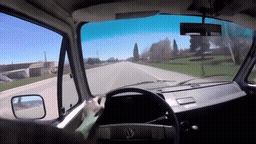
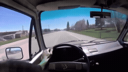
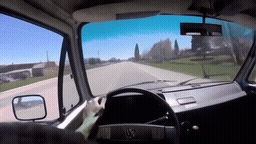
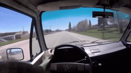
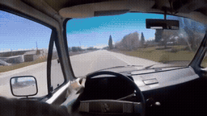
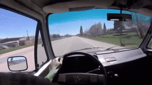
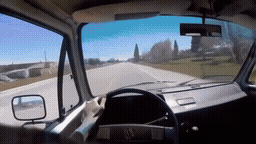

# Prompt P0 / P1 / P2 / P3 · 캠퍼 밴 외관으로 시점 전환

[이 실험의 사례 목록](README.md) · [전체 실험](../README.md) · [입력 방식](../../docs/METHODS.md)

P1 출력 구도·행동, P2 +연속성, P3 +참조 역할. 같은 prompt의 Local/Image-Past/Video-Past를 비교합니다. P0는 재사용입니다.

관찰·해석은 [실험별 결과](../../docs/EXPERIMENTS.md)를 함께 확인하세요.

**GIF는 축소 미리보기(8 FPS)입니다.** 모든 생성 Target은 원본 3초입니다. 미리보기 또는 MP4 링크를 클릭하면 저장소 파일을 열 수 있습니다. 재사용 표시는 같은 원실행을 다시 비교했다는 뜻입니다.

## 실제 입력과 평가용 후속

Local은 생성 조건입니다. 원본 후속은 입력에 넣지 않았습니다.

### Local · 고정 생성 조건

[](../../media/videos/03b21a0e48d639865fddad345ed89a316b202dd6e88187af24b98b7471bde7e7.mp4)

RGB 표시 · 48 frames / 24 FPS · [MP4 파일](../../media/videos/03b21a0e48d639865fddad345ed89a316b202dd6e88187af24b98b7471bde7e7.mp4) · [원본 열기/다운로드](../../media/videos/03b21a0e48d639865fddad345ed89a316b202dd6e88187af24b98b7471bde7e7.mp4?raw=true)

### Oracle · 과거 증거

[](../../media/videos/e33850631fcd7e747aaf2538e358829bedc976dfecc83af5ff5b2748314a5338.mp4)

RGB 표시 · 72 frames / 24 FPS · [MP4 파일](../../media/videos/e33850631fcd7e747aaf2538e358829bedc976dfecc83af5ff5b2748314a5338.mp4) · [원본 열기/다운로드](../../media/videos/e33850631fcd7e747aaf2538e358829bedc976dfecc83af5ff5b2748314a5338.mp4?raw=true)

### 원본 후속 · 생성 입력 제외

[](../../media/videos/b44c687f4f87587bace865f6293b91f8b43a1e48ea904ffca70e1f2e30d5643a.mp4)

원본 후속 · 생성 입력 제외 · [MP4 파일](../../media/videos/b44c687f4f87587bace865f6293b91f8b43a1e48ea904ffca70e1f2e30d5643a.mp4) · [원본 열기/다운로드](../../media/videos/b44c687f4f87587bace865f6293b91f8b43a1e48ea904ffca70e1f2e30d5643a.mp4?raw=true)

### Oracle 이미지 · 실제 frame 36


이미지 조건은 이 한 장을 인코딩했습니다. 영상 조건과 구분합니다.

원본: 1983 Aircooled Vanagon Subaru JDM 2.5 Conversion Tour · [구간·출처 metadata](../../records/data/five_004_van_exterior/metadata.json)

## 생성 결과

### P0 Local-only · seed 42

**재사용 · run_043**

[](../../media/videos/19b428a4d2ccce5d75bcf07bcb960848c4a164f477aba0ca1074f00b25d6d6ac.mp4)

[Target MP4](../../media/videos/19b428a4d2ccce5d75bcf07bcb960848c4a164f477aba0ca1074f00b25d6d6ac.mp4) · [원본 열기/다운로드](../../media/videos/19b428a4d2ccce5d75bcf07bcb960848c4a164f477aba0ca1074f00b25d6d6ac.mp4?raw=true) · [Local + Target 5초](../../media/videos/d649c384ed1838007fd91f370a46fda4284556c71718ce5c8f7941ccd656bd0d.mp4) · [원실행 config](../../records/outputs/five_004_van_exterior/image_past_seed42/local/config.json)

참조: 추가 참조 없음. Local clean prefix + Target noise

<details>
<summary>Prompt · 시간 좌표 · 원실행</summary>

```text
The camera transitions outside to the camper van from the tour as it slowly drives across the driveway.
```

- 참조 모델 좌표: `[0.0000, 0.0417) s`
- Target 모델 좌표: `[6.0833, 9.0833) s`
- 원본 참조 구간: `원본 config 참조`
- 추가 참조 token: 0
- 원실행: `outputs/five_004_van_exterior/image_past_seed42/local/config.json`

</details>

### P0 Oracle · Video-Past · seed 42

**재사용 · run_044**

[](../../media/videos/db8048153744ff0655b43d50af02cdb2eac672c257c8facab712a4677b595cc9.mp4)

[Target MP4](../../media/videos/db8048153744ff0655b43d50af02cdb2eac672c257c8facab712a4677b595cc9.mp4) · [원본 열기/다운로드](../../media/videos/db8048153744ff0655b43d50af02cdb2eac672c257c8facab712a4677b595cc9.mp4?raw=true) · [Local + Target 5초](../../media/videos/6535911ac31f5aca75de0910d61a989e21a02aaa9fd19565d46c5188a9a5dfca.mp4) · [원실행 config](../../records/outputs/five_004_van_exterior/image_past_seed42/oracle/config.json)

참조: Oracle 영상 · 전체 프레임. Local clean prefix + 별도 clean 참조 token + Target noise

[이 조건의 참조 파일](../../media/videos/e33850631fcd7e747aaf2538e358829bedc976dfecc83af5ff5b2748314a5338.mp4)

<details>
<summary>Prompt · 시간 좌표 · 원실행</summary>

```text
The camera transitions outside to the camper van from the tour as it slowly drives across the driveway.
```

- 참조 모델 좌표: `[0.0000, 0.0417) s`
- Target 모델 좌표: `[6.0833, 9.0833) s`
- 원본 참조 구간: `[138.0000, 141.0000) s`
- 추가 참조 token: 144
- 원실행: `outputs/five_004_van_exterior/image_past_seed42/oracle/config.json`

</details>

### P0 Oracle · Video-Past · seed 42

**재사용 · run_055**

[](../../media/videos/b1253c3ffc2ec2ff4d6fa36c3be535dac0865efb01ac6e1b4ae6873a568df09f.mp4)

[Target MP4](../../media/videos/b1253c3ffc2ec2ff4d6fa36c3be535dac0865efb01ac6e1b4ae6873a568df09f.mp4) · [원본 열기/다운로드](../../media/videos/b1253c3ffc2ec2ff4d6fa36c3be535dac0865efb01ac6e1b4ae6873a568df09f.mp4?raw=true) · [Local + Target 5초](../../media/videos/989e109b86dac45f5674ff7490f0dd4c0c219930acdbcfbf870e8a480145229f.mp4) · [원실행 config](../../records/outputs/five_004_van_exterior/reference_grid_seed42/video_past/config.json)

참조: Oracle 영상 · 전체 프레임. Local clean prefix + 별도 clean 참조 token + Target noise

[이 조건의 참조 파일](../../media/videos/e33850631fcd7e747aaf2538e358829bedc976dfecc83af5ff5b2748314a5338.mp4)

<details>
<summary>Prompt · 시간 좌표 · 원실행</summary>

```text
The camera transitions outside to the camper van from the tour as it slowly drives across the driveway.
```

- 참조 모델 좌표: `[0.0000, 3.0417) s`
- Target 모델 좌표: `[6.0833, 9.0833) s`
- 원본 참조 구간: `[138.0000, 141.0000) s`
- 추가 참조 token: 1440
- 원실행: `outputs/five_004_van_exterior/reference_grid_seed42/video_past/config.json`

</details>

### P1 Local-only · seed 42

**신규 실행 · run_046**

[](../../media/videos/4b16b5a2cef99873f270af708235d79c955f37992e09a0ce78e10908f0882080.mp4)

[Target MP4](../../media/videos/4b16b5a2cef99873f270af708235d79c955f37992e09a0ce78e10908f0882080.mp4) · [원본 열기/다운로드](../../media/videos/4b16b5a2cef99873f270af708235d79c955f37992e09a0ce78e10908f0882080.mp4?raw=true) · [Local + Target 5초](../../media/videos/a4336db91ba24893ab1f7989457b1f00f7960e2e1072586aad67798e978722da.mp4) · [원실행 config](../../records/outputs/five_004_van_exterior/prompt_control_seed42/P1/local/config.json)

참조: 추가 참조 없음. Local clean prefix + Target noise

<details>
<summary>Prompt · 시간 좌표 · 원실행</summary>

```text
A hard cut switches from the view inside the van to a wide exterior shot of the same camper van on a driveway. A stationary camera stands outside the vehicle at a front three-quarter angle, with the entire van in frame. The van itself rolls slowly forward across the driveway while its wheels turn. The camera remains fixed, and the exterior shot fills the frame.
```

- 참조 모델 좌표: `[0.0000, 0.0000) s`
- Target 모델 좌표: `[6.0833, 9.0833) s`
- 원본 참조 구간: `원본 config 참조`
- 추가 참조 token: 0
- 원실행: `outputs/five_004_van_exterior/prompt_control_seed42/P1/local/config.json`

</details>

### P1 Oracle · Image-Past · seed 42

**신규 실행 · run_045**

[](../../media/videos/7b7ce83758a7aab2794a2225c87f05daaa8a1e73da35685d8f3571cf35f4df56.mp4)

[Target MP4](../../media/videos/7b7ce83758a7aab2794a2225c87f05daaa8a1e73da35685d8f3571cf35f4df56.mp4) · [원본 열기/다운로드](../../media/videos/7b7ce83758a7aab2794a2225c87f05daaa8a1e73da35685d8f3571cf35f4df56.mp4?raw=true) · [Local + Target 5초](../../media/videos/d4c9f2b9f5e6d35a80e671f63a45ad25cba8eb945f1986657855aa3036844e2d.mp4) · [원실행 config](../../records/outputs/five_004_van_exterior/prompt_control_seed42/P1/image_past/config.json)

참조: Oracle 이미지 · frame 36. Local clean prefix + 별도 clean 참조 token + Target noise

[이 조건의 참조 파일](../../media/stills/five_004_van_exterior_oracle_frame36.png)

<details>
<summary>Prompt · 시간 좌표 · 원실행</summary>

```text
A hard cut switches from the view inside the van to a wide exterior shot of the same camper van on a driveway. A stationary camera stands outside the vehicle at a front three-quarter angle, with the entire van in frame. The van itself rolls slowly forward across the driveway while its wheels turn. The camera remains fixed, and the exterior shot fills the frame.
```

- 참조 모델 좌표: `[0.0000, 0.0417) s`
- Target 모델 좌표: `[6.0833, 9.0833) s`
- 원본 참조 구간: `[138.0000, 141.0000) s`
- 추가 참조 token: 144
- 원실행: `outputs/five_004_van_exterior/prompt_control_seed42/P1/image_past/config.json`

</details>

### P1 Oracle · Video-Past · seed 42

**신규 실행 · run_047**

[](../../media/videos/193bb27b6fc0b914ffacc7d91ed7d595c856001525d7a0f0a3c12d98c12a97c8.mp4)

[Target MP4](../../media/videos/193bb27b6fc0b914ffacc7d91ed7d595c856001525d7a0f0a3c12d98c12a97c8.mp4) · [원본 열기/다운로드](../../media/videos/193bb27b6fc0b914ffacc7d91ed7d595c856001525d7a0f0a3c12d98c12a97c8.mp4?raw=true) · [Local + Target 5초](../../media/videos/33f3a77970684d430a27dfca2c005877f5f6ae9440c1dd92ac62dd9a0a79af70.mp4) · [원실행 config](../../records/outputs/five_004_van_exterior/prompt_control_seed42/P1/video_past/config.json)

참조: Oracle 영상 · 전체 프레임. Local clean prefix + 별도 clean 참조 token + Target noise

[이 조건의 참조 파일](../../media/videos/e33850631fcd7e747aaf2538e358829bedc976dfecc83af5ff5b2748314a5338.mp4)

<details>
<summary>Prompt · 시간 좌표 · 원실행</summary>

```text
A hard cut switches from the view inside the van to a wide exterior shot of the same camper van on a driveway. A stationary camera stands outside the vehicle at a front three-quarter angle, with the entire van in frame. The van itself rolls slowly forward across the driveway while its wheels turn. The camera remains fixed, and the exterior shot fills the frame.
```

- 참조 모델 좌표: `[0.0000, 3.0417) s`
- Target 모델 좌표: `[6.0833, 9.0833) s`
- 원본 참조 구간: `[138.0000, 141.0000) s`
- 추가 참조 token: 1440
- 원실행: `outputs/five_004_van_exterior/prompt_control_seed42/P1/video_past/config.json`

</details>

### P2 Local-only · seed 42

**신규 실행 · run_049**

[](../../media/videos/77f4680912ddef57e3ae0d1a059c3784a2b70dbc2e1976cc24a787d521521538.mp4)

[Target MP4](../../media/videos/77f4680912ddef57e3ae0d1a059c3784a2b70dbc2e1976cc24a787d521521538.mp4) · [원본 열기/다운로드](../../media/videos/77f4680912ddef57e3ae0d1a059c3784a2b70dbc2e1976cc24a787d521521538.mp4?raw=true) · [Local + Target 5초](../../media/videos/27d43afa77243644d99cf03ce8a90dbbcb6b16146ac5d326e6d99eddc97ce40d.mp4) · [원실행 config](../../records/outputs/five_004_van_exterior/prompt_control_seed42/P2/local/config.json)

참조: 추가 참조 없음. Local clean prefix + Target noise

<details>
<summary>Prompt · 시간 좌표 · 원실행</summary>

```text
A hard cut switches from the view inside the van to a wide exterior shot of the same camper van on a driveway. A stationary camera stands outside the vehicle at a front three-quarter angle, with the entire van in frame. The van itself rolls slowly forward across the driveway while its wheels turn. The camera remains fixed, and the exterior shot fills the frame. The same camper van seen earlier in the tour keeps its appearance across the cut.
```

- 참조 모델 좌표: `[0.0000, 0.0000) s`
- Target 모델 좌표: `[6.0833, 9.0833) s`
- 원본 참조 구간: `원본 config 참조`
- 추가 참조 token: 0
- 원실행: `outputs/five_004_van_exterior/prompt_control_seed42/P2/local/config.json`

</details>

### P2 Oracle · Image-Past · seed 42

**신규 실행 · run_048**

[](../../media/videos/6f9db90dcf44a0d4863a805b5fb1a6ff995a5ed82431a740ffe5127f2f9716f0.mp4)

[Target MP4](../../media/videos/6f9db90dcf44a0d4863a805b5fb1a6ff995a5ed82431a740ffe5127f2f9716f0.mp4) · [원본 열기/다운로드](../../media/videos/6f9db90dcf44a0d4863a805b5fb1a6ff995a5ed82431a740ffe5127f2f9716f0.mp4?raw=true) · [Local + Target 5초](../../media/videos/441a8cb5b9f3d6f20e88dc3fb9249cbe0adc22eccf771afaf6898f19ca5a3723.mp4) · [원실행 config](../../records/outputs/five_004_van_exterior/prompt_control_seed42/P2/image_past/config.json)

참조: Oracle 이미지 · frame 36. Local clean prefix + 별도 clean 참조 token + Target noise

[이 조건의 참조 파일](../../media/stills/five_004_van_exterior_oracle_frame36.png)

<details>
<summary>Prompt · 시간 좌표 · 원실행</summary>

```text
A hard cut switches from the view inside the van to a wide exterior shot of the same camper van on a driveway. A stationary camera stands outside the vehicle at a front three-quarter angle, with the entire van in frame. The van itself rolls slowly forward across the driveway while its wheels turn. The camera remains fixed, and the exterior shot fills the frame. The same camper van seen earlier in the tour keeps its appearance across the cut.
```

- 참조 모델 좌표: `[0.0000, 0.0417) s`
- Target 모델 좌표: `[6.0833, 9.0833) s`
- 원본 참조 구간: `[138.0000, 141.0000) s`
- 추가 참조 token: 144
- 원실행: `outputs/five_004_van_exterior/prompt_control_seed42/P2/image_past/config.json`

</details>

### P2 Oracle · Video-Past · seed 42

**신규 실행 · run_050**

[](../../media/videos/72392ecdc8c8e60bdd544a4b62ea2244b7d9b553b5aa55464d0c579cfe84b1c5.mp4)

[Target MP4](../../media/videos/72392ecdc8c8e60bdd544a4b62ea2244b7d9b553b5aa55464d0c579cfe84b1c5.mp4) · [원본 열기/다운로드](../../media/videos/72392ecdc8c8e60bdd544a4b62ea2244b7d9b553b5aa55464d0c579cfe84b1c5.mp4?raw=true) · [Local + Target 5초](../../media/videos/b27013508dcf48f667d4238e2d4da71126830d2aaf9d14f14037aedcf81b8ed0.mp4) · [원실행 config](../../records/outputs/five_004_van_exterior/prompt_control_seed42/P2/video_past/config.json)

참조: Oracle 영상 · 전체 프레임. Local clean prefix + 별도 clean 참조 token + Target noise

[이 조건의 참조 파일](../../media/videos/e33850631fcd7e747aaf2538e358829bedc976dfecc83af5ff5b2748314a5338.mp4)

<details>
<summary>Prompt · 시간 좌표 · 원실행</summary>

```text
A hard cut switches from the view inside the van to a wide exterior shot of the same camper van on a driveway. A stationary camera stands outside the vehicle at a front three-quarter angle, with the entire van in frame. The van itself rolls slowly forward across the driveway while its wheels turn. The camera remains fixed, and the exterior shot fills the frame. The same camper van seen earlier in the tour keeps its appearance across the cut.
```

- 참조 모델 좌표: `[0.0000, 3.0417) s`
- Target 모델 좌표: `[6.0833, 9.0833) s`
- 원본 참조 구간: `[138.0000, 141.0000) s`
- 추가 참조 token: 1440
- 원실행: `outputs/five_004_van_exterior/prompt_control_seed42/P2/video_past/config.json`

</details>

### P3 Local-only · seed 42

**신규 실행 · run_052**

[](../../media/videos/6751f3dede839dff2166f316fad20c28f6df1ad180bad311fe8d4417dc927069.mp4)

[Target MP4](../../media/videos/6751f3dede839dff2166f316fad20c28f6df1ad180bad311fe8d4417dc927069.mp4) · [원본 열기/다운로드](../../media/videos/6751f3dede839dff2166f316fad20c28f6df1ad180bad311fe8d4417dc927069.mp4?raw=true) · [Local + Target 5초](../../media/videos/d31cad3594d9b1ad41840712a6c45f6c322c528ea3c9dd9a997f9fe75dd3298d.mp4) · [원실행 config](../../records/outputs/five_004_van_exterior/prompt_control_seed42/P3/local/config.json)

참조: 추가 참조 없음. Local clean prefix + Target noise

<details>
<summary>Prompt · 시간 좌표 · 원실행</summary>

```text
A hard cut switches from the view inside the van to a wide exterior shot of the same camper van on a driveway. A stationary camera stands outside the vehicle at a front three-quarter angle, with the entire van in frame. The van itself rolls slowly forward across the driveway while its wheels turn. The camera remains fixed, and the exterior shot fills the frame. The same camper van seen earlier in the tour keeps its appearance across the cut. The earlier view supplies visual details of the van and any surroundings that are visible again. The fixed camera and the van's forward movement follow the new exterior shot described here.
```

- 참조 모델 좌표: `[0.0000, 0.0000) s`
- Target 모델 좌표: `[6.0833, 9.0833) s`
- 원본 참조 구간: `원본 config 참조`
- 추가 참조 token: 0
- 원실행: `outputs/five_004_van_exterior/prompt_control_seed42/P3/local/config.json`

</details>

### P3 Oracle · Image-Past · seed 42

**신규 실행 · run_051**

[](../../media/videos/352c31528d62c2bcc0fa7fc102d4b91230b9e9bb7313f740457f88cf279d4e3c.mp4)

[Target MP4](../../media/videos/352c31528d62c2bcc0fa7fc102d4b91230b9e9bb7313f740457f88cf279d4e3c.mp4) · [원본 열기/다운로드](../../media/videos/352c31528d62c2bcc0fa7fc102d4b91230b9e9bb7313f740457f88cf279d4e3c.mp4?raw=true) · [Local + Target 5초](../../media/videos/709a0b8b436ddba3c2ad5989592290ef990a5ff6cb1f59e401fe67e578918273.mp4) · [원실행 config](../../records/outputs/five_004_van_exterior/prompt_control_seed42/P3/image_past/config.json)

참조: Oracle 이미지 · frame 36. Local clean prefix + 별도 clean 참조 token + Target noise

[이 조건의 참조 파일](../../media/stills/five_004_van_exterior_oracle_frame36.png)

<details>
<summary>Prompt · 시간 좌표 · 원실행</summary>

```text
A hard cut switches from the view inside the van to a wide exterior shot of the same camper van on a driveway. A stationary camera stands outside the vehicle at a front three-quarter angle, with the entire van in frame. The van itself rolls slowly forward across the driveway while its wheels turn. The camera remains fixed, and the exterior shot fills the frame. The same camper van seen earlier in the tour keeps its appearance across the cut. The earlier view supplies visual details of the van and any surroundings that are visible again. The fixed camera and the van's forward movement follow the new exterior shot described here.
```

- 참조 모델 좌표: `[0.0000, 0.0417) s`
- Target 모델 좌표: `[6.0833, 9.0833) s`
- 원본 참조 구간: `[138.0000, 141.0000) s`
- 추가 참조 token: 144
- 원실행: `outputs/five_004_van_exterior/prompt_control_seed42/P3/image_past/config.json`

</details>

### P3 Oracle · Video-Past · seed 42

**신규 실행 · run_053**

[](../../media/videos/6acd7684c6a4b642d24177f14f1b88da53bbe49e9e0c592834a14c559fc6ace8.mp4)

[Target MP4](../../media/videos/6acd7684c6a4b642d24177f14f1b88da53bbe49e9e0c592834a14c559fc6ace8.mp4) · [원본 열기/다운로드](../../media/videos/6acd7684c6a4b642d24177f14f1b88da53bbe49e9e0c592834a14c559fc6ace8.mp4?raw=true) · [Local + Target 5초](../../media/videos/fc687028f225403d2c1c8a50d25665dc32756fa3707776da15a41906c68f51ff.mp4) · [원실행 config](../../records/outputs/five_004_van_exterior/prompt_control_seed42/P3/video_past/config.json)

참조: Oracle 영상 · 전체 프레임. Local clean prefix + 별도 clean 참조 token + Target noise

[이 조건의 참조 파일](../../media/videos/e33850631fcd7e747aaf2538e358829bedc976dfecc83af5ff5b2748314a5338.mp4)

<details>
<summary>Prompt · 시간 좌표 · 원실행</summary>

```text
A hard cut switches from the view inside the van to a wide exterior shot of the same camper van on a driveway. A stationary camera stands outside the vehicle at a front three-quarter angle, with the entire van in frame. The van itself rolls slowly forward across the driveway while its wheels turn. The camera remains fixed, and the exterior shot fills the frame. The same camper van seen earlier in the tour keeps its appearance across the cut. The earlier view supplies visual details of the van and any surroundings that are visible again. The fixed camera and the van's forward movement follow the new exterior shot described here.
```

- 참조 모델 좌표: `[0.0000, 3.0417) s`
- Target 모델 좌표: `[6.0833, 9.0833) s`
- 원본 참조 구간: `[138.0000, 141.0000) s`
- 추가 참조 token: 1440
- 원실행: `outputs/five_004_van_exterior/prompt_control_seed42/P3/video_past/config.json`

</details>
