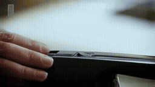
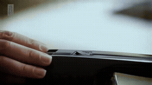
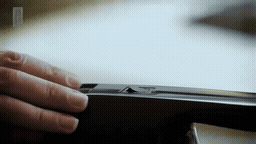

# Prompt P0 / P1 / P2 / P3 · 보존 작업자의 얼굴 재등장

[이 실험의 사례 목록](README.md) · [전체 실험](../README.md) · [입력 방식](../../docs/METHODS.md)

P1 출력 구도·행동, P2 +연속성, P3 +참조 역할. 같은 prompt의 Local/Image-Past/Video-Past를 비교합니다. P0는 재사용입니다.

관찰·해석은 [실험별 결과](../../docs/EXPERIMENTS.md)를 함께 확인하세요.

**GIF는 축소 미리보기(8 FPS)입니다.** 모든 생성 Target은 원본 3초입니다. 미리보기 또는 MP4 링크를 클릭하면 저장소 파일을 열 수 있습니다. 재사용 표시는 같은 원실행을 다시 비교했다는 뜻입니다.

## 실제 입력과 평가용 후속

Local은 생성 조건입니다. 원본 후속은 입력에 넣지 않았습니다.

### Local · 고정 생성 조건

[](../../media/videos/16c72b537953bab48122204bddffdbf880fbc1c8a55c3d74073ec4b2bf5bc8e8.mp4)

RGB 표시 · 48 frames / 24 FPS · [MP4 파일](../../media/videos/16c72b537953bab48122204bddffdbf880fbc1c8a55c3d74073ec4b2bf5bc8e8.mp4) · [원본 열기/다운로드](../../media/videos/16c72b537953bab48122204bddffdbf880fbc1c8a55c3d74073ec4b2bf5bc8e8.mp4?raw=true)

### Oracle · 과거 증거

[](../../media/videos/043b280c2f5d90c63b8c4df759e5accad5931d9c1abeff3c3d1ccf33ce09edbb.mp4)

RGB 표시 · 72 frames / 24 FPS · [MP4 파일](../../media/videos/043b280c2f5d90c63b8c4df759e5accad5931d9c1abeff3c3d1ccf33ce09edbb.mp4) · [원본 열기/다운로드](../../media/videos/043b280c2f5d90c63b8c4df759e5accad5931d9c1abeff3c3d1ccf33ce09edbb.mp4?raw=true)

### 원본 후속 · 생성 입력 제외

[](../../media/videos/9e8d86af098e2df1ce18e10fe7c47eabfcc5ed15dcc009cb2dcad403d90daa2f.mp4)

원본 후속 · 생성 입력 제외 · [MP4 파일](../../media/videos/9e8d86af098e2df1ce18e10fe7c47eabfcc5ed15dcc009cb2dcad403d90daa2f.mp4) · [원본 열기/다운로드](../../media/videos/9e8d86af098e2df1ce18e10fe7c47eabfcc5ed15dcc009cb2dcad403d90daa2f.mp4?raw=true)

### Oracle 이미지 · 실제 frame 36


이미지 조건은 이 한 장을 인코딩했습니다. 영상 조건과 구분합니다.

원본: Cleaning a tiny 500-year-old embroidered book | In the Conservation Studio | British Library · [구간·출처 metadata](../../records/data/five_005_conservator/metadata.json)

## 생성 결과

### P0 Local-only · seed 42

**재사용 · run_057**

[](../../media/videos/005b3bfdcb07fe347b149c349026cb1ed3da658e6a61301bff8b365760d550a8.mp4)

[Target MP4](../../media/videos/005b3bfdcb07fe347b149c349026cb1ed3da658e6a61301bff8b365760d550a8.mp4) · [원본 열기/다운로드](../../media/videos/005b3bfdcb07fe347b149c349026cb1ed3da658e6a61301bff8b365760d550a8.mp4?raw=true) · [Local + Target 5초](../../media/videos/26bfc5f6b951f591a7492bb58c1ea5fa206ea75d116f7f4d5b7a3c7ac68a3e7d.mp4) · [원실행 config](../../records/outputs/five_005_conservator/image_past_seed42/local/config.json)

참조: 추가 참조 없음. Local clean prefix + Target noise

<details>
<summary>Prompt · 시간 좌표 · 원실행</summary>

```text
The camera returns to the textile conservator at the workbench, showing her face as she looks down and resumes working.
```

- 참조 모델 좌표: `[0.0000, 0.0417) s`
- Target 모델 좌표: `[6.0833, 9.0833) s`
- 원본 참조 구간: `원본 config 참조`
- 추가 참조 token: 0
- 원실행: `outputs/five_005_conservator/image_past_seed42/local/config.json`

</details>

### P0 Oracle · Video-Past · seed 42

**재사용 · run_058**

[](../../media/videos/49514a10a20a205616e9881ebc65efcb22e910ac7fe9488509cc486034b08842.mp4)

[Target MP4](../../media/videos/49514a10a20a205616e9881ebc65efcb22e910ac7fe9488509cc486034b08842.mp4) · [원본 열기/다운로드](../../media/videos/49514a10a20a205616e9881ebc65efcb22e910ac7fe9488509cc486034b08842.mp4?raw=true) · [Local + Target 5초](../../media/videos/785b1d602705b182d4ad285f1a8a89e93eacca77dc90d40c26c1201051ebddad.mp4) · [원실행 config](../../records/outputs/five_005_conservator/image_past_seed42/oracle/config.json)

참조: Oracle 영상 · 전체 프레임. Local clean prefix + 별도 clean 참조 token + Target noise

[이 조건의 참조 파일](../../media/videos/043b280c2f5d90c63b8c4df759e5accad5931d9c1abeff3c3d1ccf33ce09edbb.mp4)

<details>
<summary>Prompt · 시간 좌표 · 원실행</summary>

```text
The camera returns to the textile conservator at the workbench, showing her face as she looks down and resumes working.
```

- 참조 모델 좌표: `[0.0000, 0.0417) s`
- Target 모델 좌표: `[6.0833, 9.0833) s`
- 원본 참조 구간: `[45.5000, 48.5000) s`
- 추가 참조 token: 144
- 원실행: `outputs/five_005_conservator/image_past_seed42/oracle/config.json`

</details>

### P0 Oracle · Video-Past · seed 42

**재사용 · run_069**

[](../../media/videos/635ce4475e920af26526fc5c349d7de5c18443a3adfcb909c5df6b68d95f7f06.mp4)

[Target MP4](../../media/videos/635ce4475e920af26526fc5c349d7de5c18443a3adfcb909c5df6b68d95f7f06.mp4) · [원본 열기/다운로드](../../media/videos/635ce4475e920af26526fc5c349d7de5c18443a3adfcb909c5df6b68d95f7f06.mp4?raw=true) · [Local + Target 5초](../../media/videos/db9bf3a04b8a6632f524c519f1086316869935d7447df8d345840b8179895ef1.mp4) · [원실행 config](../../records/outputs/five_005_conservator/reference_grid_seed42/video_past/config.json)

참조: Oracle 영상 · 전체 프레임. Local clean prefix + 별도 clean 참조 token + Target noise

[이 조건의 참조 파일](../../media/videos/043b280c2f5d90c63b8c4df759e5accad5931d9c1abeff3c3d1ccf33ce09edbb.mp4)

<details>
<summary>Prompt · 시간 좌표 · 원실행</summary>

```text
The camera returns to the textile conservator at the workbench, showing her face as she looks down and resumes working.
```

- 참조 모델 좌표: `[0.0000, 3.0417) s`
- Target 모델 좌표: `[6.0833, 9.0833) s`
- 원본 참조 구간: `[45.5000, 48.5000) s`
- 추가 참조 token: 1440
- 원실행: `outputs/five_005_conservator/reference_grid_seed42/video_past/config.json`

</details>

### P1 Local-only · seed 42

**신규 실행 · run_060**

[](../../media/videos/cc25faff53df883ea55b20cf0778bcb0575fc84529d6a7ee5f384f5dbc3450f9.mp4)

[Target MP4](../../media/videos/cc25faff53df883ea55b20cf0778bcb0575fc84529d6a7ee5f384f5dbc3450f9.mp4) · [원본 열기/다운로드](../../media/videos/cc25faff53df883ea55b20cf0778bcb0575fc84529d6a7ee5f384f5dbc3450f9.mp4?raw=true) · [Local + Target 5초](../../media/videos/075d88b6ddb024280906c90920bf71aaf4cb14bd62762853d3e2d22093e31633.mp4) · [원실행 config](../../records/outputs/five_005_conservator/prompt_control_seed42/P1/local/config.json)

참조: 추가 참조 없음. Local clean prefix + Target noise

<details>
<summary>Prompt · 시간 좌표 · 원실행</summary>

```text
The close-up of the hands ends with a hard cut to a side-angle medium close-up of the same textile conservator at the workbench. Her face remains in the upper half of the frame, with her hands and the book visible below. She looks down and continues gently cleaning the book. The camera holds this view throughout the shot.
```

- 참조 모델 좌표: `[0.0000, 0.0000) s`
- Target 모델 좌표: `[6.0833, 9.0833) s`
- 원본 참조 구간: `원본 config 참조`
- 추가 참조 token: 0
- 원실행: `outputs/five_005_conservator/prompt_control_seed42/P1/local/config.json`

</details>

### P1 Oracle · Image-Past · seed 42

**신규 실행 · run_059**

[](../../media/videos/e9fe67137d4e903fc64b8be2b2276e577ed4bf00bd32f5af2a0e5267de8b381f.mp4)

[Target MP4](../../media/videos/e9fe67137d4e903fc64b8be2b2276e577ed4bf00bd32f5af2a0e5267de8b381f.mp4) · [원본 열기/다운로드](../../media/videos/e9fe67137d4e903fc64b8be2b2276e577ed4bf00bd32f5af2a0e5267de8b381f.mp4?raw=true) · [Local + Target 5초](../../media/videos/3d1dd9b99309277c724e51e0e6b8547ea743fe7381d3a7ae3c5f3826b6bc7d40.mp4) · [원실행 config](../../records/outputs/five_005_conservator/prompt_control_seed42/P1/image_past/config.json)

참조: Oracle 이미지 · frame 36. Local clean prefix + 별도 clean 참조 token + Target noise

[이 조건의 참조 파일](../../media/stills/five_005_conservator_oracle_frame36.png)

<details>
<summary>Prompt · 시간 좌표 · 원실행</summary>

```text
The close-up of the hands ends with a hard cut to a side-angle medium close-up of the same textile conservator at the workbench. Her face remains in the upper half of the frame, with her hands and the book visible below. She looks down and continues gently cleaning the book. The camera holds this view throughout the shot.
```

- 참조 모델 좌표: `[0.0000, 0.0417) s`
- Target 모델 좌표: `[6.0833, 9.0833) s`
- 원본 참조 구간: `[45.5000, 48.5000) s`
- 추가 참조 token: 144
- 원실행: `outputs/five_005_conservator/prompt_control_seed42/P1/image_past/config.json`

</details>

### P1 Oracle · Video-Past · seed 42

**신규 실행 · run_061**

[](../../media/videos/bac190957a00a5bce30cb7ef4794a72e55068d9998e72770e8a944598cf945c0.mp4)

[Target MP4](../../media/videos/bac190957a00a5bce30cb7ef4794a72e55068d9998e72770e8a944598cf945c0.mp4) · [원본 열기/다운로드](../../media/videos/bac190957a00a5bce30cb7ef4794a72e55068d9998e72770e8a944598cf945c0.mp4?raw=true) · [Local + Target 5초](../../media/videos/f8660a1e23e9a4a21b7160b448c5b75654919920e17a300025079ead5c16e342.mp4) · [원실행 config](../../records/outputs/five_005_conservator/prompt_control_seed42/P1/video_past/config.json)

참조: Oracle 영상 · 전체 프레임. Local clean prefix + 별도 clean 참조 token + Target noise

[이 조건의 참조 파일](../../media/videos/043b280c2f5d90c63b8c4df759e5accad5931d9c1abeff3c3d1ccf33ce09edbb.mp4)

<details>
<summary>Prompt · 시간 좌표 · 원실행</summary>

```text
The close-up of the hands ends with a hard cut to a side-angle medium close-up of the same textile conservator at the workbench. Her face remains in the upper half of the frame, with her hands and the book visible below. She looks down and continues gently cleaning the book. The camera holds this view throughout the shot.
```

- 참조 모델 좌표: `[0.0000, 3.0417) s`
- Target 모델 좌표: `[6.0833, 9.0833) s`
- 원본 참조 구간: `[45.5000, 48.5000) s`
- 추가 참조 token: 1440
- 원실행: `outputs/five_005_conservator/prompt_control_seed42/P1/video_past/config.json`

</details>

### P2 Local-only · seed 42

**신규 실행 · run_063**

[](../../media/videos/008b477fe16e33c5318ca1fcbdb394a7f47d5f731ebc8037a795d381ab2d33a5.mp4)

[Target MP4](../../media/videos/008b477fe16e33c5318ca1fcbdb394a7f47d5f731ebc8037a795d381ab2d33a5.mp4) · [원본 열기/다운로드](../../media/videos/008b477fe16e33c5318ca1fcbdb394a7f47d5f731ebc8037a795d381ab2d33a5.mp4?raw=true) · [Local + Target 5초](../../media/videos/7f0f53db63228ccd572b6e10c053fa405da803b67d79ca04861b15d6bd613581.mp4) · [원실행 config](../../records/outputs/five_005_conservator/prompt_control_seed42/P2/local/config.json)

참조: 추가 참조 없음. Local clean prefix + Target noise

<details>
<summary>Prompt · 시간 좌표 · 원실행</summary>

```text
The close-up of the hands ends with a hard cut to a side-angle medium close-up of the same textile conservator at the workbench. Her face remains in the upper half of the frame, with her hands and the book visible below. She looks down and continues gently cleaning the book. The camera holds this view throughout the shot. The conservator, the book and the workbench retain their appearance from the earlier conservation scene.
```

- 참조 모델 좌표: `[0.0000, 0.0000) s`
- Target 모델 좌표: `[6.0833, 9.0833) s`
- 원본 참조 구간: `원본 config 참조`
- 추가 참조 token: 0
- 원실행: `outputs/five_005_conservator/prompt_control_seed42/P2/local/config.json`

</details>

### P2 Oracle · Image-Past · seed 42

**신규 실행 · run_062**

[](../../media/videos/2576dba0977cdec9a0cd8ff2c0da85f43e444fc1d15081279345f4a1818ebc2e.mp4)

[Target MP4](../../media/videos/2576dba0977cdec9a0cd8ff2c0da85f43e444fc1d15081279345f4a1818ebc2e.mp4) · [원본 열기/다운로드](../../media/videos/2576dba0977cdec9a0cd8ff2c0da85f43e444fc1d15081279345f4a1818ebc2e.mp4?raw=true) · [Local + Target 5초](../../media/videos/f2481589bc78fea2fda96482dfd9ceacc3024d1702f2c17698b847710771926a.mp4) · [원실행 config](../../records/outputs/five_005_conservator/prompt_control_seed42/P2/image_past/config.json)

참조: Oracle 이미지 · frame 36. Local clean prefix + 별도 clean 참조 token + Target noise

[이 조건의 참조 파일](../../media/stills/five_005_conservator_oracle_frame36.png)

<details>
<summary>Prompt · 시간 좌표 · 원실행</summary>

```text
The close-up of the hands ends with a hard cut to a side-angle medium close-up of the same textile conservator at the workbench. Her face remains in the upper half of the frame, with her hands and the book visible below. She looks down and continues gently cleaning the book. The camera holds this view throughout the shot. The conservator, the book and the workbench retain their appearance from the earlier conservation scene.
```

- 참조 모델 좌표: `[0.0000, 0.0417) s`
- Target 모델 좌표: `[6.0833, 9.0833) s`
- 원본 참조 구간: `[45.5000, 48.5000) s`
- 추가 참조 token: 144
- 원실행: `outputs/five_005_conservator/prompt_control_seed42/P2/image_past/config.json`

</details>

### P2 Oracle · Video-Past · seed 42

**신규 실행 · run_064**

[](../../media/videos/d69f43d423d3dcbf1e25717039fd84b1cef187697649e8fb86707f1a5706aeab.mp4)

[Target MP4](../../media/videos/d69f43d423d3dcbf1e25717039fd84b1cef187697649e8fb86707f1a5706aeab.mp4) · [원본 열기/다운로드](../../media/videos/d69f43d423d3dcbf1e25717039fd84b1cef187697649e8fb86707f1a5706aeab.mp4?raw=true) · [Local + Target 5초](../../media/videos/75af131e0a6489b17884e6f18e4cf88350e68dacca24387618b7fd9c8f4b5ccc.mp4) · [원실행 config](../../records/outputs/five_005_conservator/prompt_control_seed42/P2/video_past/config.json)

참조: Oracle 영상 · 전체 프레임. Local clean prefix + 별도 clean 참조 token + Target noise

[이 조건의 참조 파일](../../media/videos/043b280c2f5d90c63b8c4df759e5accad5931d9c1abeff3c3d1ccf33ce09edbb.mp4)

<details>
<summary>Prompt · 시간 좌표 · 원실행</summary>

```text
The close-up of the hands ends with a hard cut to a side-angle medium close-up of the same textile conservator at the workbench. Her face remains in the upper half of the frame, with her hands and the book visible below. She looks down and continues gently cleaning the book. The camera holds this view throughout the shot. The conservator, the book and the workbench retain their appearance from the earlier conservation scene.
```

- 참조 모델 좌표: `[0.0000, 3.0417) s`
- Target 모델 좌표: `[6.0833, 9.0833) s`
- 원본 참조 구간: `[45.5000, 48.5000) s`
- 추가 참조 token: 1440
- 원실행: `outputs/five_005_conservator/prompt_control_seed42/P2/video_past/config.json`

</details>

### P3 Local-only · seed 42

**신규 실행 · run_066**

[](../../media/videos/23da59dc5f63d96f58c7e733483f06006fff1d44705c11be5b3ee06e2b09d81b.mp4)

[Target MP4](../../media/videos/23da59dc5f63d96f58c7e733483f06006fff1d44705c11be5b3ee06e2b09d81b.mp4) · [원본 열기/다운로드](../../media/videos/23da59dc5f63d96f58c7e733483f06006fff1d44705c11be5b3ee06e2b09d81b.mp4?raw=true) · [Local + Target 5초](../../media/videos/6038e210b88c9516ccf4c7ff20b78f54cdac4b6a6dd0833d2806199711052fc1.mp4) · [원실행 config](../../records/outputs/five_005_conservator/prompt_control_seed42/P3/local/config.json)

참조: 추가 참조 없음. Local clean prefix + Target noise

<details>
<summary>Prompt · 시간 좌표 · 원실행</summary>

```text
The close-up of the hands ends with a hard cut to a side-angle medium close-up of the same textile conservator at the workbench. Her face remains in the upper half of the frame, with her hands and the book visible below. She looks down and continues gently cleaning the book. The camera holds this view throughout the shot. The conservator, the book and the workbench retain their appearance from the earlier conservation scene. The earlier scene provides visual details of the conservator and the work area. Her cleaning action and the camera framing follow the new side-angle shot described here.
```

- 참조 모델 좌표: `[0.0000, 0.0000) s`
- Target 모델 좌표: `[6.0833, 9.0833) s`
- 원본 참조 구간: `원본 config 참조`
- 추가 참조 token: 0
- 원실행: `outputs/five_005_conservator/prompt_control_seed42/P3/local/config.json`

</details>

### P3 Oracle · Image-Past · seed 42

**신규 실행 · run_065**

[](../../media/videos/926402f4b7b80bd4a5a8c11685c06dcce6e1b57fbf97e8753322fb45ffce6704.mp4)

[Target MP4](../../media/videos/926402f4b7b80bd4a5a8c11685c06dcce6e1b57fbf97e8753322fb45ffce6704.mp4) · [원본 열기/다운로드](../../media/videos/926402f4b7b80bd4a5a8c11685c06dcce6e1b57fbf97e8753322fb45ffce6704.mp4?raw=true) · [Local + Target 5초](../../media/videos/672a378f906e8b07e8e957056fe35cc50096030f9ee3e88d30e907dc2090763d.mp4) · [원실행 config](../../records/outputs/five_005_conservator/prompt_control_seed42/P3/image_past/config.json)

참조: Oracle 이미지 · frame 36. Local clean prefix + 별도 clean 참조 token + Target noise

[이 조건의 참조 파일](../../media/stills/five_005_conservator_oracle_frame36.png)

<details>
<summary>Prompt · 시간 좌표 · 원실행</summary>

```text
The close-up of the hands ends with a hard cut to a side-angle medium close-up of the same textile conservator at the workbench. Her face remains in the upper half of the frame, with her hands and the book visible below. She looks down and continues gently cleaning the book. The camera holds this view throughout the shot. The conservator, the book and the workbench retain their appearance from the earlier conservation scene. The earlier scene provides visual details of the conservator and the work area. Her cleaning action and the camera framing follow the new side-angle shot described here.
```

- 참조 모델 좌표: `[0.0000, 0.0417) s`
- Target 모델 좌표: `[6.0833, 9.0833) s`
- 원본 참조 구간: `[45.5000, 48.5000) s`
- 추가 참조 token: 144
- 원실행: `outputs/five_005_conservator/prompt_control_seed42/P3/image_past/config.json`

</details>

### P3 Oracle · Video-Past · seed 42

**신규 실행 · run_067**

[](../../media/videos/e25f5ac4fa79839e04cd40616a24f3a762956cc449d83696cfc16ddcaf97293e.mp4)

[Target MP4](../../media/videos/e25f5ac4fa79839e04cd40616a24f3a762956cc449d83696cfc16ddcaf97293e.mp4) · [원본 열기/다운로드](../../media/videos/e25f5ac4fa79839e04cd40616a24f3a762956cc449d83696cfc16ddcaf97293e.mp4?raw=true) · [Local + Target 5초](../../media/videos/c189fd32db912baf0eb98018b54c5d267aaf26c7e42065839956ece90a4eda0e.mp4) · [원실행 config](../../records/outputs/five_005_conservator/prompt_control_seed42/P3/video_past/config.json)

참조: Oracle 영상 · 전체 프레임. Local clean prefix + 별도 clean 참조 token + Target noise

[이 조건의 참조 파일](../../media/videos/043b280c2f5d90c63b8c4df759e5accad5931d9c1abeff3c3d1ccf33ce09edbb.mp4)

<details>
<summary>Prompt · 시간 좌표 · 원실행</summary>

```text
The close-up of the hands ends with a hard cut to a side-angle medium close-up of the same textile conservator at the workbench. Her face remains in the upper half of the frame, with her hands and the book visible below. She looks down and continues gently cleaning the book. The camera holds this view throughout the shot. The conservator, the book and the workbench retain their appearance from the earlier conservation scene. The earlier scene provides visual details of the conservator and the work area. Her cleaning action and the camera framing follow the new side-angle shot described here.
```

- 참조 모델 좌표: `[0.0000, 3.0417) s`
- Target 모델 좌표: `[6.0833, 9.0833) s`
- 원본 참조 구간: `[45.5000, 48.5000) s`
- 추가 참조 token: 1440
- 원실행: `outputs/five_005_conservator/prompt_control_seed42/P3/video_past/config.json`

</details>
