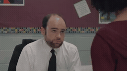
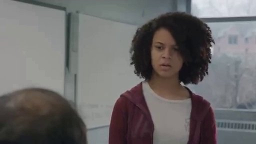
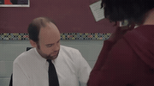
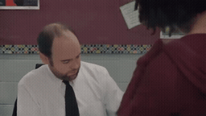
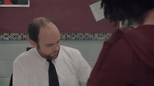

# 32초 전체 / 선택 chunk · 교실 학생의 얼굴 재등장

[이 실험의 사례 목록](README.md) · [전체 실험](../README.md) · [입력 방식](../../docs/METHODS.md)

같은 연속 과거 32초의 Local / Native-Full / Full-reference / Oracle-sparse / Uniform-sparse입니다. 실제 참조 좌표를 보존했습니다. Sparse clip은 bank의 선택 위치를 보여주는 RGB 표시 영상입니다.

모든 조건에서 필요한 학생 얼굴이 드러나지 않습니다. Oracle/Uniform indices가 8/9 겹칩니다.

**GIF는 축소 미리보기(8 FPS)입니다.** 모든 생성 Target은 원본 3초입니다. 미리보기 또는 MP4 링크를 클릭하면 저장소 파일을 열 수 있습니다. 재사용 표시는 같은 원실행을 다시 비교했다는 뜻입니다.

## 실제 입력과 평가용 후속

Local은 생성 조건입니다. 원본 후속은 입력에 넣지 않았습니다. Oracle/Uniform clip은 명목 구간 표시이며 독립 VAE 입력이 아닙니다.

### Local · 고정 생성 조건

[](../../media/videos/ce12a8ff3a1f93a3b63070823f09e83a8a1d690dbd34ae566220a05c20ccf738.mp4)

RGB 표시 · 48 frames / 24 FPS · [MP4 파일](../../media/videos/ce12a8ff3a1f93a3b63070823f09e83a8a1d690dbd34ae566220a05c20ccf738.mp4) · [원본 열기/다운로드](../../media/videos/ce12a8ff3a1f93a3b63070823f09e83a8a1d690dbd34ae566220a05c20ccf738.mp4?raw=true)

### 연속 과거 32초 · 정지 미리보기

[](../../media/videos/06b7a5614664b30f994a8d62865dfa6e45093882abe287bfa9cebeb03d05d521.mp4)

RGB 표시 · 768 frames / 24 FPS · [MP4 파일](../../media/videos/06b7a5614664b30f994a8d62865dfa6e45093882abe287bfa9cebeb03d05d521.mp4) · [원본 열기/다운로드](../../media/videos/06b7a5614664b30f994a8d62865dfa6e45093882abe287bfa9cebeb03d05d521.mp4?raw=true)

### Oracle · 과거 증거

[](../../media/videos/f5aea1fe170dec8130cab65006f08062ea0caa62fc32714cfb22a1c0a331efa0.mp4)

RGB 표시 · 72 frames / 24 FPS · 실제 입력은 H bank의 latent 부분집합 · [MP4 파일](../../media/videos/f5aea1fe170dec8130cab65006f08062ea0caa62fc32714cfb22a1c0a331efa0.mp4) · [원본 열기/다운로드](../../media/videos/f5aea1fe170dec8130cab65006f08062ea0caa62fc32714cfb22a1c0a331efa0.mp4?raw=true)

### Uniform · 중앙 구간

[](../../media/videos/8ec9fa2b579e3428528069b13401de9cb9b4e0e8576a57bc8e99d67407a59c3d.mp4)

RGB 표시 · 72 frames / 24 FPS · 실제 입력은 H bank의 latent 부분집합 · [MP4 파일](../../media/videos/8ec9fa2b579e3428528069b13401de9cb9b4e0e8576a57bc8e99d67407a59c3d.mp4) · [원본 열기/다운로드](../../media/videos/8ec9fa2b579e3428528069b13401de9cb9b4e0e8576a57bc8e99d67407a59c3d.mp4?raw=true)

### 원본 후속 · 생성 입력 제외

[](../../media/videos/a5c8f3acf6682d799ba0652dc157059d48b8dd1a8d2000e32c505ac7a2d20a19.mp4)

원본 후속 · 생성 입력 제외 · [MP4 파일](../../media/videos/a5c8f3acf6682d799ba0652dc157059d48b8dd1a8d2000e32c505ac7a2d20a19.mp4) · [원본 열기/다운로드](../../media/videos/a5c8f3acf6682d799ba0652dc157059d48b8dd1a8d2000e32c505ac7a2d20a19.mp4?raw=true)

원본: Short Film: Third Period · [구간·출처 metadata](../../records/data/long_input/long_003_student_return/metadata.json)

## 생성 결과

###  Local-only · seed 42

**신규 실행 · run_082**

[](../../media/videos/8becca4bee1f178f753d59ee295ce9a252081fb4d5622a3835fe6c3da5be99b2.mp4)

[Target MP4](../../media/videos/8becca4bee1f178f753d59ee295ce9a252081fb4d5622a3835fe6c3da5be99b2.mp4) · [원본 열기/다운로드](../../media/videos/8becca4bee1f178f753d59ee295ce9a252081fb4d5622a3835fe6c3da5be99b2.mp4?raw=true) · [Local + Target 5초](../../media/videos/a4e6ef7e7dfd8ddb33310ed4dcc93df7fcf1b8aa8481f427ba005d0e53473b10.mp4) · [원실행 config](../../records/outputs/long_input/seed42/long_003_student_return/local/config.json)

참조: 추가 참조 없음. Local clean prefix + Target noise

Denoising **2.719 s**, peak allocated **35.970 GiB**.

<details>
<summary>Prompt · 시간 좌표 · 원실행</summary>

```text
A hard cut switches from the teacher-facing view to a reverse-angle medium close-up of the same student at the teacher's desk. Her face is fully visible as she looks toward the teacher just beside the camera. She listens and gives a brief response with a small nod. The camera stays fixed on the student throughout the shot.
```

- 참조 모델 좌표: `원본 config 참조`
- Target 모델 좌표: `[32.0417, 35.0417) s`
- 원본 참조 구간: `원본 config 참조`
- 추가 참조 token: 0
- 원실행: `outputs/long_input/seed42/long_003_student_return/local/config.json`

</details>

###  Native-Full · 연속 32초 · seed 42

**신규 실행 · run_083**

[](../../media/videos/1273d6a2abfab01773e25564ef3710a0b1731097ebaaa9017205094014762567.mp4)

[Target MP4](../../media/videos/1273d6a2abfab01773e25564ef3710a0b1731097ebaaa9017205094014762567.mp4) · [원본 열기/다운로드](../../media/videos/1273d6a2abfab01773e25564ef3710a0b1731097ebaaa9017205094014762567.mp4?raw=true) · [Local + Target 5초](../../media/videos/92052c7b19420acb9a9d9fdf023470f0d990e0951be9cc14ed515a6c5849bbc7.mp4) · [원실행 config](../../records/outputs/long_input/seed42/long_003_student_return/native_full/config.json)

참조: 연속 32초 · clean prefix. 연속 인코딩한 97 latent prefix + Target noise; 전체 video token 15,264

[이 조건의 참조 파일](../../media/videos/06b7a5614664b30f994a8d62865dfa6e45093882abe287bfa9cebeb03d05d521.mp4)

Denoising **18.035 s**, peak allocated **39.016 GiB**.

<details>
<summary>Prompt · 시간 좌표 · 원실행</summary>

```text
A hard cut switches from the teacher-facing view to a reverse-angle medium close-up of the same student at the teacher's desk. Her face is fully visible as she looks toward the teacher just beside the camera. She listens and gives a brief response with a small nod. The camera stays fixed on the student throughout the shot.
```

- 참조 모델 좌표: `[0.0000, 32.0417) s`
- Target 모델 좌표: `[32.0417, 35.0417) s`
- 원본 참조 구간: `[92.5833, 124.5833) s`
- 추가 참조 token: 0
- 원실행: `outputs/long_input/seed42/long_003_student_return/native_full/config.json`

</details>

###  Full-reference · H 전체 · seed 42

**신규 실행 · run_081**

[](../../media/videos/090014ba272ed0463268104657a9d2be4f5fccb71a1330c4b7fce5bd80b43dcf.mp4)

[Target MP4](../../media/videos/090014ba272ed0463268104657a9d2be4f5fccb71a1330c4b7fce5bd80b43dcf.mp4) · [원본 열기/다운로드](../../media/videos/090014ba272ed0463268104657a9d2be4f5fccb71a1330c4b7fce5bd80b43dcf.mp4?raw=true) · [Local + Target 5초](../../media/videos/ec60c0b271a8472fddbecf74185ff0f51d59d7001b08d036378a81489fa5c231.mp4) · [원실행 config](../../records/outputs/long_input/seed42/long_003_student_return/full_reference/config.json)

참조: 이 32초의 앞 H 30초 전체. H 91 latent를 별도 추가 + 독립 Local + Target; 전체 video token 15,408

[이 조건의 참조 파일](../../media/videos/06b7a5614664b30f994a8d62865dfa6e45093882abe287bfa9cebeb03d05d521.mp4)

Denoising **18.180 s**, peak allocated **39.049 GiB**.

<details>
<summary>Prompt · 시간 좌표 · 원실행</summary>

```text
A hard cut switches from the teacher-facing view to a reverse-angle medium close-up of the same student at the teacher's desk. Her face is fully visible as she looks toward the teacher just beside the camera. She listens and gives a brief response with a small nod. The camera stays fixed on the student throughout the shot.
```

- 참조 모델 좌표: `[0.0000, 30.0417) s`
- Target 모델 좌표: `[32.0417, 35.0417) s`
- 원본 참조 구간: `[92.5833, 122.5833) s`
- 추가 참조 token: 13104
- 원실행: `outputs/long_input/seed42/long_003_student_return/full_reference/config.json`

</details>

###  Oracle-sparse · 선택 chunk · seed 42

**신규 실행 · run_084**

[](../../media/videos/d5c336949436bf0b2e5a2b1e363a687cc2af654fad540b445ac73312f4a3f457.mp4)

[Target MP4](../../media/videos/d5c336949436bf0b2e5a2b1e363a687cc2af654fad540b445ac73312f4a3f457.mp4) · [원본 열기/다운로드](../../media/videos/d5c336949436bf0b2e5a2b1e363a687cc2af654fad540b445ac73312f4a3f457.mp4?raw=true) · [Local + Target 5초](../../media/videos/198c0eb0f5abdc83e6867750b5a98c99d1ab71d5e0d63de3e54adf75466ca469.mp4) · [원실행 config](../../records/outputs/long_input/seed42/long_003_student_return/oracle_sparse/config.json)

참조: Oracle 명목 RGB 구간 · 실제 입력은 H bank의 9 latent. Full H bank의 정확한 부분집합 + 독립 Local + Target; 전체 video token 3,600

[이 조건의 참조 파일](../../media/videos/f5aea1fe170dec8130cab65006f08062ea0caa62fc32714cfb22a1c0a331efa0.mp4)

Denoising **3.865 s**, peak allocated **36.276 GiB**.

<details>
<summary>Prompt · 시간 좌표 · 원실행</summary>

```text
A hard cut switches from the teacher-facing view to a reverse-angle medium close-up of the same student at the teacher's desk. Her face is fully visible as she looks toward the teacher just beside the camera. She listens and gives a brief response with a small nod. The camera stays fixed on the student throughout the shot.
```

- 참조 모델 좌표: `[13.7083, 16.7083) s`
- Target 모델 좌표: `[32.0417, 35.0417) s`
- 원본 참조 구간: `[106.2500, 109.2500) s`
- 추가 참조 token: 1296
- 원실행: `outputs/long_input/seed42/long_003_student_return/oracle_sparse/config.json`

</details>

###  Uniform-sparse · 중앙 chunk · seed 42

**신규 실행 · run_085**

[](../../media/videos/63df5efc815895143368c1e2f3fc808b943d194ba4fd7deef0789d0662f7b0cc.mp4)

[Target MP4](../../media/videos/63df5efc815895143368c1e2f3fc808b943d194ba4fd7deef0789d0662f7b0cc.mp4) · [원본 열기/다운로드](../../media/videos/63df5efc815895143368c1e2f3fc808b943d194ba4fd7deef0789d0662f7b0cc.mp4?raw=true) · [Local + Target 5초](../../media/videos/a1eebea67a3ab1b27593783cfa5c5325c1b2d3fc091e963cae0d7da0b5c3355b.mp4) · [원실행 config](../../records/outputs/long_input/seed42/long_003_student_return/uniform_sparse/config.json)

참조: Uniform 명목 RGB 구간 · 실제 입력은 H bank의 9 latent. Full H bank의 정확한 부분집합 + 독립 Local + Target; 전체 video token 3,600

[이 조건의 참조 파일](../../media/videos/8ec9fa2b579e3428528069b13401de9cb9b4e0e8576a57bc8e99d67407a59c3d.mp4)

Denoising **3.864 s**, peak allocated **36.276 GiB**.

<details>
<summary>Prompt · 시간 좌표 · 원실행</summary>

```text
A hard cut switches from the teacher-facing view to a reverse-angle medium close-up of the same student at the teacher's desk. Her face is fully visible as she looks toward the teacher just beside the camera. She listens and gives a brief response with a small nod. The camera stays fixed on the student throughout the shot.
```

- 참조 모델 좌표: `[13.3750, 16.3750) s`
- Target 모델 좌표: `[32.0417, 35.0417) s`
- 원본 참조 구간: `[105.9167, 108.9167) s`
- 추가 참조 token: 1296
- 원실행: `outputs/long_input/seed42/long_003_student_return/uniform_sparse/config.json`

</details>
