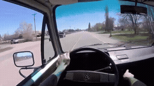
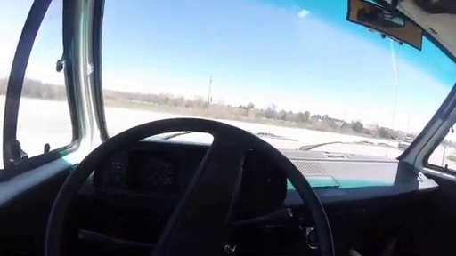
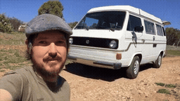
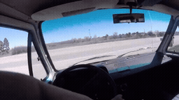
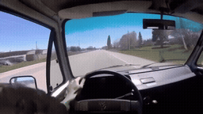
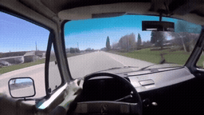
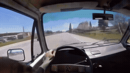
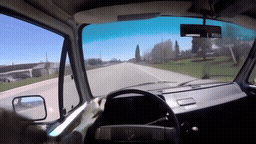

# 32초 전체 / 선택 chunk · 캠퍼 밴 외관으로 시점 전환

[이 실험의 사례 목록](README.md) · [전체 실험](../README.md) · [입력 방식](../../docs/METHODS.md)

같은 연속 과거 32초의 Local / Native-Full / Full-reference / Oracle-sparse / Uniform-sparse입니다. 실제 참조 좌표를 보존했습니다. Sparse clip은 bank의 선택 위치를 보여주는 RGB 표시 영상입니다.

Oracle에서 밴 외관이 드러나지만 selfie/주차 장면을 재현합니다. 주행 성공으로 판단하지 않았습니다.

**GIF는 축소 미리보기(8 FPS)입니다.** 모든 생성 Target은 원본 3초입니다. 미리보기 또는 MP4 링크를 클릭하면 저장소 파일을 열 수 있습니다. 재사용 표시는 같은 원실행을 다시 비교했다는 뜻입니다.

## 실제 입력과 평가용 후속

Local은 생성 조건입니다. 원본 후속은 입력에 넣지 않았습니다. Oracle/Uniform clip은 명목 구간 표시이며 독립 VAE 입력이 아닙니다.

### Local · 고정 생성 조건

[](../../media/videos/ff56594fa1e2046ff5dc13a79e8ac5d0829a927b6ee5c593503b9b3c6957b4fc.mp4)

RGB 표시 · 48 frames / 24 FPS · [MP4 파일](../../media/videos/ff56594fa1e2046ff5dc13a79e8ac5d0829a927b6ee5c593503b9b3c6957b4fc.mp4) · [원본 열기/다운로드](../../media/videos/ff56594fa1e2046ff5dc13a79e8ac5d0829a927b6ee5c593503b9b3c6957b4fc.mp4?raw=true)

### 연속 과거 32초 · 정지 미리보기

[](../../media/videos/f0306a3de129f688293622b79db339bd9884172a99ec65f15a09fdc0f3332d08.mp4)

RGB 표시 · 768 frames / 24 FPS · [MP4 파일](../../media/videos/f0306a3de129f688293622b79db339bd9884172a99ec65f15a09fdc0f3332d08.mp4) · [원본 열기/다운로드](../../media/videos/f0306a3de129f688293622b79db339bd9884172a99ec65f15a09fdc0f3332d08.mp4?raw=true)

### Oracle · 과거 증거

[](../../media/videos/59fd2e786d1071e7e30026a90d1e76d207635bf442c06c74aa5eb01003de082f.mp4)

RGB 표시 · 72 frames / 24 FPS · 실제 입력은 H bank의 latent 부분집합 · [MP4 파일](../../media/videos/59fd2e786d1071e7e30026a90d1e76d207635bf442c06c74aa5eb01003de082f.mp4) · [원본 열기/다운로드](../../media/videos/59fd2e786d1071e7e30026a90d1e76d207635bf442c06c74aa5eb01003de082f.mp4?raw=true)

### Uniform · 중앙 구간

[](../../media/videos/566fdff17a339ccea7d9c4a4b212bf671281c6d99aa184dc23fdb074dc5d8aae.mp4)

RGB 표시 · 72 frames / 24 FPS · 실제 입력은 H bank의 latent 부분집합 · [MP4 파일](../../media/videos/566fdff17a339ccea7d9c4a4b212bf671281c6d99aa184dc23fdb074dc5d8aae.mp4) · [원본 열기/다운로드](../../media/videos/566fdff17a339ccea7d9c4a4b212bf671281c6d99aa184dc23fdb074dc5d8aae.mp4?raw=true)

### 원본 후속 · 생성 입력 제외

[](../../media/videos/b44c687f4f87587bace865f6293b91f8b43a1e48ea904ffca70e1f2e30d5643a.mp4)

원본 후속 · 생성 입력 제외 · [MP4 파일](../../media/videos/b44c687f4f87587bace865f6293b91f8b43a1e48ea904ffca70e1f2e30d5643a.mp4) · [원본 열기/다운로드](../../media/videos/b44c687f4f87587bace865f6293b91f8b43a1e48ea904ffca70e1f2e30d5643a.mp4?raw=true)

원본: 1983 Aircooled Vanagon Subaru JDM 2.5 Conversion Tour · [구간·출처 metadata](../../records/data/long_input/long_004_van_exterior/metadata.json)

## 생성 결과

###  Local-only · seed 42

**신규 실행 · run_087**

[](../../media/videos/ec8dc598f89141889a34fb87d0684718ee65058fb0a7d851e6240687db3bd525.mp4)

[Target MP4](../../media/videos/ec8dc598f89141889a34fb87d0684718ee65058fb0a7d851e6240687db3bd525.mp4) · [원본 열기/다운로드](../../media/videos/ec8dc598f89141889a34fb87d0684718ee65058fb0a7d851e6240687db3bd525.mp4?raw=true) · [Local + Target 5초](../../media/videos/2c0c95af3cfbf2d7acd88d5a831802b0b5f51c146f5e27339f6f2c34abac82f6.mp4) · [원실행 config](../../records/outputs/long_input/seed42/long_004_van_exterior/local/config.json)

참조: 추가 참조 없음. Local clean prefix + Target noise

Denoising **2.712 s**, peak allocated **35.970 GiB**.

<details>
<summary>Prompt · 시간 좌표 · 원실행</summary>

```text
A hard cut switches from the view inside the van to a wide exterior shot of the same camper van on a driveway. A stationary camera stands outside the vehicle at a front three-quarter angle, with the entire van in frame. The van itself rolls slowly forward across the driveway while its wheels turn. The camera remains fixed, and the exterior shot fills the frame. The same camper van seen earlier in the tour keeps its appearance across the cut.
```

- 참조 모델 좌표: `원본 config 참조`
- Target 모델 좌표: `[32.0417, 35.0417) s`
- 원본 참조 구간: `원본 config 참조`
- 추가 참조 token: 0
- 원실행: `outputs/long_input/seed42/long_004_van_exterior/local/config.json`

</details>

###  Native-Full · 연속 32초 · seed 42

**신규 실행 · run_088**

[](../../media/videos/10bee2850b6969cdcada237dfa7379124ee12cb7af7be898d470fc3b7ebc2516.mp4)

[Target MP4](../../media/videos/10bee2850b6969cdcada237dfa7379124ee12cb7af7be898d470fc3b7ebc2516.mp4) · [원본 열기/다운로드](../../media/videos/10bee2850b6969cdcada237dfa7379124ee12cb7af7be898d470fc3b7ebc2516.mp4?raw=true) · [Local + Target 5초](../../media/videos/42afe44e73cde450dbf46a46106b62af68aa97e532a979cb5956aeb278aa84a6.mp4) · [원실행 config](../../records/outputs/long_input/seed42/long_004_van_exterior/native_full/config.json)

참조: 연속 32초 · clean prefix. 연속 인코딩한 97 latent prefix + Target noise; 전체 video token 15,264

[이 조건의 참조 파일](../../media/videos/f0306a3de129f688293622b79db339bd9884172a99ec65f15a09fdc0f3332d08.mp4)

Denoising **18.037 s**, peak allocated **39.016 GiB**.

<details>
<summary>Prompt · 시간 좌표 · 원실행</summary>

```text
A hard cut switches from the view inside the van to a wide exterior shot of the same camper van on a driveway. A stationary camera stands outside the vehicle at a front three-quarter angle, with the entire van in frame. The van itself rolls slowly forward across the driveway while its wheels turn. The camera remains fixed, and the exterior shot fills the frame. The same camper van seen earlier in the tour keeps its appearance across the cut.
```

- 참조 모델 좌표: `[0.0000, 32.0417) s`
- Target 모델 좌표: `[32.0417, 35.0417) s`
- 원본 참조 구간: `[276.0000, 308.0000) s`
- 추가 참조 token: 0
- 원실행: `outputs/long_input/seed42/long_004_van_exterior/native_full/config.json`

</details>

###  Full-reference · H 전체 · seed 42

**신규 실행 · run_086**

[](../../media/videos/c8bee6e7e05c4c478ea58200298849aff18147dcacf20c72b9dae83032b06846.mp4)

[Target MP4](../../media/videos/c8bee6e7e05c4c478ea58200298849aff18147dcacf20c72b9dae83032b06846.mp4) · [원본 열기/다운로드](../../media/videos/c8bee6e7e05c4c478ea58200298849aff18147dcacf20c72b9dae83032b06846.mp4?raw=true) · [Local + Target 5초](../../media/videos/d0ebc73c4ea55e1d5ac01bfc326e0aeae5fe5c7cb927909293319d542d3c5d0c.mp4) · [원실행 config](../../records/outputs/long_input/seed42/long_004_van_exterior/full_reference/config.json)

참조: 이 32초의 앞 H 30초 전체. H 91 latent를 별도 추가 + 독립 Local + Target; 전체 video token 15,408

[이 조건의 참조 파일](../../media/videos/f0306a3de129f688293622b79db339bd9884172a99ec65f15a09fdc0f3332d08.mp4)

Denoising **18.194 s**, peak allocated **39.049 GiB**.

<details>
<summary>Prompt · 시간 좌표 · 원실행</summary>

```text
A hard cut switches from the view inside the van to a wide exterior shot of the same camper van on a driveway. A stationary camera stands outside the vehicle at a front three-quarter angle, with the entire van in frame. The van itself rolls slowly forward across the driveway while its wheels turn. The camera remains fixed, and the exterior shot fills the frame. The same camper van seen earlier in the tour keeps its appearance across the cut.
```

- 참조 모델 좌표: `[0.0000, 30.0417) s`
- Target 모델 좌표: `[32.0417, 35.0417) s`
- 원본 참조 구간: `[276.0000, 306.0000) s`
- 추가 참조 token: 13104
- 원실행: `outputs/long_input/seed42/long_004_van_exterior/full_reference/config.json`

</details>

###  Oracle-sparse · 선택 chunk · seed 42

**신규 실행 · run_089**

[](../../media/videos/70c85b9a27576f88ae6f2e653e8c6c9e8bd0c62331ab0723ea45b0c69f0d1b9b.mp4)

[Target MP4](../../media/videos/70c85b9a27576f88ae6f2e653e8c6c9e8bd0c62331ab0723ea45b0c69f0d1b9b.mp4) · [원본 열기/다운로드](../../media/videos/70c85b9a27576f88ae6f2e653e8c6c9e8bd0c62331ab0723ea45b0c69f0d1b9b.mp4?raw=true) · [Local + Target 5초](../../media/videos/9e702cd9b19ddc405eebac754a4515ebf52e4e974fabab44872c3dab3c8de581.mp4) · [원실행 config](../../records/outputs/long_input/seed42/long_004_van_exterior/oracle_sparse/config.json)

참조: Oracle 명목 RGB 구간 · 실제 입력은 H bank의 9 latent. Full H bank의 정확한 부분집합 + 독립 Local + Target; 전체 video token 3,600

[이 조건의 참조 파일](../../media/videos/59fd2e786d1071e7e30026a90d1e76d207635bf442c06c74aa5eb01003de082f.mp4)

Denoising **3.868 s**, peak allocated **36.276 GiB**.

<details>
<summary>Prompt · 시간 좌표 · 원실행</summary>

```text
A hard cut switches from the view inside the van to a wide exterior shot of the same camper van on a driveway. A stationary camera stands outside the vehicle at a front three-quarter angle, with the entire van in frame. The van itself rolls slowly forward across the driveway while its wheels turn. The camera remains fixed, and the exterior shot fills the frame. The same camper van seen earlier in the tour keeps its appearance across the cut.
```

- 참조 모델 좌표: `[0.0417, 3.0417) s`
- Target 모델 좌표: `[32.0417, 35.0417) s`
- 원본 참조 구간: `[276.0000, 279.0000) s`
- 추가 참조 token: 1296
- 원실행: `outputs/long_input/seed42/long_004_van_exterior/oracle_sparse/config.json`

</details>

###  Uniform-sparse · 중앙 chunk · seed 42

**신규 실행 · run_090**

[](../../media/videos/afa957a0c079e3de8f23530d455656ff09768c37771984111fcebe9bc71e77f2.mp4)

[Target MP4](../../media/videos/afa957a0c079e3de8f23530d455656ff09768c37771984111fcebe9bc71e77f2.mp4) · [원본 열기/다운로드](../../media/videos/afa957a0c079e3de8f23530d455656ff09768c37771984111fcebe9bc71e77f2.mp4?raw=true) · [Local + Target 5초](../../media/videos/0614a920bb11629be1b3eb724bf6c7c6bdb9d2f6e963cd63cfc5ab51c2c1a3dc.mp4) · [원실행 config](../../records/outputs/long_input/seed42/long_004_van_exterior/uniform_sparse/config.json)

참조: Uniform 명목 RGB 구간 · 실제 입력은 H bank의 9 latent. Full H bank의 정확한 부분집합 + 독립 Local + Target; 전체 video token 3,600

[이 조건의 참조 파일](../../media/videos/566fdff17a339ccea7d9c4a4b212bf671281c6d99aa184dc23fdb074dc5d8aae.mp4)

Denoising **3.866 s**, peak allocated **36.276 GiB**.

<details>
<summary>Prompt · 시간 좌표 · 원실행</summary>

```text
A hard cut switches from the view inside the van to a wide exterior shot of the same camper van on a driveway. A stationary camera stands outside the vehicle at a front three-quarter angle, with the entire van in frame. The van itself rolls slowly forward across the driveway while its wheels turn. The camera remains fixed, and the exterior shot fills the frame. The same camper van seen earlier in the tour keeps its appearance across the cut.
```

- 참조 모델 좌표: `[13.3750, 16.3750) s`
- Target 모델 좌표: `[32.0417, 35.0417) s`
- 원본 참조 구간: `[289.3333, 292.3333) s`
- 추가 참조 token: 1296
- 원실행: `outputs/long_input/seed42/long_004_van_exterior/uniform_sparse/config.json`

</details>
