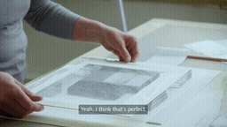
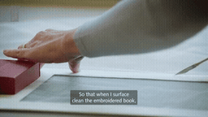
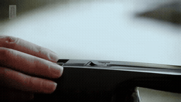
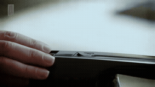
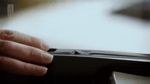

# 32초 전체 / 선택 chunk · 보존 작업자의 얼굴 재등장

[이 실험의 사례 목록](README.md) · [전체 실험](../README.md) · [입력 방식](../../docs/METHODS.md)

같은 연속 과거 32초의 Local / Native-Full / Full-reference / Oracle-sparse / Uniform-sparse입니다. 실제 참조 좌표를 보존했습니다. Sparse clip은 bank의 선택 위치를 보여주는 RGB 표시 영상입니다.

Oracle의 회색 머리/안경은 일부만 노출되고 얼굴이 잘립니다. Native/Full은 지속적인 겹침을 보입니다.

**GIF는 축소 미리보기(8 FPS)입니다.** 모든 생성 Target은 원본 3초입니다. 미리보기 또는 MP4 링크를 클릭하면 저장소 파일을 열 수 있습니다. 재사용 표시는 같은 원실행을 다시 비교했다는 뜻입니다.

## 실제 입력과 평가용 후속

Local은 생성 조건입니다. 원본 후속은 입력에 넣지 않았습니다. Oracle/Uniform clip은 명목 구간 표시이며 독립 VAE 입력이 아닙니다.

### Local · 고정 생성 조건

[](../../media/videos/2a93021b1f15e6f7fc429aec569af1b223de7303474dc4d55fab4223fa183fd6.mp4)

RGB 표시 · 48 frames / 24 FPS · [MP4 파일](../../media/videos/2a93021b1f15e6f7fc429aec569af1b223de7303474dc4d55fab4223fa183fd6.mp4) · [원본 열기/다운로드](../../media/videos/2a93021b1f15e6f7fc429aec569af1b223de7303474dc4d55fab4223fa183fd6.mp4?raw=true)

### 연속 과거 32초 · 정지 미리보기

[](../../media/videos/66f1afff8aae3597f06ccab1c1ee6325e24e1692d01f070a588536560ca04d70.mp4)

RGB 표시 · 768 frames / 24 FPS · [MP4 파일](../../media/videos/66f1afff8aae3597f06ccab1c1ee6325e24e1692d01f070a588536560ca04d70.mp4) · [원본 열기/다운로드](../../media/videos/66f1afff8aae3597f06ccab1c1ee6325e24e1692d01f070a588536560ca04d70.mp4?raw=true)

### Oracle · 과거 증거

[](../../media/videos/ee4b4cb49cd711044cf503295e06120c23428b8d2843da9d89287da0a16dcc1c.mp4)

RGB 표시 · 72 frames / 24 FPS · 실제 입력은 H bank의 latent 부분집합 · [MP4 파일](../../media/videos/ee4b4cb49cd711044cf503295e06120c23428b8d2843da9d89287da0a16dcc1c.mp4) · [원본 열기/다운로드](../../media/videos/ee4b4cb49cd711044cf503295e06120c23428b8d2843da9d89287da0a16dcc1c.mp4?raw=true)

### Uniform · 중앙 구간

[](../../media/videos/87427179c1a265698e6df25754229ac51b5750a867d50c458704ddd074dfadbd.mp4)

RGB 표시 · 72 frames / 24 FPS · 실제 입력은 H bank의 latent 부분집합 · [MP4 파일](../../media/videos/87427179c1a265698e6df25754229ac51b5750a867d50c458704ddd074dfadbd.mp4) · [원본 열기/다운로드](../../media/videos/87427179c1a265698e6df25754229ac51b5750a867d50c458704ddd074dfadbd.mp4?raw=true)

### 원본 후속 · 생성 입력 제외

[](../../media/videos/9e8d86af098e2df1ce18e10fe7c47eabfcc5ed15dcc009cb2dcad403d90daa2f.mp4)

원본 후속 · 생성 입력 제외 · [MP4 파일](../../media/videos/9e8d86af098e2df1ce18e10fe7c47eabfcc5ed15dcc009cb2dcad403d90daa2f.mp4) · [원본 열기/다운로드](../../media/videos/9e8d86af098e2df1ce18e10fe7c47eabfcc5ed15dcc009cb2dcad403d90daa2f.mp4?raw=true)

원본: Cleaning a tiny 500-year-old embroidered book | In the Conservation Studio | British Library · [구간·출처 metadata](../../records/data/long_input/long_005_conservator/metadata.json)

## 생성 결과

###  Local-only · seed 42

**신규 실행 · run_092**

[](../../media/videos/de3ce2e267887b8b33de3bcaada8a8dffe2dd1e95861d3d4ebeedc5d43afde7b.mp4)

[Target MP4](../../media/videos/de3ce2e267887b8b33de3bcaada8a8dffe2dd1e95861d3d4ebeedc5d43afde7b.mp4) · [원본 열기/다운로드](../../media/videos/de3ce2e267887b8b33de3bcaada8a8dffe2dd1e95861d3d4ebeedc5d43afde7b.mp4?raw=true) · [Local + Target 5초](../../media/videos/e537e15712d186b70d075b4ae8617666d4572b0a45a3e673d64833704916e5ff.mp4) · [원실행 config](../../records/outputs/long_input/seed42/long_005_conservator/local/config.json)

참조: 추가 참조 없음. Local clean prefix + Target noise

Denoising **2.725 s**, peak allocated **35.970 GiB**.

<details>
<summary>Prompt · 시간 좌표 · 원실행</summary>

```text
The close-up of the hands ends with a hard cut to a side-angle medium close-up of the same textile conservator at the workbench. Her face remains in the upper half of the frame, with her hands and the book visible below. She looks down and continues gently cleaning the book. The camera holds this view throughout the shot.
```

- 참조 모델 좌표: `원본 config 참조`
- Target 모델 좌표: `[32.0417, 35.0417) s`
- 원본 참조 구간: `원본 config 참조`
- 추가 참조 token: 0
- 원실행: `outputs/long_input/seed42/long_005_conservator/local/config.json`

</details>

###  Native-Full · 연속 32초 · seed 42

**신규 실행 · run_093**

[](../../media/videos/bbecc5ead06476dc5d977e6a48cb5e968f52cc2b6f2c3ebee6c6998d99221f15.mp4)

[Target MP4](../../media/videos/bbecc5ead06476dc5d977e6a48cb5e968f52cc2b6f2c3ebee6c6998d99221f15.mp4) · [원본 열기/다운로드](../../media/videos/bbecc5ead06476dc5d977e6a48cb5e968f52cc2b6f2c3ebee6c6998d99221f15.mp4?raw=true) · [Local + Target 5초](../../media/videos/f1f8928e73b5caa93bdb50038e431b89651e65d1290005352e267ddc49501f1d.mp4) · [원실행 config](../../records/outputs/long_input/seed42/long_005_conservator/native_full/config.json)

참조: 연속 32초 · clean prefix. 연속 인코딩한 97 latent prefix + Target noise; 전체 video token 15,264

[이 조건의 참조 파일](../../media/videos/66f1afff8aae3597f06ccab1c1ee6325e24e1692d01f070a588536560ca04d70.mp4)

Denoising **18.022 s**, peak allocated **39.016 GiB**.

<details>
<summary>Prompt · 시간 좌표 · 원실행</summary>

```text
The close-up of the hands ends with a hard cut to a side-angle medium close-up of the same textile conservator at the workbench. Her face remains in the upper half of the frame, with her hands and the book visible below. She looks down and continues gently cleaning the book. The camera holds this view throughout the shot.
```

- 참조 모델 좌표: `[0.0000, 32.0417) s`
- Target 모델 좌표: `[32.0417, 35.0417) s`
- 원본 참조 구간: `[78.4667, 110.4667) s`
- 추가 참조 token: 0
- 원실행: `outputs/long_input/seed42/long_005_conservator/native_full/config.json`

</details>

###  Full-reference · H 전체 · seed 42

**신규 실행 · run_091**

[](../../media/videos/78c483bec7a702bf57ebd00493f6453a4ae142ab9eed3ade39b6c410defa038d.mp4)

[Target MP4](../../media/videos/78c483bec7a702bf57ebd00493f6453a4ae142ab9eed3ade39b6c410defa038d.mp4) · [원본 열기/다운로드](../../media/videos/78c483bec7a702bf57ebd00493f6453a4ae142ab9eed3ade39b6c410defa038d.mp4?raw=true) · [Local + Target 5초](../../media/videos/2a388b69418e617379037cc1274a235fba274bd9272e9215b1f1f99130bceb04.mp4) · [원실행 config](../../records/outputs/long_input/seed42/long_005_conservator/full_reference/config.json)

참조: 이 32초의 앞 H 30초 전체. H 91 latent를 별도 추가 + 독립 Local + Target; 전체 video token 15,408

[이 조건의 참조 파일](../../media/videos/66f1afff8aae3597f06ccab1c1ee6325e24e1692d01f070a588536560ca04d70.mp4)

Denoising **18.168 s**, peak allocated **39.049 GiB**.

<details>
<summary>Prompt · 시간 좌표 · 원실행</summary>

```text
The close-up of the hands ends with a hard cut to a side-angle medium close-up of the same textile conservator at the workbench. Her face remains in the upper half of the frame, with her hands and the book visible below. She looks down and continues gently cleaning the book. The camera holds this view throughout the shot.
```

- 참조 모델 좌표: `[0.0000, 30.0417) s`
- Target 모델 좌표: `[32.0417, 35.0417) s`
- 원본 참조 구간: `[78.4667, 108.4667) s`
- 추가 참조 token: 13104
- 원실행: `outputs/long_input/seed42/long_005_conservator/full_reference/config.json`

</details>

###  Oracle-sparse · 선택 chunk · seed 42

**신규 실행 · run_094**

[](../../media/videos/5b77819b62c0875f1a12166d7d992e5e0d2e1ac5d707e335aef449e73d2da652.mp4)

[Target MP4](../../media/videos/5b77819b62c0875f1a12166d7d992e5e0d2e1ac5d707e335aef449e73d2da652.mp4) · [원본 열기/다운로드](../../media/videos/5b77819b62c0875f1a12166d7d992e5e0d2e1ac5d707e335aef449e73d2da652.mp4?raw=true) · [Local + Target 5초](../../media/videos/5e112ddc8efcaff0568d8b6601f7026d3f7f52af3ac2e9d98a3ecb9f308d17b2.mp4) · [원실행 config](../../records/outputs/long_input/seed42/long_005_conservator/oracle_sparse/config.json)

참조: Oracle 명목 RGB 구간 · 실제 입력은 H bank의 9 latent. Full H bank의 정확한 부분집합 + 독립 Local + Target; 전체 video token 3,600

[이 조건의 참조 파일](../../media/videos/ee4b4cb49cd711044cf503295e06120c23428b8d2843da9d89287da0a16dcc1c.mp4)

Denoising **3.873 s**, peak allocated **36.276 GiB**.

<details>
<summary>Prompt · 시간 좌표 · 원실행</summary>

```text
The close-up of the hands ends with a hard cut to a side-angle medium close-up of the same textile conservator at the workbench. Her face remains in the upper half of the frame, with her hands and the book visible below. She looks down and continues gently cleaning the book. The camera holds this view throughout the shot.
```

- 참조 모델 좌표: `[7.7083, 10.7083) s`
- Target 모델 좌표: `[32.0417, 35.0417) s`
- 원본 참조 구간: `[86.1333, 89.1333) s`
- 추가 참조 token: 1296
- 원실행: `outputs/long_input/seed42/long_005_conservator/oracle_sparse/config.json`

</details>

###  Uniform-sparse · 중앙 chunk · seed 42

**신규 실행 · run_095**

[](../../media/videos/fd00c81af42b0b4795a651c08e681e508dc59a0d403565ba7bd09e48b1ec87d4.mp4)

[Target MP4](../../media/videos/fd00c81af42b0b4795a651c08e681e508dc59a0d403565ba7bd09e48b1ec87d4.mp4) · [원본 열기/다운로드](../../media/videos/fd00c81af42b0b4795a651c08e681e508dc59a0d403565ba7bd09e48b1ec87d4.mp4?raw=true) · [Local + Target 5초](../../media/videos/f476b86e4f204a1b01717dddffecdd54fa02aba75c05dc727e41264245291136.mp4) · [원실행 config](../../records/outputs/long_input/seed42/long_005_conservator/uniform_sparse/config.json)

참조: Uniform 명목 RGB 구간 · 실제 입력은 H bank의 9 latent. Full H bank의 정확한 부분집합 + 독립 Local + Target; 전체 video token 3,600

[이 조건의 참조 파일](../../media/videos/87427179c1a265698e6df25754229ac51b5750a867d50c458704ddd074dfadbd.mp4)

Denoising **3.877 s**, peak allocated **36.276 GiB**.

<details>
<summary>Prompt · 시간 좌표 · 원실행</summary>

```text
The close-up of the hands ends with a hard cut to a side-angle medium close-up of the same textile conservator at the workbench. Her face remains in the upper half of the frame, with her hands and the book visible below. She looks down and continues gently cleaning the book. The camera holds this view throughout the shot.
```

- 참조 모델 좌표: `[13.3750, 16.3750) s`
- Target 모델 좌표: `[32.0417, 35.0417) s`
- 원본 참조 구간: `[91.8000, 94.8000) s`
- 추가 참조 token: 1296
- 원실행: `outputs/long_input/seed42/long_005_conservator/uniform_sparse/config.json`

</details>
